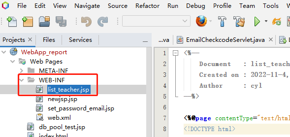
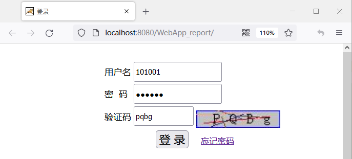

继续编辑教师界面JSP程序“list_teacher.jsp”


```html {wrap}
<%-- 
    Document   : list_teacher
    Author     : cyl
--%>

<%@page import="com.report.javabeans.Course"%>
<%@page import="com.report.javabeans.Project"%>
<%@page import="com.report.dao.ProjectDAO"%>
<%@page import="com.report.javabeans.User"%>
<%@page import="com.report.dao.CourseDAO"%>
<%@page import="java.util.ArrayList"%>
<%@page import="java.io.File"%>
<%@page import="java.util.List"%>
<%@page import="java.net.URLEncoder"%>
<%@page import="java.util.Map"%>
<%@page contentType="text/html" pageEncoding="UTF-8"%>
<!DOCTYPE html>
<html>
  <head>
    <meta http-equiv="Content-Type" content="text/html; charset=UTF-8">
    <title>实验报告系统 </title>
  </head>
  <%
    response.setHeader("Pragma", "no-cache");
    response.addHeader("Cache-Control", "must-revalidate");
    response.addHeader("Cache-Control", "no-cache");
    response.addHeader("Cache-Control", "no-store");
    response.setDateHeader("Expires", 0);
  %>
  <body>
    <div style=" width: 800px;height:800px;position: absolute;top: 10%;left: 30%;">
      <h1><font color="blue"> 实验管理</font><font style="font-size:15px;color:red">&nbsp;&nbsp;&nbsp;&nbsp; <a href="exit">安全退出</a></font></h1>  
      <p>
                        
        <a href="teacher/uploadCourse.jsp"> 新建课程 </a>
      </p>  
    </div>  
  </body>
</html>
```

运行项目，用教师用户101001登录


进入教师界面


现在还没有课程，教师可以新建课程，新建课程功能待续...，显示课程功能待续...

