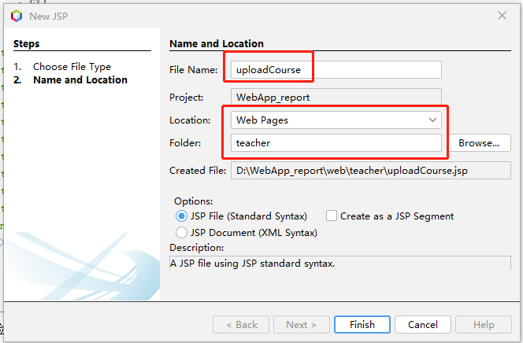
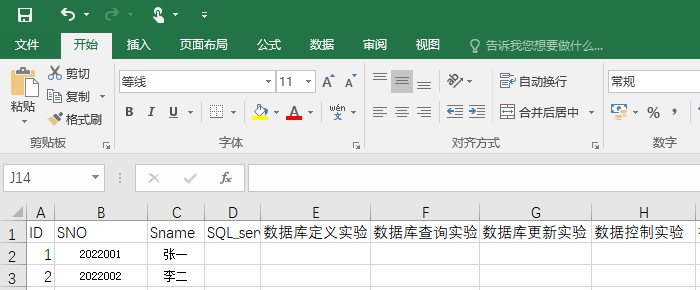
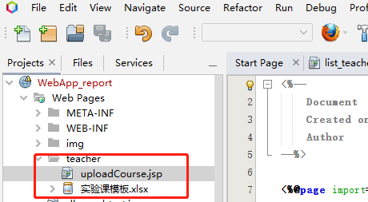
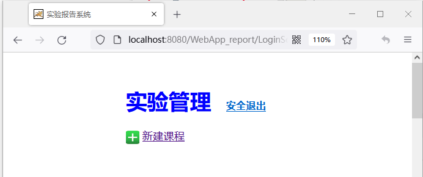
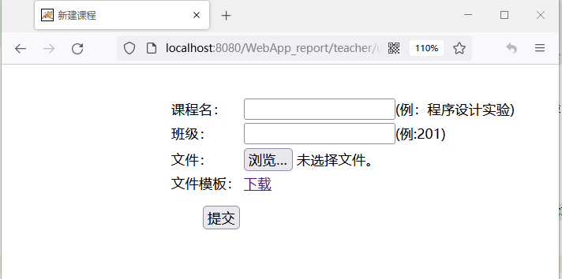

新建JSP程序“uploadCoures.jsp”


准备“实验课模板.xlsx”文件，格式如下：


目录结构如图



编辑“uploadCourse.jsp”代码
```java
<%-- 
    Document   : uploadCourse
    Created on : 2022-11-5, 16:18:58
    Author     : cyl
--%>

<%@page import="com.report.javabeans.User"%>
<%@ page contentType="text/html; charset=UTF-8" pageEncoding="UTF-8"%>
<%@ page errorPage="/WEB-INF/errorHandler.jsp" %>
<%response.setContentType("text/html;charset=UTF-8");
  response.setHeader("Pragma", "no-cache");
  response.addHeader("Cache-Control", "must-revalidate");
  response.addHeader("Cache-Control", "no-cache");
  response.addHeader("Cache-Control", "no-store");
  response.setDateHeader("Expires", 0);
%> 
<!DOCTYPE html>
<script>
  var isIE = /msie/i.test(navigator.userAgent) && !window.opera;
  function fileChange(target) {
    var fileSize = 0;
    var filetypes = [".xlsx"];
    var filepath = target.value;
    var filemaxsize = 1024 * 5;//5M
    if (filepath) {
      var isnext = false;
      var fileend = filepath.substring(filepath.lastIndexOf("."));
      if (filetypes && filetypes.length > 0) {
        for (var i = 0; i < filetypes.length; i++) {
          if (filetypes[i] == fileend) {
            isnext = true;
            break;
          }
        }
      }
      if (!isnext) {
        alert("不接受此文件类型！");
        target.value = "";
        return false;
      }
    } else {
      return false;
    }
    if (isIE && !target.files) {
      var filePath = target.value;
      var fileSystem = new ActiveXObject("Scripting.FileSystemObject");
      if (!fileSystem.FileExists(filePath)) {
        alert("附件不存在，请重新输入！");
        return false;
      }
      var file = fileSystem.GetFile(filePath);
      fileSize = file.Size;
    } else {
      fileSize = target.files[0].size;
    }

    var size = fileSize / 1024;
    if (size > filemaxsize) {
      alert("附件大小不能大于" + filemaxsize / 1024 + "M！");
      target.value = "";
      return false;
    }
    if (size <= 0) {
      alert("附件大小不能为0M！");
      target.value = "";
      return false;
    }
  }
  function Check()
  {
    for (var i = 0; i < document.form1.elements.length - 1; i++)
    {
      if (document.form1.elements[i].value == "")
      {
        alert("不可空！");
        document.form1.elements[i].focus();
        return false;
      }
    }
    return true;
  }
</script>

<html>
  <head>
    <meta http-equiv="Content-Type" content="text/html; charset=UTF-8">
    <title>新建课程</title>
  </head>
  <body>
    <div style=" width: 600px;height:300px;position: absolute;top: 10%;left: 30%;">
      <%User user = (User) session.getAttribute("user");
        if (user == null || !user.getRole().trim().equals("teacher")) {
          response.sendRedirect("login.jsp");
        }     
%>
      <form action="../uploadCourseServlet" enctype="multipart/form-data" method="post" name="form1" onSubmit="return Check()">
        <table>             
          <tr> <td>课程名：</td>
            <td><input style=" font-size:16px" type="text" name="courseName" size="20"/>(例：程序设计实验)</td>
          </tr>
          <tr> <td>班级：</td>
            <td><input style=" font-size:16px" type="text" name="className" size="20"/>(例:201)</td>
          </tr>
          <tr> <td>文件：</td>
            <td><input style=" font-size:16px" type="file" name="file" size="40" id="fup" onchange="fileChange(this);"/></td>
          </tr>
             <tr> <td>文件模板：</td>
               <td><a href="实验课模板.xlsx">下载</a>&nbsp;&nbsp;&nbsp;&nbsp;注:课程学生名单可到教务系统下载</td>
          </tr>
          <tr>
            <td style="height:50px;" align="right" ><input style=" font-size:16px" type="submit" value="提交" size='30'/> </td>
            <td align="left"> </td>
          </tr>
        </table>
      </form>
    </div>
  </body>
</html>
```

运行项目，教师登录后，选择新建课程，


界面如下。


提交功能待续...

