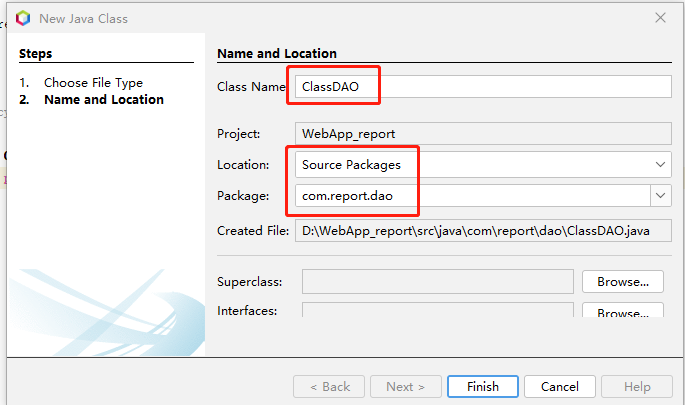

每个实验课的courseID是不同的（实验课名称可能相同）对应一个教学班级。
教师按照按照Excel模板上传“实验课教学班excel表”后， 系统使用ClassDAO的 createClass方法先创建“实验课教学班表”，然后调用数据库存储过程把课程信息插入到课程表（tb_Course），登录用户信息插入到用户表（tb_User），选课信息插入到选课表（tb_SC)，项目信息插入到项目表（tb_Project）。
新建类“ClassDAO”


编辑代码
```java {wrap}
 
package com.report.dao;
import com.report.javabeans.BaseUser;
import java.sql.CallableStatement;
import java.sql.Connection;
import java.sql.PreparedStatement;
import java.sql.ResultSet;
import java.sql.SQLException;
import java.util.List;
/**
 *
 * @author cyl
 */
public class ClassDAO implements DAO {
    public String getFilePath(String CourseID, String ProjectID, String SNO){
        CourseDAO course = new CourseDAO();
        //String tablename=course.getTalbeName(CourseID);
        ProjectID = ProjectID.substring(3);
        String sql = "SELECT " + ProjectID + " FROM " + course.getTalbeName(CourseID) + " where SNO=?";
        String FilePath = null;
        try (Connection conn = getConnection();
                PreparedStatement pstmt = conn.prepareStatement(sql)) {
            pstmt.setString(1, SNO);
            //System.out.println(sql);
            //System.out.println(SNO);
            try (ResultSet rst = pstmt.executeQuery()) {
                while (rst.next()) {
                    FilePath = rst.getString(1);
                }
                conn.close();

            }
        } catch (SQLException se) {
            System.out.println(se);

        }
        return FilePath;
    }

    public String setFilePath(String CourseID, String ProjectID, String SNO, String FilePath){
        CourseDAO course = new CourseDAO();
        String tablename = course.getTalbeName(CourseID);
        //System.out.println(tablename);
        String sql = "update " + tablename + " set " + ProjectID + "=? where SNO=?";
        try (Connection conn = getConnection();
                PreparedStatement pstmt = conn.prepareStatement(sql)) {
            pstmt.setString(1, FilePath);
            pstmt.setString(2, SNO);
            pstmt.executeUpdate();
            conn.close();
        } catch (SQLException se) {
            System.out.println(se);
            //System.out.println("写文件路径失败！");
            return null;

        }

        return FilePath;
    }

    public boolean createClass(String teacherID,String className, List<String> prjList, List<BaseUser> userList){
        String sql = "CREATE TABLE " + className + "(ID int PRIMARY KEY,SNO nvarchar(10) NULL,Sname nvarchar (255) NULL";
        // ,数据库设计实验 nvarchar(255) NULL
        for (int i = 0; i < prjList.size(); i++) {
            sql += "," + prjList.get(i) + " nvarchar(255) NULL";
        }
        sql += ")";
        System.out.println(sql);
        try (Connection conn = getConnection();
                PreparedStatement pstmt = conn.prepareStatement(sql)) {
            //pstmt.setString(1,className);
            pstmt.executeUpdate();
            conn.close();
        } catch (SQLException se) {
            System.out.println(se);
            //System.out.println("创建班级失败！");         

        }
        sql = "insert into " + className + "(ID,SNO,Sname) values(?,?,?)";
        try (Connection conn = getConnection();
                PreparedStatement pstmt = conn.prepareStatement(sql)) {
            //pstmt.setString(1,className);
            for (int i = 0; i < userList.size(); i++) {
                pstmt.setInt(1, userList.get(i).getID());
                pstmt.setString(2, userList.get(i).getSno().trim());
                pstmt.setString(3, userList.get(i).getStudentName().trim());
                System.out.println(sql + userList.get(i).getID() + userList.get(i).getSno() + userList.get(i).getStudentName());
                pstmt.executeUpdate();
            }
            conn.close();
        } catch (SQLException se) {
            System.out.println(se);
            //System.out.println("插入学生失败！");         

        }

        try(Connection conn = getConnection();){
                CallableStatement  proc = conn.prepareCall("{ call add_data(?,?,?) }");
                proc.setString(1, className);
                proc.setString(2, className);
                proc.setString(3, teacherID);
                proc.execute();
                conn.close(); 
        } catch (SQLException se) {
            System.out.println(se);
            //System.out.println("创建班级失败！");
        }
        return true;
    }
}
```

