# **一  Apache ****POI****下载和加库**
地址：** **https://poi.apache.org/download.html
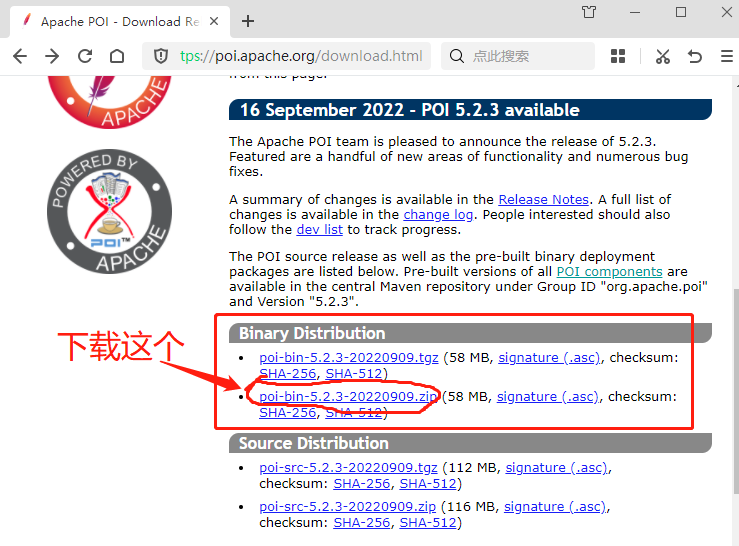

选择推荐的下载站点就行了，点击开始下载
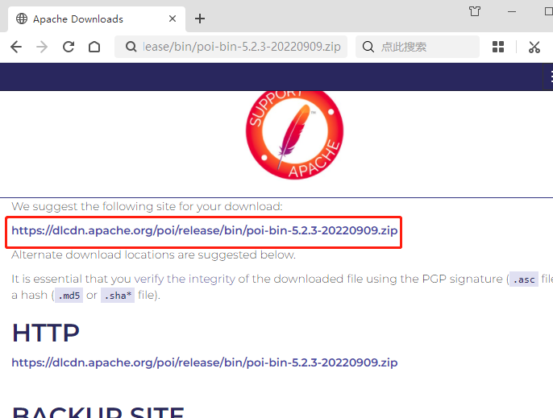

下载后解压，最好解压到项目文件夹里。
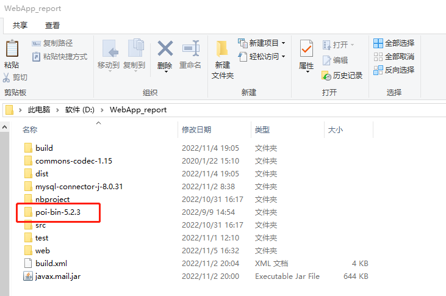

把**Apache ****POI****加入库，**
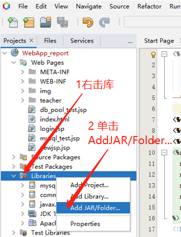

选择Jar文件
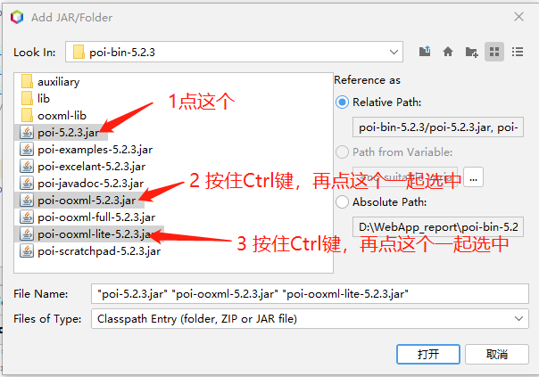

lib文件夹里的，
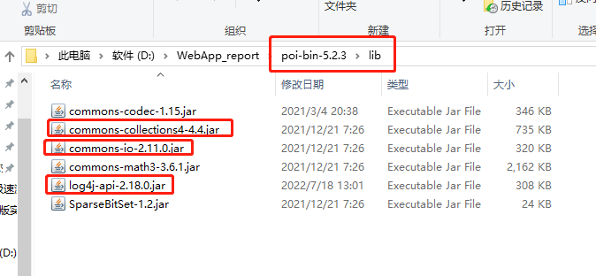


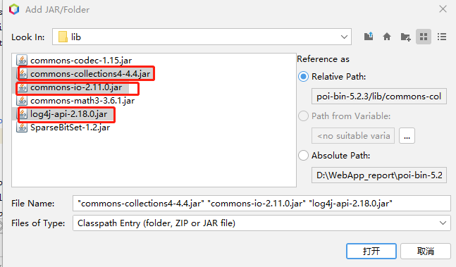

还有ooxml-lib文件夹里的，
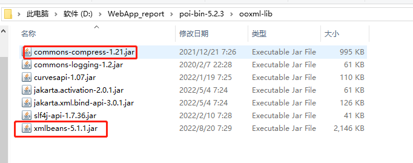

# 二 log4j-core下载和加库
https://logging.apache.org/log4j/2.x/download.html
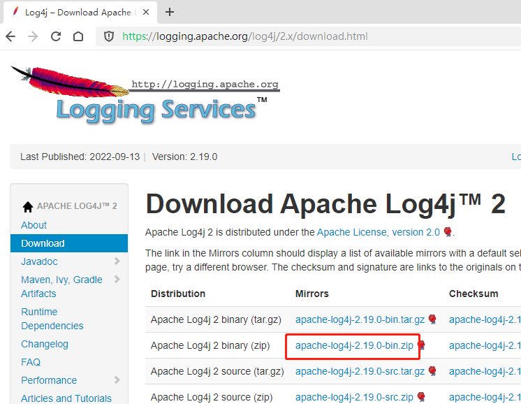

点击打开下载页
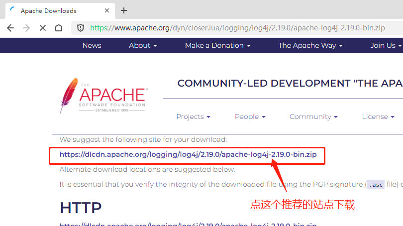


下载后解压，把log4j-core加入到项目库里，
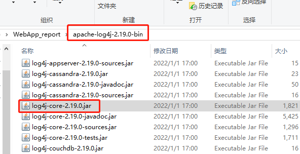

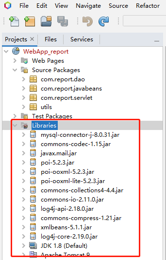


# 三 Excel工具类
**POI-HSSF和POI-XSSF/SXSSF是可以访问Microsoft Excel 格式文件的 Java ****API**** **
我们使用**POI-XSSF访问教师按照按照Excel模板上传的“实验课教学班excel表”，**
https://poi.apache.org/components/spreadsheet/index.html
文件和输入流
https://poi.apache.org/components/spreadsheet/quick-guide.html#FileInputStream
获取单元格内容
https://poi.apache.org/components/spreadsheet/quick-guide.html#CellContents
新建类BaseUser，保存Excel表中的学生数据
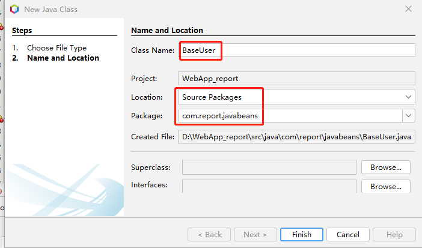

```java
 package com.report.javabeans;

/**
 *保存Excel表中的学生信息
 * @author cyl
 */
public class BaseUser {
int ID;//序号
String sno;//学号
String studentName;//学生姓名

    public int getID() {
        return ID;
    }

    public void setID(int ID) {
        this.ID = ID;
    }

    public String getSno() {
        return sno;
    }

    public void setSno(String sno) {
        this.sno = sno;
    }

    public String getStudentName() {
        return studentName;
    }

    public void setStudentName(String studentName) {
        this.studentName = studentName;
    }

}
```


新建Excel文件工具类“Exceltutil”
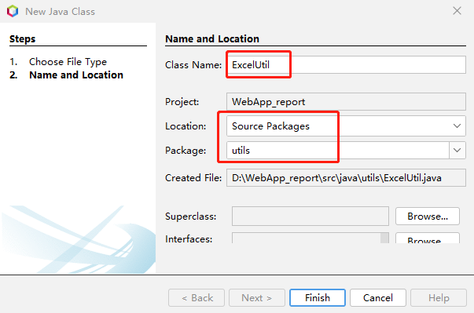

编辑代码
```java
package utils;

import com.report.dao.ClassDAO;
import com.report.javabeans.BaseUser;
import java.io.File;
import java.io.IOException;
import java.util.ArrayList;
import java.util.logging.Level;
import java.util.logging.Logger;
import org.apache.poi.openxml4j.exceptions.InvalidFormatException;
import org.apache.poi.openxml4j.opc.OPCPackage;
import org.apache.poi.ss.usermodel.CellType;
import org.apache.poi.xssf.usermodel.*;

/**
 *
 * @author cyl
 */
public class ExcelUtil {

  public static boolean excelToList(String file) throws IOException, InvalidFormatException {

    //创建工作簿
    OPCPackage pkg = OPCPackage.open(new File(file));
    XSSFWorkbook xssfWorkbook = new XSSFWorkbook(pkg);
    // = new XSSFWorkbook(new File(file));
    System.out.println("xssfWorkbook对象：" + xssfWorkbook);
    //读取第一个工作表(下标从0开始)
    XSSFSheet sheet = xssfWorkbook.getSheetAt(0);
    System.out.println("sheet对象：" + sheet);
    //获取第一行的数据
    XSSFRow row = sheet.getRow(0);
    System.out.println("row对象->CellNum：" + row.getLastCellNum());
    //获取该行第一个单元格的数据
    XSSFCell cell0 = row.getCell(0);
    System.out.println("cell0对象：" + cell0);
    ArrayList<String> projects = new ArrayList<>();//项目名称列表
    for (int i = 3; i < row.getLastCellNum(); i++) {
      projects.add(row.getCell(i).getStringCellValue().trim().replace(' ', '_'));
    }
    for (int i = 0; i < projects.size(); i++) {
      System.out.println(projects.get(i));
    }
    System.out.println("项目数：" + projects.size());
    // 获取到最后一行
    int physicalNumberOfRows = sheet.getPhysicalNumberOfRows();
    // 该集合用来储存行对象
    ArrayList<BaseUser> userList = new ArrayList<>();

    // 遍历整张表，从第二行开始，第一行的表头不要，循环次数不大于最后一行的值
    XSSFCell cell;
    // 遍历整张表，从第二行开始，第一行的表头不要，循环次数不大于最后一行的值  
    for (int i = 1; i < physicalNumberOfRows; i++) {
      // 该对象用来储存行数据
      BaseUser user = new BaseUser();
      // 获取目标单元格的值并存进对象中
      row = sheet.getRow(i);
      user.setID(Integer.valueOf(row.getCell(0).getRawValue()));
      //System.out.println(user.getID());
      cell = row.getCell(1);
      cell.setCellType(CellType.STRING);
      user.setSno(cell.getStringCellValue());
      cell = row.getCell(2);
      cell.setCellType(CellType.STRING);
      user.setStudentName(cell.getStringCellValue().trim());
      userList.add(user);
      System.out.println(user.getStudentName());
    }
    System.out.println("学生人数：" + userList.size());
    pkg.close();
    return true;
  }

  public static boolean excelToDB(String teacherID, String courseClass, String file) throws IOException, InvalidFormatException {
    //创建工作簿
    OPCPackage pkg = OPCPackage.open(new File(file));
    XSSFWorkbook xssfWorkbook = new XSSFWorkbook(pkg);
    //读取第一个工作表(下标从0开始)
    XSSFSheet sheet = xssfWorkbook.getSheetAt(0);
    //获取第一行的数据,表头
    XSSFRow row = sheet.getRow(0);
    ArrayList<String> projects = new ArrayList<>();//项目名称列表
    for (int i = 3; i < row.getLastCellNum(); i++) {
      projects.add(row.getCell(i).getStringCellValue().trim().replace(' ', '_'));
    }
    // 获取到最后一行
    int physicalNumberOfRows = sheet.getPhysicalNumberOfRows();
    // 该集合用来储存行对象
    ArrayList<BaseUser> userList = new ArrayList<>();
    // 遍历整张表，从第二行开始，循环次数不大于最后一行的值
    XSSFCell cell;
    // 遍历整张表，从第二行开始，第一行的表头不要，循环次数不大于最后一行的值  
    for (int i = 1; i < physicalNumberOfRows; i++) {
      // 该对象用来储存行数据
      BaseUser user = new BaseUser();
      // 获取目标单元格的值并存进对象中
      row = sheet.getRow(i);
      user.setID(Integer.valueOf(row.getCell(0).getRawValue()));
      //System.out.println(user.getID());
      cell = row.getCell(1);
      cell.setCellType(CellType.STRING);
      user.setSno(cell.getStringCellValue());
      cell = row.getCell(2);
      cell.setCellType(CellType.STRING);
      user.setStudentName(cell.getStringCellValue().trim());
      userList.add(user);
    }
    pkg.close();
    //创建表           
    ClassDAO classDAO = new ClassDAO();
    System.out.println("创建班级。。。。");
    classDAO.createClass(teacherID, courseClass, projects, userList);
    return true;
  }
  
 /* //用于测试目的
  public static void main(String[] args) throws IOException {
    String file = "D:/InfoSec221_DB.xlsx";
    try {
      System.out.println(ExcelUtil.excelToList(file));
    } catch (InvalidFormatException ex) {
      Logger.getLogger(ExcelUtil.class.getName()).log(Level.SEVERE, null, ex);
    }
  }
*/
}
```

# 四 创建课程
新建Servlet程序“uploadCourseServlet”，实现Excel文件的上传和新课程的创建。
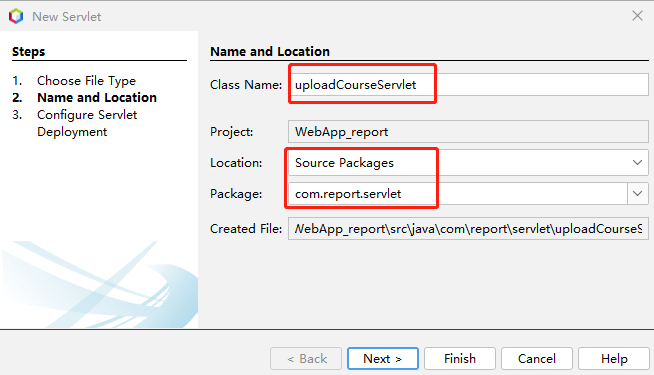


编辑代码，
```java
package com.report.servlet;

import com.report.javabeans.User;
import java.io.File;
import java.io.IOException;
import java.io.PrintWriter;
import java.util.logging.Level;
import java.util.logging.Logger;
import javax.servlet.RequestDispatcher;
import javax.servlet.ServletException;
import javax.servlet.annotation.MultipartConfig;
import javax.servlet.annotation.WebServlet;
import javax.servlet.http.HttpServlet;
import javax.servlet.http.HttpServletRequest;
import javax.servlet.http.HttpServletResponse;
import javax.servlet.http.Part;
import org.apache.poi.openxml4j.exceptions.InvalidFormatException;
import utils.ExcelUtil;
import utils.LoggerUtil;
import utils.PropertiesUtil;

/**
 *
 * @author cyl
 */
@WebServlet(name = "uploadCourseServlet", urlPatterns = {"/uploadCourseServlet"})
@MultipartConfig(location = "/", fileSizeThreshold = 10)
public class uploadCourseServlet extends HttpServlet {

  @Override
  public void doPost(HttpServletRequest request, HttpServletResponse response) throws ServletException, IOException {
    response.setContentType("text/html;charset=UTF-8");
    response.setHeader("Pragma", "no-cache");
    response.addHeader("Cache-Control", "must-revalidate");
    response.addHeader("Cache-Control", "no-cache");
    response.addHeader("Cache-Control", "no-store");
    response.setDateHeader("Expires", 0);

    request.setCharacterEncoding("utf-8");
    try ( PrintWriter out = response.getWriter()) {
      /* TODO output your page here. You may use following sample code. */
      out.println("<!DOCTYPE html>");
      out.println("<html>");
      out.println("<head>");
      out.println("<title>Servlet UploadServlet</title>");
      out.println("</head>");
      out.println("<body>");
      request.setCharacterEncoding("utf-8");
      String message;
      User user = (User) request.getSession().getAttribute("user");
      if (user == null || !user.getRole().trim().equals("teacher")) {
        response.sendRedirect("login.jsp");
      }
      Part part = request.getPart("file"); // 获取文件
      String fileName = part.getSubmittedFileName();   // 得到文件名
      int start = fileName.lastIndexOf(".") + 1;
      String type = fileName.substring(start).replace(".", "");
      //System.out.println(type);
      if (!type.equals("xlsx")) {
        message = "文件类型错误，必须是xlsx文件！";
        out.print(message);
        out.flush();
        out.close();
        return;
      }
      //使用配置文件设置          
      String savePath;
      if (System.getProperties().getProperty("os.name").startsWith("Windows")){
        savePath = PropertiesUtil.pro.getProperty("Win_path");
      } else {
        savePath = PropertiesUtil.pro.getProperty("Linux_path");
      }
      String courseClass = request.getParameter("courseName") + request.getParameter("className");
      savePath = savePath + File.separator + courseClass.trim().replace(' ', '_');
      //目录不存在则新建
      File dir = new File(savePath);
      if (!dir.exists()) {
        dir.mkdirs();
        System.out.println("build" + savePath);
      }
      String saveName = courseClass + ".xlsx";
      //System.out.println(saveName);
      saveName = dir + File.separator + saveName;
      //System.out.println(saveName);
      if (fileName != null && !"".equals(fileName)) {
        // 写入磁盘
        part.write(saveName);
      }
      File f = new File(saveName);
      if (f.exists()) {
        try {
          ExcelUtil.excelToDB(user.getUsername().trim(), courseClass, saveName);
        } catch (InvalidFormatException ex) {
          Logger.getLogger(uploadCourseServlet.class.getName()).log(Level.SEVERE, null, ex);
          RequestDispatcher rd = request.getRequestDispatcher("/WEB-INF/error.jsp");
          rd.forward(request, response);
        }
        message = user.getFullName() + user.getUsername() + "课程：";
        LoggerUtil.logger.warning(message);
        //request.getSession().setAttribute("number", mnumber);
        //request.getSession().setAttribute("fname", fname);
        RequestDispatcher rd = request.getRequestDispatcher("/WEB-INF/list_teacher.jsp");
        rd.forward(request, response);

      } else {
        message = courseClass + "创建课程失败！";
        LoggerUtil.logger.warning(message);
        RequestDispatcher rd = request.getRequestDispatcher("/WEB-INF/error.jsp");
        rd.forward(request, response);
      }
    }
  }
}
```

运行项目，教师用户101001登录，
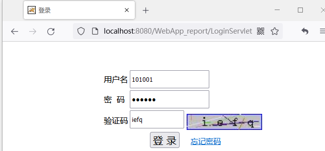

登录后，点击“新建课程”，
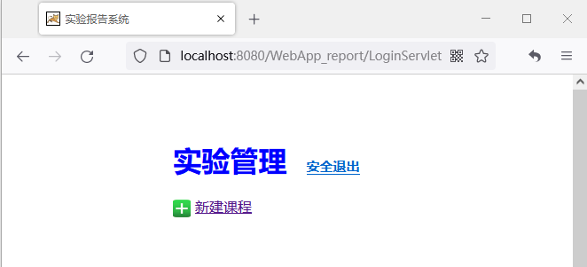

打开新建课程界面
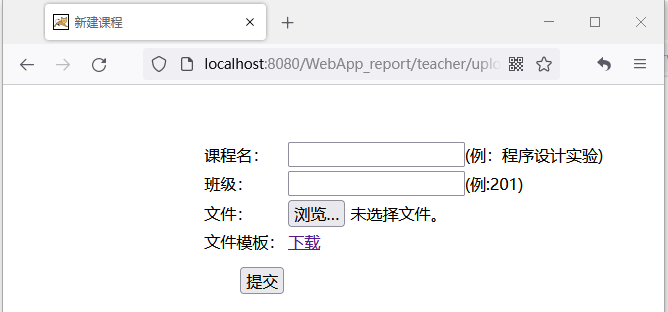

输入课程名，班级，作为测试，这里直接选择下载的“实验课模板.xlsx”文件，然后提交。
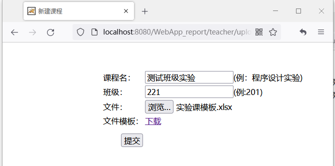

提交后将显示教师界面，
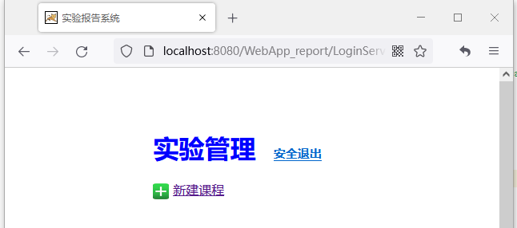

运行MySQL Workbench ,查看数据库
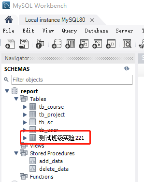

查看User表
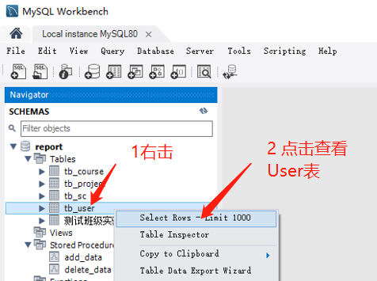

数据导入成功，
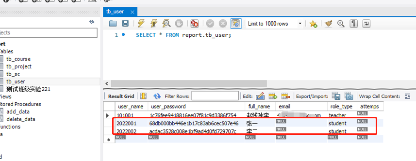

同理，查看表tb_course，tb_project，tb_SC。
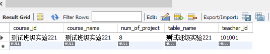

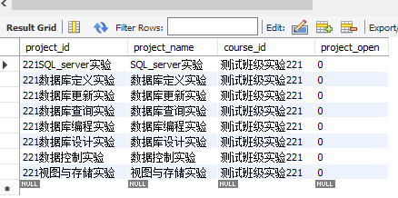

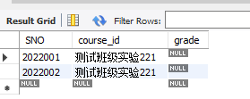

课程信息显示功能待续...
