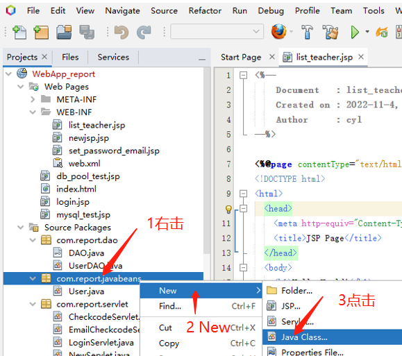
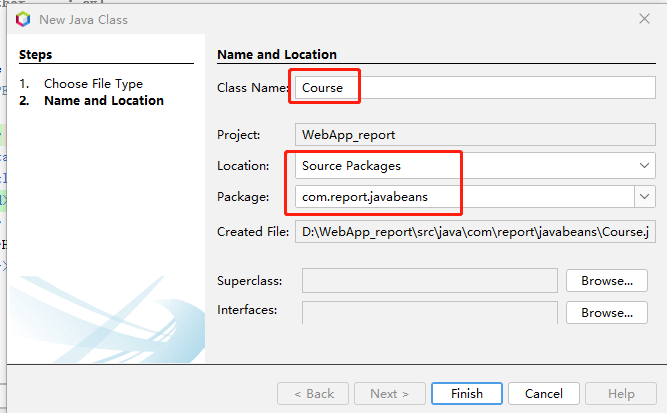
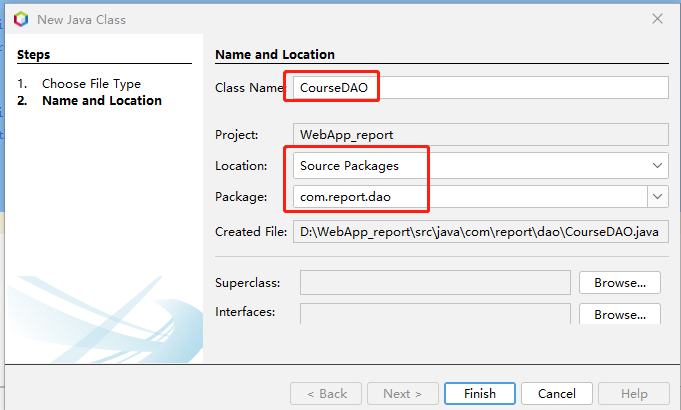
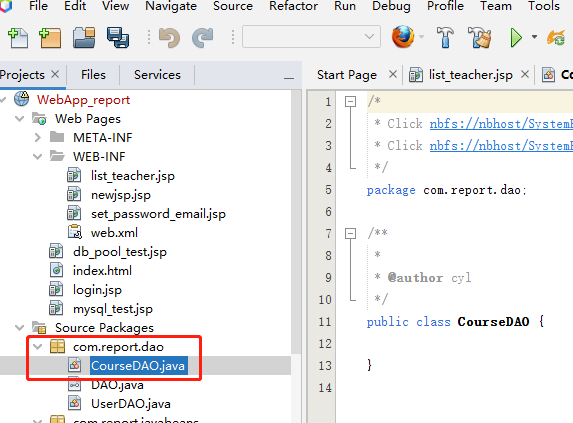

# 一 课程实体类
新建课程实体类Course


设置类名Course


编辑代码
```java
package com.report.javabeans;

/**
 *
 * @author cyl
 */
public class Course {
 String courseID;//课程id
 String courseName;//课程名
 String numofProject;//课程项目数
 String tableName;//课程信息表
 String teacherID;//教师id

    public String getCourseID() {
        return courseID;
    }

    public void setCourseID(String courseID) {
        this.courseID = courseID;
    }

    public String getCourseName() {
        return courseName;
    }

    public void setCourseName(String courseName) {
        this.courseName = courseName;
    }

    public String getNumofProject() {
        return numofProject;
    }

    public void setNumofProject(String numofProject) {
        this.numofProject = numofProject;
    }

    public String getTableName() {
        return tableName;
    }

    public void setTableName(String tableName) {
        this.tableName = tableName;
    }

    public String getTeacherID() {
        return teacherID;
    }

    public void setTeacherID(String teacherID) {
        this.teacherID = teacherID;
    }
 
}
```

# 二 CourseDAO
新建JAVA类“CourseDAO”




编辑代码
```java
package com.report.dao;

import com.report.javabeans.Course;
import java.sql.Connection;
import java.sql.PreparedStatement;
import java.sql.ResultSet;
import java.sql.SQLException;
import java.util.ArrayList;
import java.util.List;

/**
 *
 * @author cyl
 */
public class CourseDAO implements DAO {
  /**
   * 获取课程对应的“实验课班级”表的表名
   *
   * @param CourseID 课程ID
   * @return “实验课班级”表的表名
   */
  public String getTalbeName(String CourseID) {
    String sql = "SELECT table_name FROM tb_Course where course_id=?";
    String tableName = null;
    try ( Connection conn = getConnection();  PreparedStatement pstmt = conn.prepareStatement(sql)) {
      pstmt.setString(1, CourseID);
      try ( ResultSet rst = pstmt.executeQuery()) {
        while (rst.next()) {
          tableName = rst.getString("table_name");
        }
        conn.close();
      }
    } catch (SQLException se) {
      System.out.println(se);
    }
    return tableName;
  }

  /**
   * 根据教师id获取任教的课程
   *
   * @param teacherID
   * @return 任教课程List
   */
  public List<String> getCourses(String teacherID) {
    String sql = "SELECT course_id,table_name FROM tb_Course where teacher_id=?";
    //User user = new User();        
    try ( Connection conn = getConnection();  PreparedStatement pstmt = conn.prepareStatement(sql)) {
      pstmt.setString(1, teacherID);
      try ( ResultSet rst = pstmt.executeQuery()) {
        List<String> list = new ArrayList<>();
        while (rst.next()) {
          list.add(rst.getString(1));
        }
        conn.close();
        return list;
      }
    } catch (SQLException se) {
      System.out.println(se);
      return null;
    }
  }
/**
 * 获取教师课程列表
 * @param teacherID
 * @return 教师课程列表
 */
  public List<Course> getCoursesList(String teacherID) {
    String sql = "SELECT course_id,table_name FROM tb_Course where teacher_id=?";

    try ( Connection conn = getConnection();  PreparedStatement pstmt = conn.prepareStatement(sql)) {
      pstmt.setString(1, teacherID);
      try ( ResultSet rst = pstmt.executeQuery()) {
        List<Course> list = new ArrayList<>();
        while (rst.next()) {
          Course course = new Course();
          course.setTeacherID(teacherID);
          course.setCourseID(rst.getString(1));
          course.setTableName(rst.getString(2));
          list.add(course);
        }
        conn.close();
        return list;
      }
    } catch (SQLException se) {
      System.out.println(se);
      return null;
    }
  }
}
```


