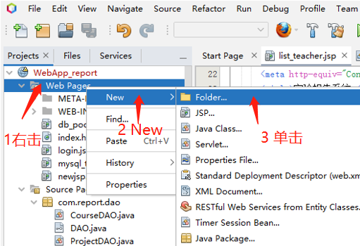
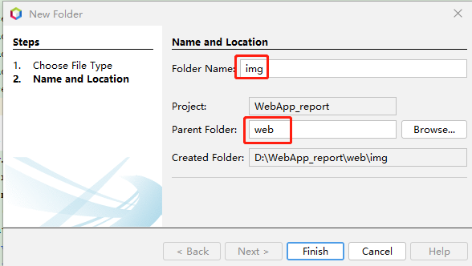
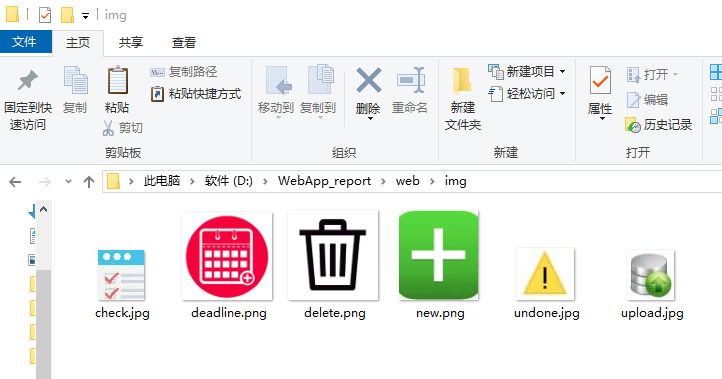
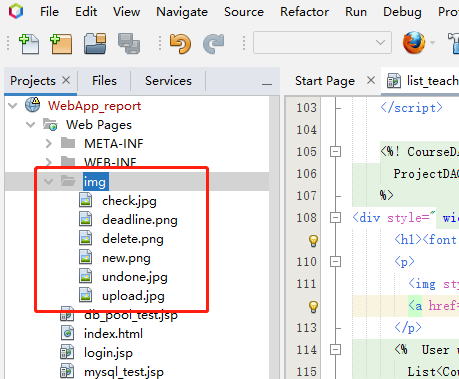
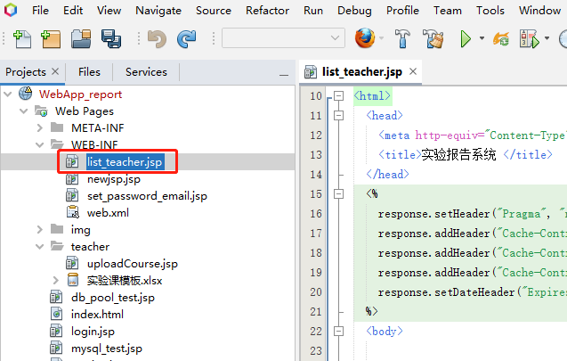
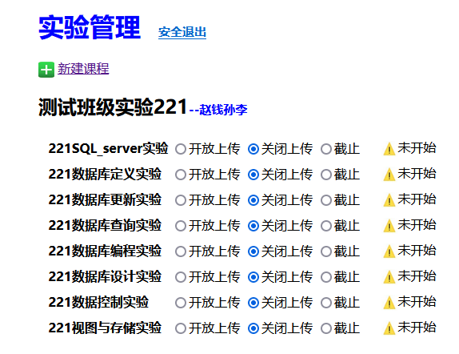

继续编辑“教师界面”，显示课程信息，新建文件夹img




准备图标，





打开“教师界面”JSP程序“list_teacher.jsp”


```java {wrap}
<%-- 
    Document   : list_teacher
    Author     : cyl
--%>

<%@page import="com.report.javabeans.Course"%>
<%@page import="com.report.javabeans.Project"%>
<%@page import="com.report.dao.ProjectDAO"%>
<%@page import="com.report.javabeans.User"%>
<%@page import="com.report.dao.CourseDAO"%>
<%@page import="java.util.ArrayList"%>
<%@page import="java.io.File"%>
<%@page import="java.util.List"%>
<%@page import="java.net.URLEncoder"%>
<%@page import="java.util.Map"%>
<%@page contentType="text/html" pageEncoding="UTF-8"%>
<!DOCTYPE html>
<html>
  <head>
    <meta http-equiv="Content-Type" content="text/html; charset=UTF-8">
    <title>实验报告系统 </title>
  </head>
  <%
    response.setHeader("Pragma", "no-cache");
    response.addHeader("Cache-Control", "must-revalidate");
    response.addHeader("Cache-Control", "no-cache");
    response.addHeader("Cache-Control", "no-store");
    response.setDateHeader("Expires", 0);
  %>
  <body>  
    <script>
      window.onload = function () {
        var ratios = document.getElementsByTagName("input");//获取所有input（本页面的input只有单选按钮）
        var map = new Map();//记录单选按钮旧值
        for (var i = 0; i < ratios.length; i++) {
          map.set((i + 1).toString(), ratios[i].checked);
          //oninput事件在input的值发生改变时触发，这里监听单选按钮值得改变
          ratios[i].oninput = function () {
          var r = false;
            if (this.value === "deadline") {//是否选择截止
              //是否确认修改
              r = confirm("截止后不可再设置，确定截止？");
            }
            //取消截止
            if (this.value === "deadline" && r === false) {
              var list = document.getElementsByName(this.name);
              for (var j = 0; j < list.length; j++)
              list[j].checked = map.get(list[j].id);
              return;
            }
            ratioName = this.name;
            //确定截止，不允许再更改状态
            if (this.value === "deadline") {
              var list = document.getElementsByName(this.name);
              for (var j = 0; j < list.length; j++)
              {list[j].disabled = "disable";
               map.set(list[j].id,list[j].checked);}
            }
            else{
              var list = document.getElementsByName(this.name);
              for (var j = 0; j < list.length; j++)
               map.set(list[j].id,false);          
               map.set(this.id,this.checked);
            } 
            var formData = new FormData();//FormData 对象
            var course = ratioName.substr(0, ratioName.indexOf("-"));
            var project = ratioName.substr(ratioName.indexOf("-") + 1, ratioName.length - 1);
            //添加KV
            formData.append("project", project);//项目
            formData.append("course", course); //课程名
            formData.append("status", this.value);//状态
            var cell = document.getElementById(this.name);
           //显示实验项目状态提示信息
            cell.innerHTML = "&nbsp;&nbsp;&nbsp;&nbsp;&nbsp;";
            if (this.value === "open")
              cell.innerHTML += "已经开放";
            if (this.value === "close")
              cell.innerHTML += "未开始";
            if (this.value === "deadline")
              cell.innerHTML += "已截止";
            //1.创建请求对象
            const xhr = new XMLHttpRequest();
            //2.设置请求行，这里用post(get请求数据写在url后面)
            //updateProject.do实现后端更新
            xhr.open("post", "/WebApp_report/updateProject.do");
            //3.设置请求头(get请求可以省略,post不发送数据也可以省略)
            //xhr.setRequestHeader("Content-type","application/x-www-form-urlencoded");
            // 这里使用 formData可以不写请求头，写了无法正常上传文件           
            //4.请求主体发送(get请求为空，或者写null，post请求数据写在这里，如果没有数据，直接为空或者写null)
            xhr.send(formData);
            //注册回调函数
            xhr.onload = function ()
            {
              if (xhr.readyState === 4)
              {
                if (xhr.status >= 200 && xhr.status <= 300)
                 { //判断响应码 2XX 表示成功                           
                    console.log(xhr.response.toString());                 
                  }
                 else
                  console.log("响应码：" + xhr.status); //状态码
              };
            };
          };
        };
      };
    </script>

    <%! CourseDAO courseDAO = new CourseDAO();
      ProjectDAO projectDAO = new ProjectDAO();
    %>
    <div style=" width: 800px;height:800px;position: absolute;top: 10%;left: 30%;">
      <h1><font color="blue"> 实验管理</font><font style="font-size:15px;color:red">&nbsp;&nbsp;&nbsp;&nbsp; <a href="exit">安全退出</a></font></h1>  
      <p>
                        
        <a href="teacher/uploadCourse.jsp"> 新建课程 </a>
      </p>   
      <%  User user = (User) session.getAttribute("user");
        //获取任教课程列表list
        List<Course> list = courseDAO.getCoursesList(user.getUsername());
        //遍历课程list,显示每个课程
        int id = 0;//单选按钮id
        for (int i = 0; i < list.size(); i++) {
      %>
      <h2> <%=list.get(i).getCourseID()%><font style="font-size:15px;color:blue">--${sessionScope.user.fullName}</font></h2>
      <p>                          
        <%//获取课程项目列表
          List<Project> listprj = projectDAO.getAllProjects(list.get(i).getCourseID());%>
      <table>  
        <%//遍历项目
          for (int j = 0; j < listprj.size(); j++) {
            String radioName = listprj.get(j).getCourseID() + "-" + listprj.get(j).getProjectID();
        %>
        <tr style=" height: 30px;border: 1px">
          <td>&nbsp;&nbsp;<b><%=listprj.get(j).getProjectID()%></b></td>
          <td><!-- 3.一组单选按钮 radio（同name），只能选一个
                   request.getParameter("***")-->
            <%
              if (listprj.get(j).getProjectOpen() == 0) {//单选按钮选中 关闭上传
                id++;
                out.println("<input type=\"radio\" id=\"" + id + "\" name=\"" + radioName + "\" value=\"open\">开放上传");
                id++;
                out.println("<input type=\"radio\"id=\"" + id + "\" name=\"" + radioName + "\" value=\"close\" checked=\"true\">关闭上传");
                id++;
                out.println("<input type=\"radio\" id=\"" + id + "\" name=\"" + radioName + "\" value=\"deadline\">截止");
              }
              if (listprj.get(j).getProjectOpen() == 1) {//单选按钮选中 开放上传
                id++;
                out.println("<input type=\"radio\" id=\"" + id + "\" name=\"" + radioName + "\" value=\"open\" checked=\"true\">开放上传");
                id++;
                out.println("<input type=\"radio\" id=\"" + id + "\" name=\"" + radioName + "\" value=\"close\">关闭上传");
                id++;
                out.println("<input type=\"radio\" id=\"" + id + "\" name=\"" + radioName + "\" value=\"deadline\">截止");
              }
              if (listprj.get(j).getProjectOpen() == 2) {//单选按钮选中 截止
                id++;
                out.println("<input type=\"radio\" id=\"" + id + "\" name=\"" + radioName + "\" value=\"open\" disabled=\"disable\">开放上传");
                id++;
                out.println("<input type=\"radio\" id=\"" + id + "\" name=\"" + radioName + "\" value=\"close\" disabled=\"disable\">关闭上传");
                id++;
                out.println("<input type=\"radio\" id=\"" + id + "\" name=\"" + radioName + "\" value=\"deadline\" checked=\"true\">截止");
              }
            %>
          </td>
          <td id="<%=radioName%>">&nbsp;&nbsp;&nbsp;&nbsp;
            <%if (listprj.get(j).getProjectOpen() == 0) 
              if (listprj.get(j).getProjectOpen() == 1) 
              if (listprj.get(j).getProjectOpen() == 2) %>
          </td>
        </tr>
        <%}//end 遍历项目%>
      </table>      
      <% }//end 遍历课程%>
    </div>  
  </body>
</html>
```

现在教师登录后可以显示课程信息，


实验项目状态前端更界面已经完成，但只是前端操作，后端数并没有更新。
代码85行“/WebApp_report/updateProject.do”后端更新功能的实现待续...
