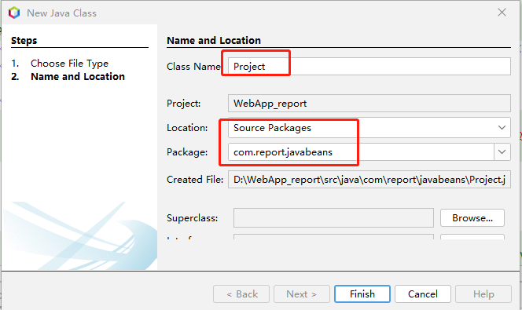
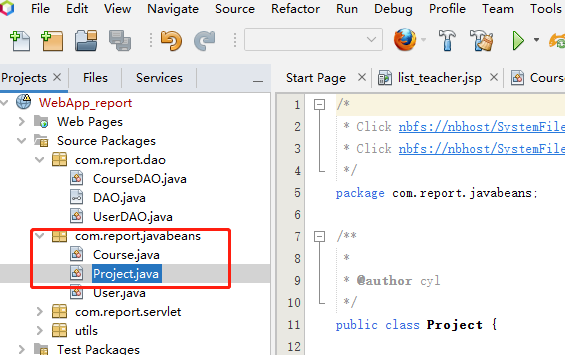
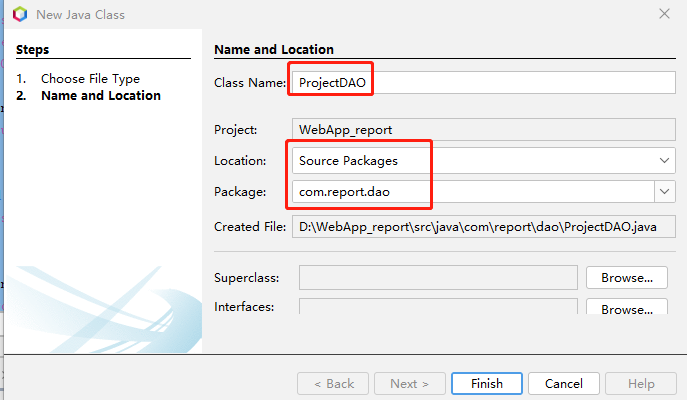
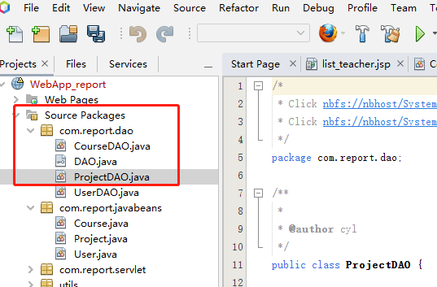
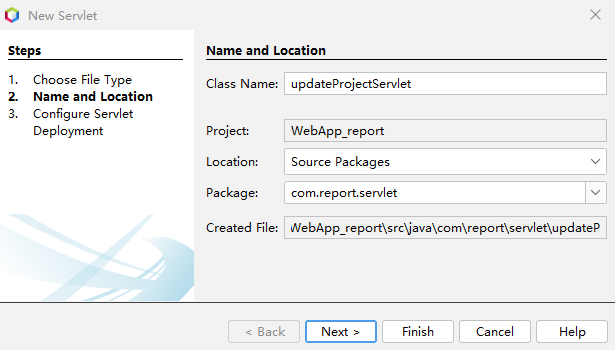
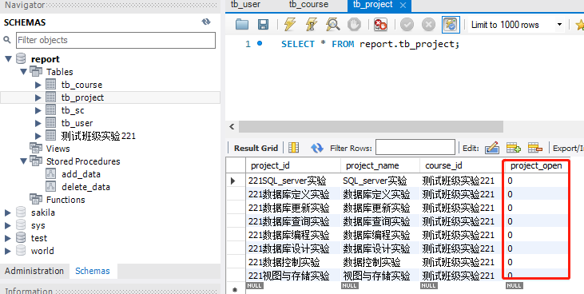
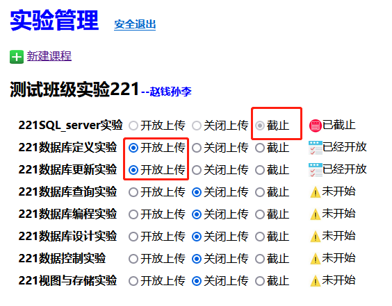
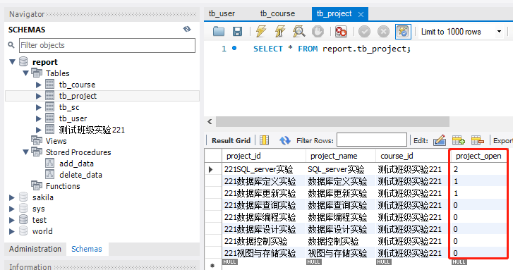

# 一  项目实体类 Project
新建类“Project”




编辑代码
```java
package com.report.javabeans;

public class Project {

  String courseID = null;
  String projectID = null;
  int projectOpen;

  public String getCourseID() {
    return courseID;
  }

  public void setCourseID(String courseID) {
    this.courseID = courseID;
  }

  public String getProjectID() {
    return projectID;
  }

  public void setProjectID(String projectID) {
    this.projectID = projectID;
  }

  public int getProjectOpen() {
    return projectOpen;
  }

  public void setProjectOpen(int projectOpen) {
    this.projectOpen = projectOpen;
  }
}
```

# 二  ProjectDAO
新建类ProjectDAO




编辑代码，
```java {wrap}
package com.report.dao;

import com.report.javabeans.Project;
import java.sql.Connection;
import java.sql.PreparedStatement;
import java.sql.ResultSet;
import java.sql.SQLException;
import java.util.ArrayList;
import java.util.List;
import utils.LoggerUtil;

/**
 *
 * @author cyl
 */
public class ProjectDAO implements DAO {

  /**
   * 获取开放上传的实验项目
   *
   * @param CourseID
   * @param status 0,1,2
   * @return List String
   */
  public List<Project> getProjects(String CourseID, int status) {
    String sql = "SELECT project_id,project_name,project_open FROM tb_Project where course_id=? and project_open=?";
    try ( Connection conn = getConnection();  PreparedStatement pstmt = conn.prepareStatement(sql)) {
      pstmt.setString(1, CourseID);
      pstmt.setInt(2, status);
      try ( ResultSet rst = pstmt.executeQuery()) {
        List<Project> list = new ArrayList<>();
        while (rst.next()) {
          Project project = new Project();
          project.setCourseID(CourseID);
          project.setProjectID(rst.getString(1));
          project.setProjectName(rst.getString(2));
          project.setProjectOpen(rst.getInt(3));
          list.add(project);
        }
        conn.close();
        return list;
      }
    } catch (SQLException se) {
      System.out.println(se);
      return null;
    }
  }

  /**
   * 获取课程实验项目
   *
   * @param CourseID
   * @return List Project
   */
  public List<Project> getAllProjects(String CourseID) {
    String sql = "SELECT project_id,project_name,project_open FROM tb_Project where course_id=?";
    try ( Connection conn = getConnection();  PreparedStatement pstmt = conn.prepareStatement(sql)) {
      pstmt.setString(1, CourseID);
      try ( ResultSet rst = pstmt.executeQuery()) {
        List<Project> list = new ArrayList<>();
        while (rst.next()) {
          Project project = new Project();
          project.setCourseID(CourseID);
          project.setProjectID(rst.getString("project_id"));
          project.setProjectName(rst.getString("project_name"));
          project.setProjectOpen(rst.getInt("project_open"));
          list.add(project);
        }
        conn.close();
        return list;
      }
    } catch (SQLException se) {
      System.out.println(se);
      return null;
    }
  }

  public String updateProject(String courseID, String projectID, String status) {
    Connection conn = getConnection();
    String sql = "UPDATE tb_Project set project_open=?  where course_id=? and project_id=?";
    try {
      PreparedStatement pstmt = conn.prepareStatement(sql);
      pstmt.setString(3, projectID);
      pstmt.setString(2, courseID);
      if (status.equals("open")) {
        pstmt.setInt(1, 1);
      }
      if (status.equals("close")) {
        pstmt.setInt(1, 0);
      }
      if (status.equals("deadline")) {
        pstmt.setInt(1, 2);
      }
      System.out.println(pstmt.executeUpdate());
      System.out.println(sql);

    } catch (SQLException sqle) {
      System.out.println(sqle);
      return "修改失败！";
    }
    try {
      conn.close();
    } catch (SQLException ex) {
      System.out.println(ex.toString());
    }
    String message = courseID + "-" + projectID + ":" + status + ":更新项目信息！";
    LoggerUtil.logger.warning(message);
    return "修改成功";
  }
}

```

# 三 更新项目状态的Servlet
新建Servlet程序“updateProjectServlet”


编辑代码
```java
package com.report.servlet;

import com.report.dao.ProjectDAO;
import java.io.IOException;
import java.io.PrintWriter;
import javax.servlet.ServletException;
import javax.servlet.annotation.MultipartConfig;
import javax.servlet.annotation.WebServlet;
import javax.servlet.http.HttpServlet;
import javax.servlet.http.HttpServletRequest;
import javax.servlet.http.HttpServletResponse;

/**
 *
 * @author cyl
 */
@WebServlet(name = "updatProjectServlet", urlPatterns = {"/updateProject.do"})
@MultipartConfig//
public class updateProjectServlet extends HttpServlet {

  /**
   * Processes requests for both HTTP <code>GET</code> and <code>POST</code> methods.
   *
   * @param request servlet request
   * @param response servlet response
   * @throws ServletException if a servlet-specific error occurs
   * @throws IOException if an I/O error occurs
   */
  protected void processRequest(HttpServletRequest request, HttpServletResponse response)
          throws ServletException, IOException {
    response.setContentType("text/html;charset=UTF-8");
    request.setCharacterEncoding("utf-8");
    System.out.println("in update!");
    try ( PrintWriter out = response.getWriter()) {
      ProjectDAO projecDAO = new ProjectDAO();
      String courseID = request.getParameter("course");
      String projectID = request.getParameter("project");
      String status = request.getParameter("status");
      System.out.println(courseID);
      System.out.println(projectID);
      System.out.println(status);
      String message;
      message = projecDAO.updateProject(courseID, projectID, status);
      out.println(message);
    }
  }

  // <editor-fold defaultstate="collapsed" desc="HttpServlet methods. Click on the + sign on the left to edit the code.">
  /**
   * Handles the HTTP <code>GET</code> method.
   *
   * @param request servlet request
   * @param response servlet response
   * @throws ServletException if a servlet-specific error occurs
   * @throws IOException if an I/O error occurs
   */
  @Override
  protected void doGet(HttpServletRequest request, HttpServletResponse response)
          throws ServletException, IOException {
    processRequest(request, response);
  }

  /**
   * Handles the HTTP <code>POST</code> method.
   *
   * @param request servlet request
   * @param response servlet response
   * @throws ServletException if a servlet-specific error occurs
   * @throws IOException if an I/O error occurs
   */
  @Override
  protected void doPost(HttpServletRequest request, HttpServletResponse response)
          throws ServletException, IOException {
    processRequest(request, response);
  }
}
```

查看表“tb_project”,


运行项目，现在教师登录后显示课程信息，


现在设置项目状态，


打开MySQL Workbench,重新查询表“tb_project”，表已经更新，



