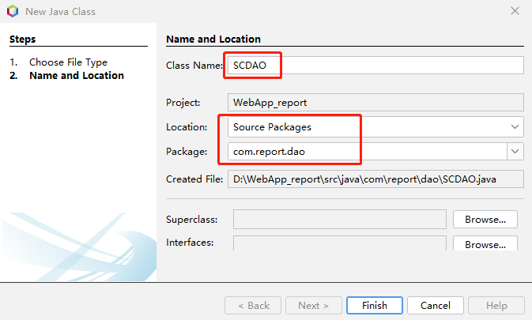
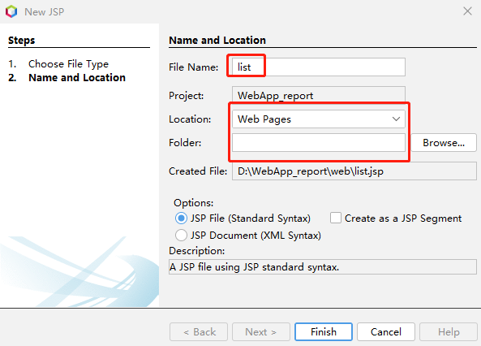
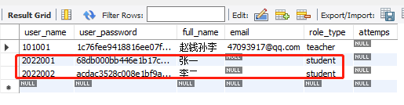
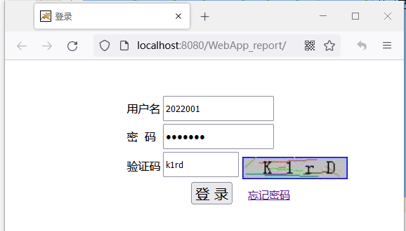
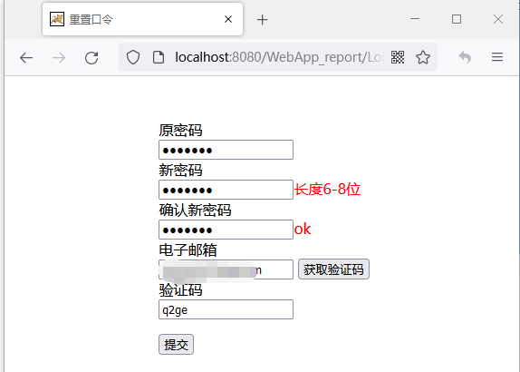

新建l类“SCDAO”


，编辑代码，SCDAO实现DAO
```java
package com.report.dao;

import java.sql.Connection;
import java.sql.PreparedStatement;
import java.sql.ResultSet;
import java.sql.SQLException;
import java.util.ArrayList;
import java.util.List;

/**
 *
 * @author cyl
 */
public class SCDAO implements DAO {

  /**
   * 获取选课列表
   *
   * @param SNO
   * @return 选课列表
   */
  public List<String> getCourses(String SNO) {
    String sql = "SELECT course_id FROM tb_SC where SNO=?";
    //User user = new User(); Connection conn = getConnection();        
    try ( Connection conn = getConnection();  PreparedStatement pstmt = conn.prepareStatement(sql)) {
      pstmt.setString(1, SNO);
      ResultSet rst = pstmt.executeQuery();
      List<String> list = new ArrayList<>();
      while (rst.next()) {
        list.add(rst.getString(1));
      }
      conn.close();
      return list;
    } catch (SQLException se) {
      System.out.println(se);
      return null;
    }
  }
}
```


新建学生界面JSP程序“list.jsp”


编辑代码
```java {wrap}
<%-- 
    Document   : list
    Author     : cyl
--%>
<%@page import="org.apache.jasper.JasperException"%>
<%@page import="com.report.dao.ClassDAO"%>
<%@page import="com.report.javabeans.Project"%>
<%@page import="com.report.javabeans.User"%>
<%@page import="com.report.dao.ProjectDAO"%>
<%@page import="com.report.dao.SCDAO"%>
<%@page import="java.io.File"%>
<%@page import="java.util.ArrayList"%>
<%@page import="java.util.List"%>
<%@page import="java.net.URLEncoder"%>
<%@page import="java.util.Map"%>
<%@page contentType="text/html" pageEncoding="UTF-8"%>
<html>
  <head>
    <meta http-equiv="Content-Type" content="text/html; charset=UTF-8">
    <title>实验项目列表</title>
  </head>
  <body>
    <style>
      .progress {
        width: 200px;
        height: 20px;
        border: 0px solid hotpink;
        border-radius: 20px;
        overflow: hidden;
      }
      .step {
        height: 100%;
        width: 0;
        background: greenyellow;
      }
    </style>
    <%  SCDAO scDAO = new SCDAO();
      ProjectDAO projectDAO = new ProjectDAO();

    %>
    <div style=" width: 800px;height:800px;position:absolute;top:5%;left:30%;">
      <h1 style="padding-left:100px"><font color='blue'>实验报告上传</font>  <font color='black'></h1>  
        <%  User user = (User) session.getAttribute("user");
          if (user == null) {
            response.sendRedirect("login.jsp");
          }
          List<String> list= scDAO.getCourses(user.getUsername());         
          List<Project> listall = new ArrayList<>();
          // System.out.println(session.getAttribute("user").toString());
          //遍历课程list
          for (int i = 0; i < list.size(); i++) {
            String coursei = "course" + i;
        %>
      <div id="${coursei}"><h2><div id="${list.get(i)}"><%=list.get(i)%></div></h2>
            <%List<Project> listprj = projectDAO.getProjects(list.get(i), 1);
              for (int j = 0; j < listprj.size(); j++) {//遍历项目list
                //所有项目写入session                    
                listall.add(listprj.get(j));
                ClassDAO classdao = new ClassDAO();
                String filepath = classdao.getFilePath(list.get(i), listprj.get(j).getProjectName(), user.getUsername());
                //System.out.println("filepath->" + filepath);
                String fileName = null;
                if (filepath != null) {
                  fileName = filepath.substring(filepath.lastIndexOf(File.separator) + 1);
                }
                System.out.println("filename->" + fileName);
                String projectij = "project" + i + j;
                String fileid = "file" + i + j;
                String btnid = "btn" + i + j;
            %> 
        <div id="<%=projectij%>">
          <b><div id="prj" style="height:40px;width:150px;display:inline-block;padding-left:15px"><%=listprj.get(j).getProjectName()%></div></b>
          <div style="display:inline-block;padding-left:10px" id="<%=j%>">
            <div id="result" style="width:100px;display:inline-block;"><%if (fileName == null)  else %></div>
            &nbsp;&nbsp;<input type="file" id="<%=fileid%>"  style="width:140px;" onchange="fileChange(this);"/>
            <input type="button" id="<%=btnid%>" value="上传" onclick="upload(this.id)"/> 
            <div id="progress" class='progress' style="display:inline-block;"><div style=" text-align: center" id="step" class="step"></div></div>                  
          </div>                   
        </div>    
        <% }%>
      </div><p> 
        <% session.setAttribute("listall", listall);
          }%> 
        </dxv>         
        <script>
          var isIE = /msie/i.test(navigator.userAgent) && !window.opera;
          function fileChange(target) {
            var fileSize = 0;
            var filetypes = [".pdf"];
            var filepath = target.value;
            var filemaxsize = 1024 * 8;//8M
            if (filepath) {
              var isnext = false;
              var fileend = filepath.substring(filepath.lastIndexOf("."));
              if (filetypes && filetypes.length > 0) {
                for (var i = 0; i < filetypes.length; i++) {
                  if (filetypes[i] === fileend) {
                    isnext = true;
                    break;
                  }
                }
              }
              if (!isnext) {
                alert("不接受此文件类型！");
                target.value = "";
                return false;
              }
            } else {
              return false;
            }
            if (isIE && !target.files) {
              var filePath = target.value;
              var fileSystem = new ActiveXObject("Scripting.FileSystemObject");
              if (!fileSystem.FileExists(filePath)) {
                alert("附件不存在，请重新输入！");
                return false;
              }
              var file = fileSystem.GetFile(filePath);
              fileSize = file.Size;
            } else {
              fileSize = target.files[0].size;
            }
            var size = fileSize / 1024;
            if (size > filemaxsize) {
              alert("附件大小不能大于" + filemaxsize / 1024 + "M！");
              target.value = "";
              return false;
            }
            if (size <= 0) {
              alert("附件大小不能为0M！");
              target.value = "";
              return false;
            }
          }
          function Check()
          {
            for (var i = 0; i < document.form1.elements.length - 1; i++)
            {
              if (document.form1.elements[i].value === "")
              {
                alert("不可空！");
                document.form1.elements[i].focus();
                return false;
              }
            }
            return true;
          }
          
          function getAppPath() {
            //获取当前URL
            var curURL = window.document.location.href;
            //获取主机地址之后的路径部分（就是文件地址）
            var pathName = window.document.location.pathname;
            var pos = curURL.indexOf(pathName);
            //获取应用地址   
            var host = curURL.substring(0, pos);
            //获取带"/"的应用名，如：/***
            var webAppName = pathName.substring(0, pathName.substr(1).indexOf('/') + 1);
            return host + webAppName;
          }

          function getFile(id) {
            var prj = id.parentElement.parentElement.parentElement;
            var courseID = prj.parentElement.getElementsByTagName("div")[0].innerHTML.toString();
            var projectID = prj.getElementsByTagName("div")[0].innerHTML.toString();
            const durl = getAppPath() + "/browsePDF.do?projectID=" + projectID + "&&courseID=" + courseID;
            //browsePDF.do 后端传送实验报告
            window.open(durl);
          }
          function upload(id) {
            var s;
            s = document.getElementById(id).parentElement.id;
            var prj = document.getElementById(s).parentElement;
            const courseID = prj.parentElement.getElementsByTagName("div")[0].innerHTML.toString();
            const projectID = prj.getElementsByTagName("div")[0].innerHTML.toString();
            //alert(courseID);
            //alert(projectID);
            //return;
            //var course = prj.parentElement.getElementsByTagName("div")[0].innerHTML;
            const fileid = document.getElementById(s).getElementsByTagName("input")[0];
            var uploadFile;
            const result = document.getElementById(s).getElementsByTagName("div")[0];
            const btn = document.getElementById(s).getElementsByTagName("input")[1];
            const step = document.getElementById(s).getElementsByTagName("div")[2];
            if (fileid.value === "")
            {
              alert("文件不可空！");
              fileid.focus();
              return false;
            }
            var files = fileid.files;
            if (files.length === 0) {
              return;
            }
            uploadFile = files[0];
            var formData = new FormData();
            formData.append("projectID", projectID);//项目名
            formData.append("courseID", courseID);//课程名
            formData.append("file", uploadFile); // 后端通过 'file' 获取
            //1.创建请求对象
            const xhr = new XMLHttpRequest();
            //2.设置请求行(get请求数据写在url后面)
            xhr.open("post", "/WebApp_report/upload.do");
            //upload.do 后端处理上传文件
            //3.设置请求头(get请求可以省略,post不发送数据也可以省略)
            // 如果使用 formData可以不写 请求头 写了 无法正常上传文件
            //  xhr.setRequestHeader("Content-type","application/x-www-form-urlencoded");
            //4.请求主体发送(get请求为空，或者写null，post请求数据写在这里，如果没有数据，直接为空或者写null)
            xhr.send(formData);
            //注册回调函数
            xhr.onload = function () {
              console.log(xhr.responseText);
              if (xhr.readyState === 4) {
                //判断响应码 2XX 表示成功
                if (xhr.status >= 200 && xhr.status <= 300) {
                  //处理结果    
                  // console.log("test Post");//状态码
                  //设置 result 显示的文本内容
                  fileid.value = "";
                  if (xhr.response.toString() === "文件上传成功！") {
                    var fileName = "${user.username}-${user.fullName}-";
                    fileName += prj.getElementsByTagName("div")[0].innerHTML.toString();
                    result.innerHTML = "<a href='#'id='" + new Date().getTime() + "' onclick='getFile(this)'>" + "检查上传</a>";
                    step.innerHTML = "100%";
                  } else
                    step.innerHTML = xhr.response;
                }
              }
            };
            // XHR2.0新增 上传进度监控
            xhr.upload.onprogress = function (event) {
              var percent = event.loaded / event.total * 100 + '%';
              //console.log(percent);
              // 设置 进度条内部step的 宽度
              step.style.width = percent;
              //console.log(step.id);
            };
          }
        </script>    
      <p><a href="exitServlet">退出</a></font>   
        </body>
        </html>
```

运行项目，使用学生用户登录，用户名和密码相同，





修改密码，使用邮箱获取验证码，


提交后显示学生界面，


实验报告上传功能和浏览上传文件功能待续...

