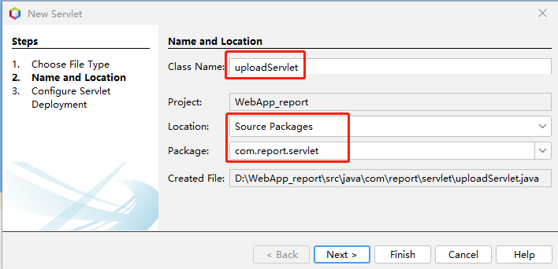
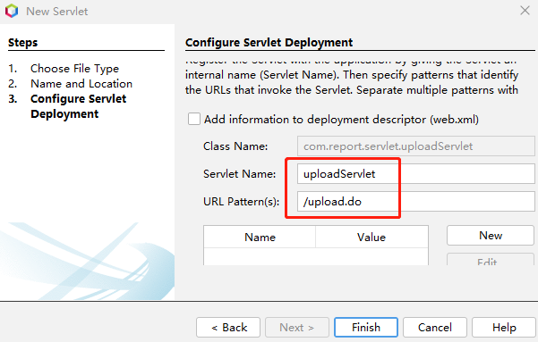
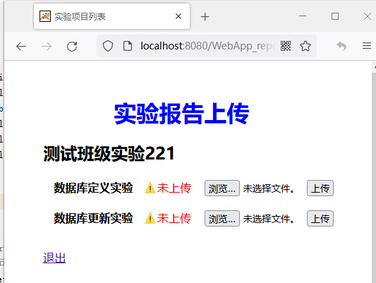
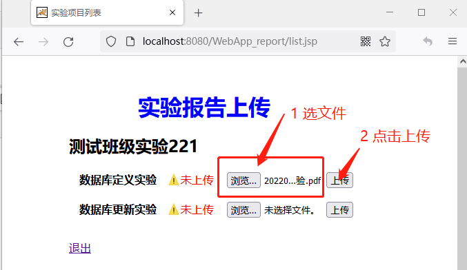
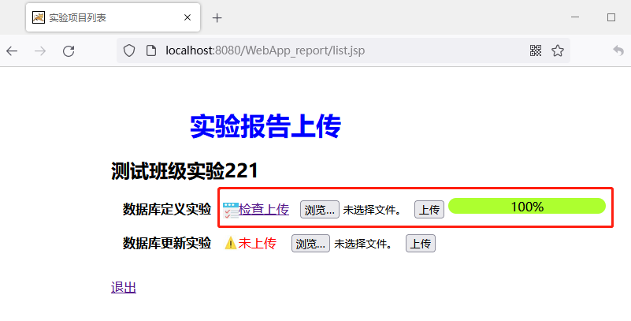

新建后端处理上传文件的Servlet程序“uploadServlet”，




编辑代码，
```java
package com.report.servlet;

import com.report.dao.ClassDAO;
import com.report.javabeans.Project;
import com.report.javabeans.User;
import java.io.File;
import java.io.IOException;
import java.io.PrintWriter;
import java.util.List;
import javax.servlet.ServletException;
import javax.servlet.annotation.MultipartConfig;
import javax.servlet.annotation.WebServlet;
import javax.servlet.http.HttpServlet;
import javax.servlet.http.HttpServletRequest;
import javax.servlet.http.HttpServletResponse;
import javax.servlet.http.Part;
import utils.LoggerUtil;
import utils.PropertiesUtil;

/**
 *
 * @author cyl
 */
@WebServlet(name = "uploadServlet", urlPatterns = {"/upload.do"})
@MultipartConfig
public class uploadServlet extends HttpServlet {

  private static final long serialVersionUID = 1L;

  @Override
  public void doGet(HttpServletRequest request, HttpServletResponse response) throws ServletException, IOException {
    doPost(request, response);
  }

  @Override
  public void doPost(HttpServletRequest request, HttpServletResponse response) throws ServletException, IOException {
    //Properties property=new Properties();        
    //property=property.load(in);
    response.setContentType("text/html;charset=utf-8");
    request.setCharacterEncoding("utf-8");
    User user = (User) request.getSession().getAttribute("user");
    List<Project> listall = (List<Project>) request.getSession().getAttribute("listall");
    boolean flag = false;
    for (Project prj : listall) {
      if (prj.getProjectName().equals(request.getParameter("projectID"))) {
        flag = true;
        //System.out.println("in prjList.");
      }
    }
    //检查是否下载关闭的项目
    if (!flag) {
      String log_str = "上传关闭的项目" + request.getParameter("projectID") + user.getFullName() + user.getUsername();
      LoggerUtil.logger.warning(log_str);
      // response.sendRedirect("error.jsp");
      request.setAttribute("message", "上传关闭的项目");
      request.getRequestDispatcher("/WEB-INF/error.jsp").forward(request, response);
    }
   
    try ( PrintWriter out = response.getWriter()) {
      String message;
      Part part = request.getPart("file"); // 获取文件                
      String fileName = part.getSubmittedFileName();   // 得到文件名\
      int start = fileName.lastIndexOf(".") + 1;
      String type = fileName.substring(start).replace(".", "");
      if (!type.equals("pdf")) {
        message = "文件类型错误，必须是PDF文件！";
        out.print(message);
        out.flush();
        out.close();
        return;
      }
      String saveName = user.getUsername() + "-" + user.getFullName() + "-" + request.getParameter("projectID") + ".pdf";
      //System.out.println(saveName);
      // 文件存放路径
      String savePath;
      if (System.getProperties().getProperty("os.name").startsWith("Windows")) {
        savePath = PropertiesUtil.pro.getProperty("Win_path");
      } else {
        savePath = PropertiesUtil.pro.getProperty("Linux_path");
      }
      savePath = savePath + File.separator + request.getParameter("courseID");
      savePath = savePath + File.separator + request.getParameter("projectID");
      //目录不存在则新建
      File dir = new File(savePath);
      if (!dir.exists()) {
        dir.mkdirs();
        //System.out.println("build->" + savePath);
      }
      savePath = savePath + File.separator + saveName;
      // 写入磁盘
      part.write(savePath);
      File f = new File(savePath);
      if (f.exists()) {
        ClassDAO classdao = new ClassDAO();
        classdao.setFilePath(request.getParameter("courseID"), request.getParameter("projectID"), user.getUsername(), savePath);
        message = "文件上传成功！";
      } else {
        message = "文件上传失败,请重试！";
      }
      out.print(message);
      out.flush();
    }
  }
}

```

打开文件上传界面


选择实验报告并上上传，


上传成功


学生查看上传的实验报告功能待续...

