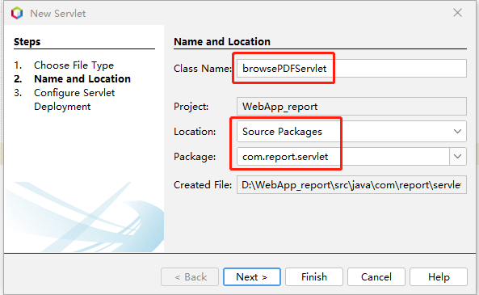
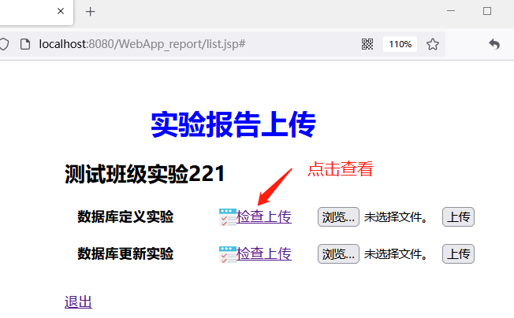

新建下载实验报告的Servlet程序“browsePDFServlet”，


编辑代码
```java
package com.report.servlet;

import com.report.dao.ClassDAO;
import com.report.javabeans.Project;
import com.report.javabeans.User;
import java.io.DataInputStream;
import java.io.DataOutputStream;
import java.io.File;
import java.io.FileInputStream;
import java.io.IOException;
import java.io.PrintWriter;
import java.util.List;
import javax.servlet.ServletException;
import javax.servlet.annotation.WebServlet;
import javax.servlet.http.HttpServlet;
import javax.servlet.http.HttpServletRequest;
import javax.servlet.http.HttpServletResponse;
import utils.LoggerUtil;

/**
 *
 * @author cyl
 */
@WebServlet(name = "browsePDFServlet", urlPatterns = {"/browsePDF.do"})
public class browsePDFServlet extends HttpServlet {

  /**
   * Processes requests for both HTTP <code>GET</code> and <code>POST</code> methods.
   *
   * @param request servlet request
   * @param response servlet response
   * @throws ServletException if a servlet-specific error occurs
   * @throws IOException if an I/O error occurs
   */
  protected void processRequest(HttpServletRequest request, HttpServletResponse response)
          throws ServletException, IOException {
    request.setCharacterEncoding("utf-8");
    String courseID = request.getParameter("courseID");
    String projectID = request.getParameter("projectID");
    User user = (User) request.getSession().getAttribute("user");
    List<Project> listall = (List<Project>) request.getSession().getAttribute("listall");
    boolean flag=false;
    for(Project prj:listall){
    if(prj.getProjectName().equals(request.getParameter("projectID")))
    {flag=true;
      //System.out.println("in prjList.");
    }}
    // System.out.println(listall.contains(projectName));
    //检查是否下载关闭的项目
    //System.out.println(projectName);
    if (!flag) {
      String log_str= "下载关闭的项目" + request.getParameter("projectID") + user.getFullName() + user.getUsername();
      LoggerUtil.logger.warning(log_str);
     // response.sendRedirect("error.jsp");
     request.setAttribute("message", "下载关闭的项目");
     request.getRequestDispatcher("/WEB-INF/error.jsp").forward(request, response);
    }
   
    ClassDAO classdao = new ClassDAO();
    String filepath = classdao.getFilePath(courseID, projectID, user.getUsername());
    File f = new File(filepath);
    if (f.exists()) {
      DataOutputStream os = new DataOutputStream(response.getOutputStream());
      //System.out.println(filepath + "存在");
      DataInputStream is = new DataInputStream(new FileInputStream(f));
      byte[] bytearray = new byte[2048]; //2K buffer
      int bytesread;
      while ((bytesread = is.read(bytearray)) != -1) {
        os.write(bytearray, 0, bytesread);
      }
      os.flush();
      is.close();
    } else {
      System.out.println("文件不存在");
      response.setContentType("text/html;charset=UTF-8");
      try ( PrintWriter out = response.getWriter()) {
        /* TODO output your page here. You may use following sample code. */
        out.println("<!DOCTYPE html>");
        out.println("<html>");
        out.println("<head>");
        out.println("<title>文件不存在</title>");
        out.println("</head>");
        out.println("<body>");
        out.println("<h1>文件不存在！</h1>");
        out.println("</body>");
        out.println("</html>");
      }
    }
  }
 
  @Override
  protected void doGet(HttpServletRequest request, HttpServletResponse response)
          throws ServletException, IOException { 
      processRequest(request, response); 
  }
 
  @Override
  protected void doPost(HttpServletRequest request, HttpServletResponse response)
          throws ServletException, IOException {
       processRequest(request, response);     
  }
 
}

```




