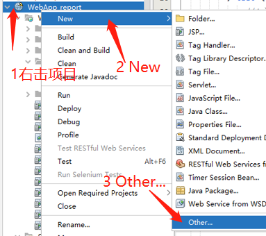
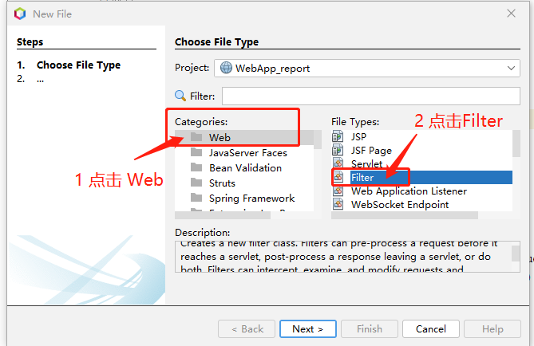
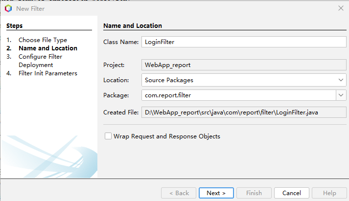
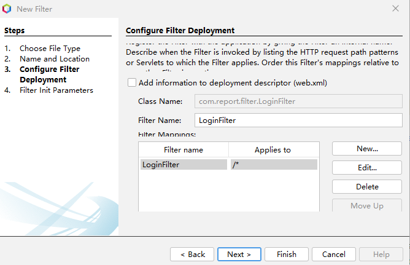
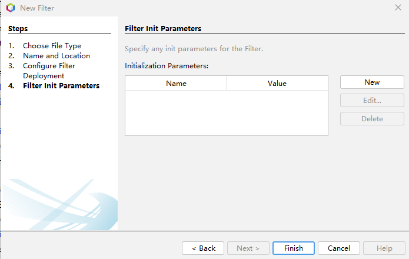

注：过滤器是一个Java类，可以使用Netbean向导建立过滤器，也可以直接使用后面的代码直接创建一个Java类来实现过滤器。项目中使用过滤器实现登录验证。
右击项目选择New ->Other


新建过滤器（Filter）


设置类名和位置


Next


Next


Finish，然后编辑代码
```java
package com.report.filter;

import java.io.IOException;
import javax.servlet.Filter;
import javax.servlet.FilterChain;
import javax.servlet.FilterConfig;
import javax.servlet.ServletException;
import javax.servlet.ServletRequest;
import javax.servlet.ServletResponse;
import javax.servlet.annotation.WebFilter;
import javax.servlet.http.HttpServletRequest;
import javax.servlet.http.HttpServletResponse;
import utils.LoggerUtil;

/**
 *
 * @author cyl
 */
@WebFilter(filterName = "LoginFilter", urlPatterns = {"/*"})
public class LoginFilter implements Filter {

  private static final boolean debug = false;
  // The filter configuration object we are associated with.  If
  // this value is null, this filter instance is not currently
  // configured. 
  private FilterConfig filterConfig = null;

  private void doBeforeProcessing(ServletRequest request, ServletResponse response)
          throws IOException, ServletException {
    if (debug) {
      LoggerUtil.logger.warning("loginFilter:DoBeforeProcessing");
    }
  }

  private void doAfterProcessing(ServletRequest request, ServletResponse response)
          throws IOException, ServletException {
    if (debug) {
      LoggerUtil.logger.warning("loginFilter:DoAfterProcessing");
    }
  }

  /**
   *
   * @param request The servlet request we are processing
   * @param response The servlet response we are creating
   * @param chain The filter chain we are processing
   *
   * @exception IOException if an input/output error occurs
   * @exception ServletException if a servlet error occurs
   */
  public void doFilter(ServletRequest request, ServletResponse response,
          FilterChain chain)
          throws IOException, ServletException {

    if (debug) {
      LoggerUtil.logger.warning("loginFilter:doFilter()");
    }

    doBeforeProcessing(request, response);

    Throwable problem = null;
    try {
      //cyl
      //1.强制转换
      HttpServletRequest req = (HttpServletRequest) request;
      //2.获取请求资源路径
      String requestURI = req.getRequestURI();
      //3.判断是否包含登录相关资源路径,同时排除css,js，图片等
      if (requestURI.contains("/login")
              || requestURI.contains("/LoginServlet")
              || requestURI.contains("/CheckcodeServlet")
              || requestURI.contains("/script/")
              || requestURI.contains("/forgetPass")
              || requestURI.contains("/EmailCheckcodeServlet")
              || requestURI.contains("/forgetPass.do")) {
        //放行
        chain.doFilter(request, response);
      } else {
        //4.判断是否登录
        Object user = req.getSession().getAttribute("user");
        if (user != null) {
          //已登录，放行
          chain.doFilter(request, response);
        } else {
          //未登录，跳转登陆页面
          //request.setAttribute("login_msg","您未登录");
          System.out.println("拦截" + req.getRequestURL());
          String str = "拦截" + request.getRemoteAddr() + req.getRequestURL();
          LoggerUtil.logger.warning(str);
         
           HttpServletResponse res = (HttpServletResponse) response;
           res.sendRedirect("/WebApp_report/login.jsp");          
        }
      }
    } catch (Throwable t) {
      // If an exception is thrown somewhere down the filter chain,
      // we still want to execute our after processing, and then
      // rethrow the problem after that.
      problem = t;
      t.printStackTrace();
    }

    doAfterProcessing(request, response);

    // If there was a problem, we want to rethrow it if it is
    // a known type, otherwise log it.
    if (problem != null) {
      if (problem instanceof ServletException) {
        throw (ServletException) problem;
      }
      if (problem instanceof IOException) {
        throw (IOException) problem;
      }
      LoggerUtil.logger.warning(problem.toString());
    }
  }

  /**
   * Init method for this filter
   */
  public void init(FilterConfig filterConfig) {
    this.filterConfig = filterConfig;
    if (filterConfig != null) {
      if (debug) {
        LoggerUtil.logger.warning("loginFilter:Initializing filter");
      }
    }
  }//
  
    @Override
    public void destroy() {
    }
}
```


