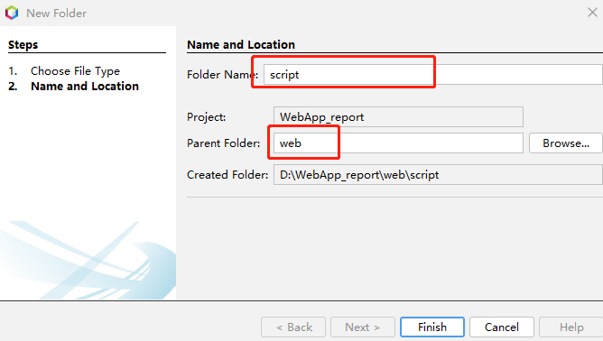
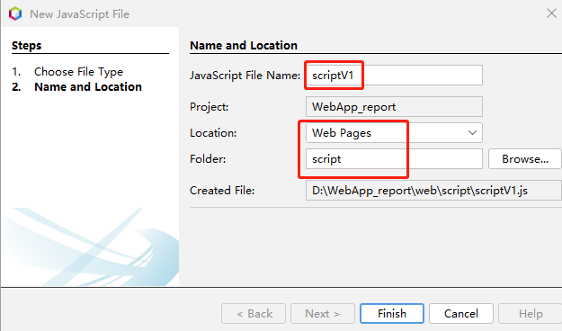
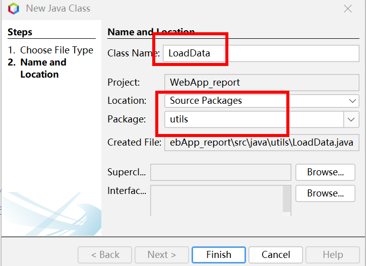
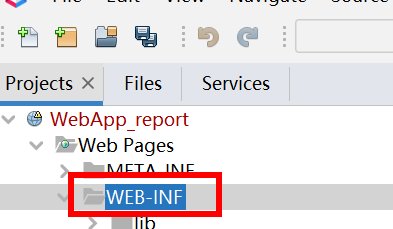
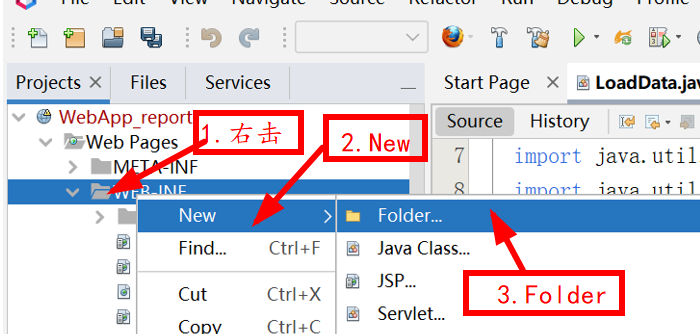
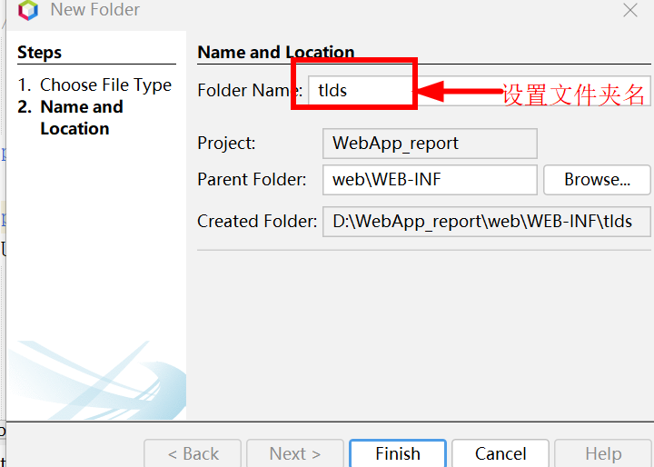
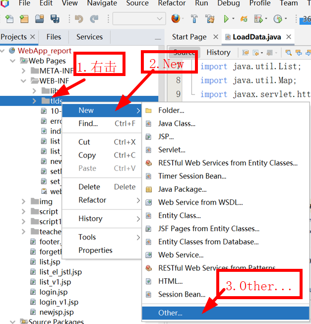
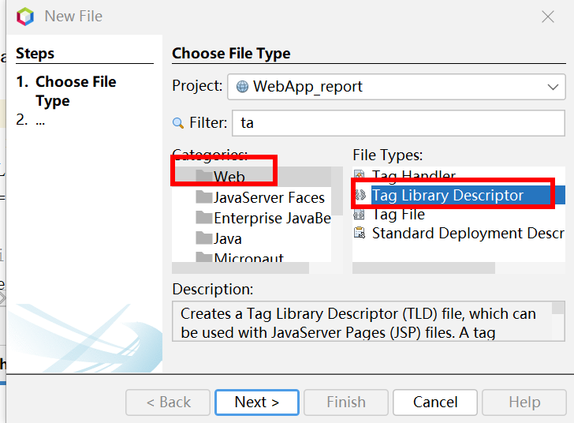
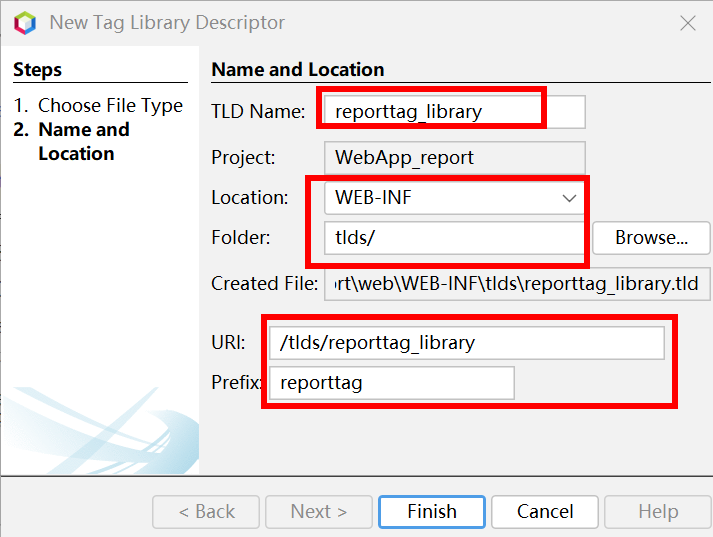
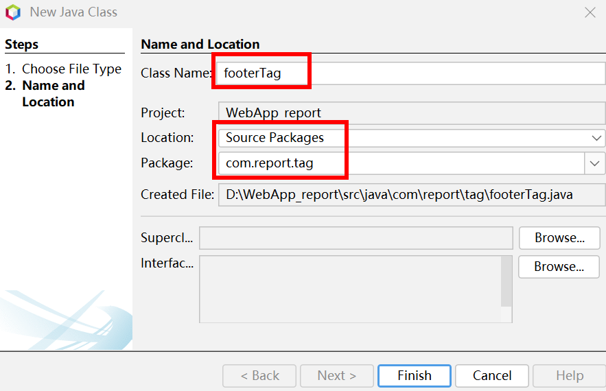

在学生界面list.jsp中，包含太多的Java程序代码（<%...%>），JSP请求是表达式（<%=和%>）和JavaScript代码，结构有点乱。
```java
<%-- 
    Document   : list
    Author     : cyl
--%>
<%@page import="org.apache.jasper.JasperException"%>
<%@page import="com.report.dao.ClassDAO"%>
<%@page import="com.report.javabeans.Project"%>
<%@page import="com.report.javabeans.User"%>
<%@page import="com.report.dao.ProjectDAO"%>
<%@page import="com.report.dao.SCDAO"%>
<%@page import="java.io.File"%>
<%@page import="java.util.ArrayList"%>
<%@page import="java.util.List"%>
<%@page import="java.net.URLEncoder"%>
<%@page import="java.util.Map"%>
<%@page contentType="text/html" pageEncoding="UTF-8"%>
<!DOCTYPE html>
<html>
  <head>
    <meta http-equiv="Content-Type" content="text/html; charset=UTF-8">
    <title>实验项目列表</title>
  </head>
  <body>
    <style>
      .progress {
        width: 200px;
        height: 20px;
        border: 0px solid hotpink;
        border-radius: 20px;
        overflow: hidden;
      }
      .step {
        height: 100%;
        width: 0;
        background: greenyellow;
      }
    </style>
    <%  SCDAO scDAO = new SCDAO();
      ProjectDAO projectDAO = new ProjectDAO();

    %>
    <div style=" width:800px;height:800px;position:absolute;top:5%;left:30%;">
      <h1 style="padding-left:100px"><font color='blue'>实验报告上传</font>  <font color='black'></h1>  
        <%  User user = (User) session.getAttribute("user");
          if (user == null) {
            response.sendRedirect("login.jsp");
          }
          List<String> list= scDAO.getCourses(user.getUsername());         
          List<Project> listall = new ArrayList<>();
          // System.out.println(session.getAttribute("user").toString());
          //遍历课程list
          for (int i = 0; i < list.size(); i++) {
            String coursei = "course" + i;
        %>
      <div id="${coursei}"><h2><div id="${list.get(i)}"><%=list.get(i)%></div></h2>
            <%List<Project> listprj = projectDAO.getProjects(list.get(i), 1);
              for (int j = 0; j < listprj.size(); j++) {//遍历项目list
                //所有项目写入session                    
                listall.add(listprj.get(j));
                ClassDAO classdao = new ClassDAO();
                String filepath = classdao.getFilePath(list.get(i), listprj.get(j).getProjectName(), user.getUsername());
                //System.out.println("filepath->" + filepath);
                String fileName = null;
                if (filepath != null) {
                  fileName = filepath.substring(filepath.lastIndexOf(File.separator) + 1);
                }
                System.out.println("filename->" + fileName);
                String projectij = "project" + i + j;
                String fileid = "file" + i + j;
                String btnid = "btn" + i + j;
            %> 
        <div id="<%=projectij%>">
          <b><div id="prj" style="height:40px;width:150px;display:inline-block;padding-left:15px"><%=listprj.get(j).getProjectName()%></div></b>
          <div style="display:inline-block;padding-left:10px" id="<%=j%>">
            <div id="result" style="width:100px;display:inline-block;"><%if (fileName == null)  else %></div>
            &nbsp;&nbsp;<input type="file" id="<%=fileid%>"  style="width:140px;" onchange="fileChange(this);"/>
            <input type="button" id="<%=btnid%>" value="上传" onclick="upload(this.id)"/> 
            <div id="progress" class='progress' style="display:inline-block;"><div style="text-align:center" id="step" class="step"></div></div>                  
          </div>                   
        </div>    
        <% }%>
      </div><p> 
        <% session.setAttribute("listall", listall);
          }%> 
        </dxv>         
        <script>
          var isIE = /msie/i.test(navigator.userAgent) && !window.opera;
          function fileChange(target) {
            var fileSize = 0;
            var filetypes = [".pdf"];
            var filepath = target.value;
            var filemaxsize = 1024 * 8;//8M
            if (filepath) {
              var isnext = false;
              var fileend = filepath.substring(filepath.lastIndexOf("."));
              if (filetypes && filetypes.length > 0) {
                for (var i = 0; i < filetypes.length; i++) {
                  if (filetypes[i] === fileend) {
                    isnext = true;
                    break;
                  }
                }
              }
              if (!isnext) {
                alert("不接受此文件类型！");
                target.value = "";
                return false;
              }
            } else {
              return false;
            }
            if (isIE && !target.files) {
              var filePath = target.value;
              var fileSystem = new ActiveXObject("Scripting.FileSystemObject");
              if (!fileSystem.FileExists(filePath)) {
                alert("附件不存在，请重新输入！");
                return false;
              }
              var file = fileSystem.GetFile(filePath);
              fileSize = file.Size;
            } else {
              fileSize = target.files[0].size;
            }
            var size = fileSize / 1024;
            if (size > filemaxsize) {
              alert("附件大小不能大于" + filemaxsize / 1024 + "M！");
              target.value = "";
              return false;
            }
            if (size <= 0) {
              alert("附件大小不能为0M！");
              target.value = "";
              return false;
            }
          }
          function Check()
          {
            for (var i = 0; i < document.form1.elements.length - 1; i++)
            {
              if (document.form1.elements[i].value === "")
              {
                alert("不可空！");
                document.form1.elements[i].focus();
                return false;
              }
            }
            return true;
          }
          
          function getAppPath() {
            //获取当前URL
            var curURL = window.document.location.href;
            //获取主机地址之后的路径部分（就是文件地址）
            var pathName = window.document.location.pathname;
            var pos = curURL.indexOf(pathName);
            //获取应用地址   
            var host = curURL.substring(0, pos);
            //获取带"/"的应用名，如：/***
            var webAppName = pathName.substring(0, pathName.substr(1).indexOf('/') + 1);
            return host + webAppName;
          }

          function getFile(id) {
            var prj = id.parentElement.parentElement.parentElement;
            var courseID = prj.parentElement.getElementsByTagName("div")[0].innerHTML.toString();
            var projectID = prj.getElementsByTagName("div")[0].innerHTML.toString();
            const durl = getAppPath() + "/browsePDF.do?projectID=" + projectID + "&&courseID=" + courseID;
            //browsePDF.do 后端传送实验报告
            window.open(durl);
          }
          function upload(id) {
            var s;
            s = document.getElementById(id).parentElement.id;
            var prj = document.getElementById(s).parentElement;
            const courseID = prj.parentElement.getElementsByTagName("div")[0].innerHTML.toString();
            const projectID = prj.getElementsByTagName("div")[0].innerHTML.toString();
            //alert(courseID);
            //alert(projectID);
            //return;
            //var course = prj.parentElement.getElementsByTagName("div")[0].innerHTML;
            const fileid = document.getElementById(s).getElementsByTagName("input")[0];
            var uploadFile;
            const result = document.getElementById(s).getElementsByTagName("div")[0];
            const btn = document.getElementById(s).getElementsByTagName("input")[1];
            const step = document.getElementById(s).getElementsByTagName("div")[2];
            if (fileid.value === "")
            {
              alert("文件不可空！");
              fileid.focus();
              return false;
            }
            var files = fileid.files;
            if (files.length === 0) {
              return;
            }
            uploadFile = files[0];
            var formData = new FormData();
            formData.append("projectID", projectID);//项目名
            formData.append("courseID", courseID);//课程名
            formData.append("file", uploadFile); // 后端通过 'file' 获取
            //1.创建请求对象
            const xhr = new XMLHttpRequest();
            //2.设置请求行(get请求数据写在url后面)
            xhr.open("post", "/WebApp_report/upload.do");
            //upload.do 后端处理上传文件
            //3.设置请求头(get请求可以省略,post不发送数据也可以省略)
            // 如果使用 formData可以不写 请求头 写了 无法正常上传文件
            //  xhr.setRequestHeader("Content-type","application/x-www-form-urlencoded");
            
            // XHR2.0新增 上传进度监控
            xhr.upload.onprogress=
            xhr.upload.onprogress = function (event) {
              var percent = event.loaded / event.total * 100 + '%';
              //console.log(percent);
              // 设置 进度条内部step的 宽度
              step.style.width = percent;
              //console.log(step.id);
            };            
            //4.请求主体发送(get请求为空，或者写null，post请求数据写在这里，如果没有数据，直接为空或者写null)
            xhr.send(formData);            
            //注册回调函数
            xhr.onload = function () {
              console.log(xhr.responseText);
              if (xhr.readyState === 4) {
                //判断响应码 2XX 表示成功
                if (xhr.status >= 200 && xhr.status <= 300) {
                  //处理结果    
                  // console.log("test Post");//状态码
                  //设置 result 显示的文本内容
                  fileid.value = "";
                  if (xhr.response.toString() === "文件上传成功！") {
                    var fileName = "${user.username}-${user.fullName}-";
                    fileName += prj.getElementsByTagName("div")[0].innerHTML.toString();
                    result.innerHTML = "<a href='#'id='" + new Date().getTime() + "' onclick='getFile(this)'>" + "检查上传</a>";
                    step.innerHTML = "100%";
                  } else
                    step.innerHTML = xhr.response;
                }
              }
            };            
          }
        </script>    
      <p><a href="exitServlet">退出</a></font>   
        </body>
        </html>
```

可以先把数据都保存到session中，然后在学生界面中只使用EL表达式和JSTL。
先修改SCDAO.java，增加方法public Map<String, List<Project>> getCourseProject(String SNO)，获取学生选课以及课程开放的项目列表。
```java
package com.report.dao;

import com.report.javabeans.Project;
import java.sql.Connection;
import java.sql.PreparedStatement;
import java.sql.ResultSet;
import java.sql.SQLException;
import java.util.ArrayList;
import java.util.HashMap;
import java.util.List;
import java.util.Map;

/**
 *
 * @author cyl
 */
public class SCDAO implements DAO {

  /**
   * 获取学生选课列表
   *
   * @param SNO
   * @return 选课列表
   */
  public List<String> getCourses(String SNO) {
    String sql = "SELECT course_id FROM tb_SC where SNO=?";
    //User user = new User(); Connection conn = getConnection();        
    try ( Connection conn = getConnection();  PreparedStatement pstmt = conn.prepareStatement(sql)) {
      pstmt.setString(1, SNO);
      ResultSet rst = pstmt.executeQuery();
      List<String> list = new ArrayList<>();
      while (rst.next()) {
        list.add(rst.getString(1));
      }
      conn.close();
      return list;
    } catch (SQLException se) {
      System.out.println(se);
      return null;
    }
  }
/**
 * 获取学生选课以及课程开放的项目列表
 * @param SNO
 * @return 课程及其项目
 */
  public Map<String, List<Project>> getCourseProject(String SNO) {
    String sql = "SELECT course_id FROM tb_SC where SNO=?";
    try ( Connection conn = getConnection();  PreparedStatement pstmt = conn.prepareStatement(sql)) {
      pstmt.setString(1, SNO);
      ResultSet rst = pstmt.executeQuery();
      ProjectDAO projectDAO = new ProjectDAO();
      Map<String, List<Project>> courseData = new HashMap();
      while (rst.next()) {
        List<Project> listprj = projectDAO.getProjects(rst.getString(1), 1);
        for (int j = 0; j < listprj.size(); j++) {//遍历项目list
          ClassDAO classdao = new ClassDAO();
          String filepath = classdao.getFilePath(rst.getString(1), listprj.get(j).getProjectName(), SNO);
          if (filepath != null) {
            listprj.get(j).setUpload(true);
          } else {
            listprj.get(j).setUpload(false);
          }
        }
        courseData.put(rst.getString(1), listprj);
      }
      conn.close();
      return courseData;
    } catch (SQLException se) {
      System.out.println(se);
      return null;
    }
  }
}
```

新建登录界面login_v1.jsp（基于login_v1.jsp，表单form的action属性不同）
```java
<%@page import="com.report.dao.SCDAO"%>
<%@page import="java.util.Map"%>
<%@page import="com.report.javabeans.Project"%>
<%@page import="java.util.List"%>
<%@page import="com.report.javabeans.User"%>

<!DOCTYPE html>
<%@page contentType="text/html" pageEncoding="UTF-8"%>
<%@ taglib uri="http://java.sun.com/jsp/jstl/core" prefix="c" %>
<%@ taglib uri="/tlds/reporttag_library" prefix="mytag" %>
<script type="text/javascript" src="${pageContext.request.contextPath}/script/scriptV1.js?v=1.0"></script>
<style>
  .progress {
    width: 200px;
    height: 20px;
    border: 0px solid hotpink;
    border-radius: 20px;
    overflow: hidden;
  }
  .step {
    height: 100%;
    width: 0;
    background: greenyellow;
  }
</style>
<html>
  <%
      response.setHeader("Pragma", "no-cache");
      response.addHeader("Cache-Control", "must-revalidate");
      response.addHeader("Cache-Control", "no-cache");
      response.addHeader("Cache-Control", "no-store");
      response.setDateHeader("Expires", 0);
  %>
  <head>
    <meta http-equiv="Content-Type" content="text/html; charset=UTF-8">
    <title>学生界面</title> 
  </head>
  <body> 
    ${mytag:getProjects(pageContext.request,pageContext.response)}
    <div style=" width: 800px;height:800px;position:absolute;top:5%;left:20%;">
      <h1 style="padding-left:100px;display:inline-block"><font color='blue'>实验报告上传</font></h1> 
      <div style="display:inline-block">--${user.fullName}</div> 
      <div style="display:inline-block"> 
        <font style="font-size:15px;color:red">&nbsp;&nbsp;&nbsp;&nbsp; 
        <a href="exit">安全退出</a></font></div> 
      <!-- 课程 -->
      <c:forEach var="course" items="${sessionScope.courseData}" varStatus="statusCourse">
        <div id="${"course".concat(statusCourse.count)}">
          <h3 style="display:inline-block"><div id="${courese.key}">${course.key}</div> </h3>             
          <!-- 实验项目 -->
          <c:forEach var="project" items="${course.value}" varStatus="statusProject">          
            <div id="${"project".concat(statusCourse.count).concat(statusProject.count)}">
              <b><div id="prj" style="height:40px;width:200px;display:inline-block;padding-left:15px">${project.projectName}</div></b>
              <div style="display:inline-block;padding-left:10px" id="${"prj".concat(statusCourse.count).concat(statusProject.count)}">
                <div id="result" style="width:100px;display:inline-block;">
                  <c:if test="${project.upload==false}">
                    
                    <font color='#FF0000'>未上传&nbsp;</font></c:if>
                  <c:if test="${project.upload==true}">
                    
                    <a href="#" id="new Date().getTime()" onclick='getFile(this)'>检查上传</a>
                  </c:if>
                </div>
                &nbsp;&nbsp;
                <input type="file" id="${"file".concat(statusCourse.count).concat(statusProject.count)}" 
                       style="width:140px;" onchange="fileChange(this);"/>
                <input type="button" id="${"btn".concat(statusCourse.count).concat(statusProject.count)}"
                       value="上传" onclick="upload(this.id)"/> 
                <div id="progress" class='progress' style="display:inline-block;">
                  <div style="text-align:center" id="step" class="step"> </div>                                    
                </div>                  
              </div>                   
            </div> 
          </c:forEach>
        </div>
      </c:forEach>
      <div style=" width: 800px;height:80px;position:absolute;bottom:15%">
        <mytag:footerTag year="2022" organization="信息科学系" email="reportServer2022@126.com"></mytag:footerTag>
      </div>
    </div> 
  </body>
</html>
```

新建一个Servlet程序LoginServletV1（与LoginServlet.java相似，个别参数不同而已），
```java
<%-- 
    Document   : login_v1
    Created on : 2022-11-27, 21:14:21
    Author     : cyl
--%>
<%@page import="com.report.javabeans.User"%>
<%@page contentType="text/html" pageEncoding="UTF-8"%>
<%
    response.setHeader("Pragma", "no-cache");
    response.addHeader("Cache-Control", "must-revalidate");
    response.addHeader("Cache-Control", "no-cache");
    response.addHeader("Cache-Control", "no-store");
    response.setDateHeader("Expires", 0);
%>
<!DOCTYPE html>
<html>  
  <head>
    <meta http-equiv="Content-Type" content="text/html; charset=UTF-8">
    <title>登录</title>
  </head> 
  <body>
    <script> //这里是JavaScript
      window.onload = function () {<%-- html加载完毕后，立刻执行--%>
        document.getElementById("img").onclick = function () {
          /*document.getElementById()会通过元素的id来获取整个元素，
           先获取"img" 元素，
           然后.onclick()，点击触发一个事件，这个事件会执行funciton()函数。               
           目的就是点击id为img的这个页面元素，就会触发funciton函数。*/
          this.src = "CheckcodeServlet?time" + new Date().getTime();
          //new Date().getTime()增加时间戳来更换验证码图片
        };
      };
    </script>
    <script>
      function Check()
      {
        for (var i = 0; i < document.form1.elements.length - 1; i++)
        {
          if (document.form1.elements[i].value === "")
          {
            alert("不允许空！");
            document.form1.elements[i].focus();
            return false;
          }
        }
        return true;
      }
    </script>
    <div style=" width:500px;height:300px;position:absolute;top:10%;left:30%;">
      <form action="LoginServletV1" method="post" name="form1" onSubmit="return Check()">
        <!-- form属性action="LoginServletV1"中，LoginServletV1待后续实现，用于处理请求--> 
        <table>
          <tr>
            <td>用户名</td>
            <td><input style="width:150px;height:30px;" type="text" name="username" size="20"></td>
          </tr>
          <tr>
            <td>密&nbsp;&nbsp;码</td>
            <td><input style="width: 150px;height:30px;" type="password" name="password" size="20"></td>
          </tr>
          <tr>
            <td>验证码</td>
            <td><input style="width: 100px;height:30px;" type="text" name="checkcode" size="15">
              
              <!-- id为img的页面元素,显示验证码图像；src="CheckcodeServlet"中，CheckcodeServlet待后续实现-->                    
            </td>
          </tr>  
          <tr><td></td>                    
            <td><input style="margin-left:40px;font-size:20px;" type="submit" value="登&nbsp;录">
              <font style="font-size:15px">&nbsp;&nbsp;&nbsp;&nbsp;<a href="forgetPassword.jsp">忘记密码 </a> </font></td>                                   
          </tr>
        </table>
      </form>
      <div style="color: red">${requestScope.login_error}</div>
      <div style="color: red">${requestScope.checkcode_error}</div>      
    </div>
    <%
        User user = (User) session.getAttribute("user");
        if (user!=null&&user.getRole().equals("student")) {
            response.sendRedirect("list_v1.jsp");
        }
        if (user!=null&&user.getRole().equals("teacher")) {
           response.sendRedirect("teacher/list_teacher_v1.jsp");           
        }
    %>
  </body>
</html>

```

新建一个文件夹


新建Java Script File，把学生界面用到的Javascript保存到Java Script File文件中，


```javascript {wrap}
//<script type="text/javascript" src="${pageContext.request.contextPath}/script/scriptV1.js?v=1.0"></script>
var isIE = /msie/i.test(navigator.userAgent) && !window.opera;
function fileChange(target) {
  var fileSize = 0;
  var filetypes = [".pdf"];
  var filepath = target.value;
  var filemaxsize = 1024 * 8;//8M
  if (filepath) {
    var isnext = false;
    var fileend = filepath.substring(filepath.lastIndexOf("."));
    if (filetypes && filetypes.length > 0) {
      for (var i = 0; i < filetypes.length; i++) {
        if (filetypes[i] === fileend) {
          isnext = true;
          break;
        }
      }
    }
    if (!isnext) {
      alert("不接受此文件类型！");
      target.value = "";
      return false;
    }
  } else {
    return false;
  }
  if (isIE && !target.files) {
    var filePath = target.value;
    var fileSystem = new ActiveXObject("Scripting.FileSystemObject");
    if (!fileSystem.FileExists(filePath)) {
      alert("附件不存在，请重新输入！");
      return false;
    }
    var file = fileSystem.GetFile(filePath);
    fileSize = file.Size;
  } else {
    fileSize = target.files[0].size;
  }
  var size = fileSize / 1024;
  if (size > filemaxsize) {
    alert("附件大小不能大于" + filemaxsize / 1024 + "M！");
    target.value = "";
    return false;
  }
  if (size <= 0) {
    alert("附件大小不能为0M！");
    target.value = "";
    return false;
  }
}
function Check()
{
  for (var i = 0; i < document.form1.elements.length - 1; i++)
  {
    if (document.form1.elements[i].value === "")
    {
      alert("不可空！");
      document.form1.elements[i].focus();
      return false;
    }
  }
  return true;
}

function getAppPath() {
  //获取当前URL
  var curURL = window.document.location.href;
  //获取主机地址之后的路径部分（就是文件地址）
  var pathName = window.document.location.pathname;
  var pos = curURL.indexOf(pathName);
  //获取应用地址   
  var host = curURL.substring(0, pos);
  //获取带"/"的应用名，如：/***
  var webAppName = pathName.substring(0, pathName.substr(1).indexOf('/') + 1);
  return host + webAppName;
}

function getFile(id) {
  var prj = id.parentElement.parentElement.parentElement;
  var courseID = prj.parentElement.getElementsByTagName("div")[0].innerHTML.toString();
  var projectID = prj.getElementsByTagName("div")[0].innerHTML.toString();
  const durl = getAppPath() + "/browsePDFV1.do?projectID=" + projectID + "&&courseID=" + courseID;
  //browsePDF.do 后端传送实验报告
  window.open(durl);
}
function upload(id) {
  var s;
  s = document.getElementById(id).parentElement.id;
  var prj = document.getElementById(s).parentElement;
  const courseID = prj.parentElement.getElementsByTagName("div")[0].innerHTML.toString();
  const projectID = prj.getElementsByTagName("div")[0].innerHTML.toString();
  //alert(courseID);
  //alert(projectID);
  //return;
  //var course = prj.parentElement.getElementsByTagName("div")[0].innerHTML;
  const fileid = document.getElementById(s).getElementsByTagName("input")[0];
  var uploadFile;
  const result = document.getElementById(s).getElementsByTagName("div")[0];
  const btn = document.getElementById(s).getElementsByTagName("input")[1];
  const step = document.getElementById(s).getElementsByTagName("div")[2];
  if (fileid.value === "")
  {
    alert("文件不可空！");
    fileid.focus();
    return false;
  }
  var files = fileid.files;
  if (files.length === 0) {
    return;
  }
  uploadFile = files[0];
  var formData = new FormData();
  formData.append("projectID", projectID);//项目名
  formData.append("courseID", courseID);//课程名
  formData.append("file", uploadFile); // 后端通过 'file' 获取
  //1.创建请求对象
  const xhr = new XMLHttpRequest();
  //2.设置请求行(get请求数据写在url后面)
  xhr.open("post", "/WebApp_report/uploadServletV1");
  //upload.do 后端处理上传文件
  //3.设置请求头(get请求可以省略,post不发送数据也可以省略)
  // 如果使用 formData可以不写 请求头 写了 无法正常上传文件
  //  xhr.setRequestHeader("Content-type","application/x-www-form-urlencoded");
  // XHR2.0新增 上传进度监控
  xhr.upload.onprogress = function (event) {
    var percent = event.loaded / event.total * 100 + '%';
    //console.log(percent);
    // 设置 进度条内部step的 宽度
    step.style.width = percent;
    //console.log(step.id);
  };
  //4.请求主体发送(get请求为空，或者写null，post请求数据写在这里，如果没有数据，直接为空或者写null)
  xhr.send(formData);
  //注册回调函数
  xhr.onload = function () {
    console.log(xhr.responseText);
    if (xhr.readyState === 4) {
      //判断响应码 2XX 表示成功
      if (xhr.status >= 200 && xhr.status <= 300) {
        //处理结果    
        // console.log("test Post");//状态码
        //设置 result 显示的文本内容
        fileid.value = "";
        if (xhr.response.toString() === "文件上传成功！") {
          var fileName = "${user.username}-${user.fullName}-";
          fileName += prj.getElementsByTagName("div")[0].innerHTML.toString();
          result.innerHTML = "<a href='#'id='" + new Date().getTime() + "' onclick='getFile(this)'>" + "检查上传</a>";
          step.innerHTML = "100%";
        } else
          step.innerHTML = xhr.response;
      }
    }
  };
}
```

新建uploadServletV1替换uploadServlet。
```java
package com.report.servlet;

import com.report.dao.ClassDAO;
import com.report.dao.SCDAO;
import com.report.javabeans.Project;
import com.report.javabeans.User;
import java.io.File;
import java.io.IOException;
import java.io.PrintWriter;
import java.util.List;
import java.util.Map;
import javax.servlet.ServletException;
import javax.servlet.annotation.MultipartConfig;
import javax.servlet.annotation.WebServlet;
import javax.servlet.http.HttpServlet;
import javax.servlet.http.HttpServletRequest;
import javax.servlet.http.HttpServletResponse;
import javax.servlet.http.Part;
import utils.LoggerUtil;
import utils.PropertiesUtil;

/**
 *
 * @author cyl
 */
@WebServlet(name = "uploadServletV1", urlPatterns = {"/uploadServletV1"})
@MultipartConfig
public class uploadServletV1 extends HttpServlet {

    private static final long serialVersionUID = 1L;

    @Override
    public void doGet(HttpServletRequest request, HttpServletResponse response) throws ServletException, IOException {
        doPost(request, response);
    }

    @Override
    public void doPost(HttpServletRequest request, HttpServletResponse response) throws ServletException, IOException {
        //Properties property=new Properties();        
        //property=property.load(in);
        response.setContentType("text/html;charset=utf-8");
        request.setCharacterEncoding("utf-8");
        User user = (User) request.getSession().getAttribute("user");
        boolean flag = false;
        String message;
        Map<String, List<Project>> courseData;
        SCDAO scDAO = new SCDAO();
        courseData = scDAO.getCourseProject(user.getUsername());
        for (Map.Entry<String, List<Project>> entry : courseData.entrySet()) {
            if (request.getParameter("courseID").equals(entry.getKey())) {
                List<Project> projects = entry.getValue();
                for (int i = 0; i < projects.size(); i++) {
                    System.out.println(projects.get(i).getProjectName());
                    if (projects.get(i).getProjectName().equals(request.getParameter("projectID"))) {
                        flag = true;
                        // System.out.println("in prjList.");
                    }
                }
            }
        }
        //检查是否下载关闭的项目
        if (!flag) {
            String log_str = "上传关闭的项目" + request.getParameter("projectID") + user.getFullName() + user.getUsername();
            LoggerUtil.logger.warning(log_str);
            message = "项目已关闭，不可上传！";

        } else {

            Part part = request.getPart("file"); // 获取文件                
            String fileName = part.getSubmittedFileName();   // 得到文件名\
            int start = fileName.lastIndexOf(".") + 1;
            String type = fileName.substring(start).replace(".", "");
            if (!type.equals("pdf")) {
                message = "文件类型错误，必须是PDF文件！";
            }
            String saveName = user.getUsername() + "-" + user.getFullName() + "-" + request.getParameter("projectID") + ".pdf";
            //System.out.println(saveName);
            // 文件存放路径
            String savePath;
            if (System.getProperties().getProperty("os.name").startsWith("Windows")) {
                savePath = PropertiesUtil.pro.getProperty("Win_path");
            } else {
                savePath = PropertiesUtil.pro.getProperty("Linux_path");
            }
            savePath = savePath + File.separator + request.getParameter("courseID");
            savePath = savePath + File.separator + request.getParameter("projectID");
            //目录不存在则新建
            File dir = new File(savePath);
            if (!dir.exists()) {
                dir.mkdirs();
            }
            savePath = savePath + File.separator + saveName;
            // 写入磁盘
            part.write(savePath);
            File f = new File(savePath);
            if (f.exists()) {
                ClassDAO classdao = new ClassDAO();
                classdao.setFilePath(request.getParameter("courseID"), request.getParameter("projectID"), user.getUsername(), savePath);
                message = "文件上传成功！";
            } else {
                message = "文件上传失败,请重试！";
            }
        }
        try ( PrintWriter out = response.getWriter()) {
            out.print(message);
            out.flush();
            out.close();
        }

    }
}
```


新建学生界面JSP程序list_v1.jsp，在list_v1中只用EL表达式和JSTL，没有JSP表达式和Java小脚本代码。
```java
<%-- 
    Document   : list_v1
    Created on : 2022-11-27, 8:23:59
    Author     : cyl
--%>
<%@page import="com.report.dao.SCDAO"%>
<%@page import="java.util.Map"%>
<%@page import="com.report.javabeans.Project"%>
<%@page import="java.util.List"%>
<%@page import="com.report.javabeans.User"%>
<!DOCTYPE html>
<%@page contentType="text/html" pageEncoding="UTF-8"%>
<%@ taglib uri="http://java.sun.com/jsp/jstl/core" prefix="c" %>
<script type="text/javascript" src="${pageContext.request.contextPath}/script/scriptV1.js?v=1.0"></script>
<style>
  .progress {
    width: 200px;
    height: 20px;
    border: 0px solid hotpink;
    border-radius: 20px;
    overflow: hidden;
  }
  .step {
    height: 100%;
    width: 0;
    background: greenyellow;
  }
</style>
<html>
  <head>
    <meta http-equiv="Content-Type" content="text/html; charset=UTF-8">
    <title>学生界面</title> 
  </head>
  <body> 
      <div style=" width: 800px;height:800px;position:absolute;top:5%;left:20%;">
      <h1 style="padding-left:100px;display:inline-block"><font color='blue'>实验报告上传</font></h1> 
      <div style="display:inline-block">--${user.fullName}</div> 
      <div style="display:inline-block"> 
        <font style="font-size:15px;color:red">&nbsp;&nbsp;&nbsp;&nbsp; 
        <a href="exit">安全退出</a></font></div> 
      <!-- 课程 -->
      <c:forEach var="course" items="${sessionScope.courseData}" varStatus="statusCourse">
        <div id="${"course".concat(statusCourse.count)}">
          <h3 style="display:inline-block"><div id="${courese.key}">${course.key}</div> </h3>             
          <!-- 实验项目 -->
          <c:forEach var="project" items="${course.value}" varStatus="statusProject">          
            <div id="${"project".concat(statusCourse.count).concat(statusProject.count)}">
              <b><div id="prj" style="height:40px;width:200px;display:inline-block;padding-left:15px">${project.projectName}</div></b>
              <div style="display:inline-block;padding-left:10px" id="${"prj".concat(statusCourse.count).concat(statusProject.count)}">
                <div id="result" style="width:100px;display:inline-block;">
                  <c:if test="${project.upload==false}">
                    
                    <font color='#FF0000'>未上传&nbsp;</font></c:if>
                  <c:if test="${project.upload==true}">
                    
                    <a href="#" id="new Date().getTime()" onclick='getFile(this)'>检查上传</a>
                  </c:if>
                </div>
                &nbsp;&nbsp;
                <input type="file" id="${"file".concat(statusCourse.count).concat(statusProject.count)}" 
                       style="width:140px;" onchange="fileChange(this);"/>
                <input type="button" id="${"btn".concat(statusCourse.count).concat(statusProject.count)}"
                       value="上传" onclick="upload(this.id)"/> 
                <div id="progress" class='progress' style="display:inline-block;">
                  <div style="text-align:center" id="step" class="step"> </div>                                    
                </div>                  
              </div>                   
            </div> 
          </c:forEach>
        </div>
      </c:forEach>
      <div style=" width: 800px;height:80px;position:absolute;bottom:15%">
        <mytag:footerTag year="2022" organization="信息科学系" email="reportServer2022@126.com"></mytag:footerTag>
      </div>
    </div> 
  </body>
</html>
```

现在list_v1.jsp代码结构简单很多了，但是后台数据更新后（实验项目开放或关闭），只刷新list_v1.jsp是不能更新程序的，因为数据是在进入list_v1.jsp之前在Servlet程序LoginServletV1中写入session的。
新建一个工具类LoadData，


编辑代码
```bash
package utils;

import com.report.dao.CourseDAO;
import com.report.dao.ProjectDAO;
import com.report.dao.SCDAO;
import com.report.javabeans.Project;
import com.report.javabeans.User;
import java.io.IOException;
import java.util.HashMap;
import java.util.List;
import java.util.Map;
import java.util.logging.Level;
import java.util.logging.Logger;
import javax.servlet.http.HttpServletRequest;
import javax.servlet.http.HttpServletResponse;

/**
 *
 * @author C2
 */
public class LoadData {

    /**
     * 获取学生课程项目列表
     *
     * @param request
     * @param response
     */
    public static void getProjects(HttpServletRequest request,HttpServletResponse response) throws IOException {
        User user = (User) request.getSession().getAttribute("user");
        if (!user.getRole().equals("student")) {          
           response.sendRedirect("login_v1.jsp");            
        }
        Map<String, List<Project>> courseData;
        SCDAO scDAO = new SCDAO();
        courseData = scDAO.getCourseProject(user.getUsername());
        //保存到session
        request.getSession().setAttribute("courseData", courseData);
    }

    /**
     * 获取教师课程项目列表
     *
     * @param request
     * @param response
     */
    public static void getTeaProjects(HttpServletRequest request,HttpServletResponse response) {
        CourseDAO courseDAO = new CourseDAO();
        ProjectDAO projectDAO = new ProjectDAO();
        Map<String, List<Project>> courseData = new HashMap();
        User user = (User) request.getSession().getAttribute("user");
        if (!user.getRole().equals("teacher")) {
            try {               
                response.sendRedirect("../login_v1.jsp"); 
                return;
            } catch (IOException ex) {
                Logger.getLogger(LoadData.class.getName()).log(Level.SEVERE, null, ex);
            }
        }
        List<String> list = courseDAO.getCourses(user.getUsername());
        for (int i = 0; i < list.size(); i++) {
            List<Project> prj = projectDAO.getAllProjects(list.get(i));
            courseData.put(list.get(i), prj);
        }
        //保存到session
        request.getSession().setAttribute("courseData", courseData);
    }      
}
```

右击项目的WEB-INF文件夹，


选择New->Folder,


设置文件夹名称，


右击新建的文件夹tlds，然后选择New->Other...





设置如下，


编辑tld文件“reporttag_library.tld”
```bash {wrap}
<?xml version="1.0" encoding="UTF-8"?>
<taglib version="2.1" xmlns="http://java.sun.com/xml/ns/javaee" xmlns:xsi="http://www.w3.org/2001/XMLSchema-instance" xsi:schemaLocation="http://java.sun.com/xml/ns/javaee http://java.sun.com/xml/ns/javaee/web-jsptaglibrary_2_1.xsd">
  <tlib-version>1.0</tlib-version>
  <short-name>reporttag</short-name>
  <uri>/tlds/reporttag_library</uri>
  <!-- A validator verifies that the tags are used correctly at JSP
          translation time. Validator entries look like this: 
       <validator>
           <validator-class>com.mycompany.TagLibValidator</validator-class>
           <init-param>
              <param-name>parameter</param-name>
              <param-value>value</param-value>
           </init-param>
       </validator>
    -->
  <!-- A tag library can register Servlet Context event listeners in
         case it needs to react to such events. Listener entries look
         like this: 
      <listener>
          <listener-class>com.mycompany.TagLibListener</listener-class> 
      </listener>
    -->
   <!--定义一个在EL中使用的函数-->
<function>
    <name>getProjects</name>//方法名
    <function-class>utils.LoadData</function-class>//类
    <function-signature>void getProjects(javax.servlet.http.HttpServletRequest,javax.servlet.http.HttpServletResponse)</function-signature>//返回参数类型      
  </function>  
</taglib>

```

编辑学生界面 list_v1.jsp程序。 代码14行，通过Taglib指令声明自定义标签的前缀和标签库的URI（tld文件“reporttag_library.tld”）；代码36行，在EL表达式中使用标签调用工具类的 void getProjects(HttpServletRequest request)方法，更新session中的数据。
```java {wrap}
<%-- 
    Document   : list_v1
    Created on : 2022-11-27, 8:23:59
    Author     : cyl
--%>
<%@page import="com.report.dao.SCDAO"%>
<%@page import="java.util.Map"%>
<%@page import="com.report.javabeans.Project"%>
<%@page import="java.util.List"%>
<%@page import="com.report.javabeans.User"%>
<!DOCTYPE html>
<%@page contentType="text/html" pageEncoding="UTF-8"%>
<%@ taglib uri="http://java.sun.com/jsp/jstl/core" prefix="c" %>
<%@ taglib uri="/tlds/reporttag_library" prefix="mytag" %>
<script type="text/javascript" src="${pageContext.request.contextPath}/script/scriptV1.js?v=1.0"></script>
<style>
  .progress {
    width: 200px;
    height: 20px;
    border: 0px solid hotpink;
    border-radius: 20px;
    overflow: hidden;
  }
  .step {
    height: 100%;
    width: 0;
    background: greenyellow;
  }
</style>
<html>
  <head>
    <meta http-equiv="Content-Type" content="text/html; charset=UTF-8">
    <title>学生界面</title> 
  </head>
  <body> 
    ${mytag:getProjects(pageContext.request,pageContext.response)}
    <div style=" width: 800px;height:800px;position:absolute;top:5%;left:20%;">
      <h1 style="padding-left:100px;display:inline-block"><font color='blue'>实验报告上传</font></h1> 
      <div style="display:inline-block">--${user.fullName}</div> 
      <div style="display:inline-block"> 
        <font style="font-size:15px;color:red">&nbsp;&nbsp;&nbsp;&nbsp; 
        <a href="exit">安全退出</a></font></div> 
      <!-- 课程 -->
      <c:forEach var="course" items="${sessionScope.courseData}" varStatus="statusCourse">
        <div id="${"course".concat(statusCourse.count)}">
          <h3 style="display:inline-block"><div id="${courese.key}">${course.key}</div> </h3>             
          <!-- 实验项目 -->
          <c:forEach var="project" items="${course.value}" varStatus="statusProject">          
            <div id="${"project".concat(statusCourse.count).concat(statusProject.count)}">
              <b><div id="prj" style="height:40px;width:200px;display:inline-block;padding-left:15px">${project.projectName}</div></b>
              <div style="display:inline-block;padding-left:10px" id="${"prj".concat(statusCourse.count).concat(statusProject.count)}">
                <div id="result" style="width:100px;display:inline-block;">
                  <c:if test="${project.upload==false}">
                    
                    <font color='#FF0000'>未上传&nbsp;</font></c:if>
                  <c:if test="${project.upload==true}">
                    
                    <a href="#" id="new Date().getTime()" onclick='getFile(this)'>检查上传</a>
                  </c:if>
                </div>
                &nbsp;&nbsp;
                <input type="file" id="${"file".concat(statusCourse.count).concat(statusProject.count)}" 
                       style="width:140px;" onchange="fileChange(this);"/>
                <input type="button" id="${"btn".concat(statusCourse.count).concat(statusProject.count)}"
                       value="上传" onclick="upload(this.id)"/> 
                <div id="progress" class='progress' style="display:inline-block;">
                  <div style="text-align:center" id="step" class="step"> </div>                                    
                </div>                  
              </div>                   
            </div> 
          </c:forEach>
        </div>
      </c:forEach>
    </div> 
  </body>
</html>
```

新建一个标签程序footerTag


编辑代码
```java
package com.report.tag;

import javax.servlet.jsp.JspWriter;
import javax.servlet.jsp.JspException;
import javax.servlet.jsp.tagext.JspFragment;
import javax.servlet.jsp.tagext.SimpleTagSupport;

/**
 *
 * @author cyl
 * <mytag:footerTag year="2022" organization="信息科学系" email="reportServer2022@126.com"></mytag:footerTag>
 */
public class footerTag extends SimpleTagSupport {

    private String email;
    private String year;
    private String organization;

    @Override
    public void doTag() throws JspException {
        JspWriter out = getJspContext().getOut();

        try {
            out.println("<hr /><p align=\"center\" ><font color=\"blue\">\n"
                    + "    版权 &copy;" + year + "  " + organization + ".</font>");
            out.println("<br>邮箱地址: " + email);
            JspFragment f = getJspBody();
            if (f != null) {
                f.invoke(out);
            }
        } catch (java.io.IOException ex) {
            throw new JspException("Error in footerTag tag", ex);
        }
    }

    public void setEmail(String email) {
        this.email = email;
    }

    public void setYear(String year) {
        this.year = year;
    }

    public void setOrganization(String organization) {
        this.organization = organization;
    }
}
```

编辑tld文件“reporttag_library.tld”，插入代码30-50行。
```java
<?xml version="1.0" encoding="UTF-8"?>
<taglib version="2.1" xmlns="http://java.sun.com/xml/ns/javaee" xmlns:xsi="http://www.w3.org/2001/XMLSchema-instance" xsi:schemaLocation="http://java.sun.com/xml/ns/javaee http://java.sun.com/xml/ns/javaee/web-jsptaglibrary_2_1.xsd">
  <tlib-version>1.0</tlib-version>
  <short-name>reporttag</short-name>
  <uri>/tlds/reporttag_library</uri>
  <!-- A validator verifies that the tags are used correctly at JSP
        translation time. Validator entries look like this: 
     <validator>
         <validator-class>com.mycompany.TagLibValidator</validator-class>
         <init-param>
            <param-name>parameter</param-name>
            <param-value>value</param-value>
         </init-param>
     </validator>
  -->
  <!-- A tag library can register Servlet Context event listeners in
       case it needs to react to such events. Listener entries look
       like this: 
    <listener>
        <listener-class>com.mycompany.TagLibListener</listener-class> 
    </listener>
  -->
  <!--定义一个在EL中使用的函数-->
  <function>
    <name>getProjects</name>//方法名
    <function-class>utils.LoadData</function-class>//类
    <function-signature>void getProjects(javax.servlet.http.HttpServletRequest,javax.servlet.http.HttpServletResponse)</function-signature>//返回参数类型      
  </function>
  
  <!--定义一个标签-->
  <tag>
    <name>footerTag</name>
    <tag-class>com.report.tag.footerTag</tag-class>
    <body-content>scriptless</body-content>
    <attribute>
      <name>email</name>
      <rtexprvalue>true</rtexprvalue>
      <type>java.lang.String</type>
    </attribute>
    <attribute>
      <name>year</name>
      <rtexprvalue>true</rtexprvalue>
      <type>java.lang.String</type>
    </attribute>
    <attribute>
      <name>organization</name>
      <rtexprvalue>true</rtexprvalue>
      <type>java.lang.String</type>
    </attribute>
  </tag>
</taglib>

```

在学生界面中使用标签，插入代码74-76行。
```java {wrap}
<%-- 
    Document   : list_v1
    Created on : 2022-11-27, 8:23:59
    Author     : cyl
--%>
<%@page import="com.report.dao.SCDAO"%>
<%@page import="java.util.Map"%>
<%@page import="com.report.javabeans.Project"%>
<%@page import="java.util.List"%>
<%@page import="com.report.javabeans.User"%>
<!DOCTYPE html>
<%@page contentType="text/html" pageEncoding="UTF-8"%>
<%@ taglib uri="http://java.sun.com/jsp/jstl/core" prefix="c" %>
<%@ taglib uri="/tlds/reporttag_library" prefix="mytag" %>
<script type="text/javascript" src="${pageContext.request.contextPath}/script/scriptV1.js?v=1.0"></script>
<style>
  .progress {
    width: 200px;
    height: 20px;
    border: 0px solid hotpink;
    border-radius: 20px;
    overflow: hidden;
  }
  .step {
    height: 100%;
    width: 0;
    background: greenyellow;
  }
</style>
<html>
  <head>
    <meta http-equiv="Content-Type" content="text/html; charset=UTF-8">
    <title>学生界面</title> 
  </head>
  <body> 
    ${mytag:getProjects(pageContext.request,pageContext.response)}
    <div style=" width: 800px;height:800px;position:absolute;top:5%;left:20%;">
      <h1 style="padding-left:100px;display:inline-block"><font color='blue'>实验报告上传</font></h1> 
      <div style="display:inline-block">--${user.fullName}</div> 
      <div style="display:inline-block"> 
        <font style="font-size:15px;color:red">&nbsp;&nbsp;&nbsp;&nbsp; 
        <a href="exit">安全退出</a></font></div> 
      <!-- 课程 -->
      <c:forEach var="course" items="${sessionScope.courseData}" varStatus="statusCourse">
        <div id="${"course".concat(statusCourse.count)}">
          <h3 style="display:inline-block"><div id="${courese.key}">${course.key}</div> </h3>             
          <!-- 实验项目 -->
          <c:forEach var="project" items="${course.value}" varStatus="statusProject">          
            <div id="${"project".concat(statusCourse.count).concat(statusProject.count)}">
              <b><div id="prj" style="height:40px;width:200px;display:inline-block;padding-left:15px">${project.projectName}</div></b>
              <div style="display:inline-block;padding-left:10px" id="${"prj".concat(statusCourse.count).concat(statusProject.count)}">
                <div id="result" style="width:100px;display:inline-block;">
                  <c:if test="${project.upload==false}">
                    
                    <font color='#FF0000'>未上传&nbsp;</font></c:if>
                  <c:if test="${project.upload==true}">
                    
                    <a href="#" id="new Date().getTime()" onclick='getFile(this)'>检查上传</a>
                  </c:if>
                </div>
                &nbsp;&nbsp;
                <input type="file" id="${"file".concat(statusCourse.count).concat(statusProject.count)}" 
                       style="width:140px;" onchange="fileChange(this);"/>
                <input type="button" id="${"btn".concat(statusCourse.count).concat(statusProject.count)}"
                       value="上传" onclick="upload(this.id)"/> 
                <div id="progress" class='progress' style="display:inline-block;">
                  <div style="text-align:center" id="step" class="step"> </div>
                </div>                  
              </div>                   
            </div> 
          </c:forEach>
        </div>
      </c:forEach>
      <div style=" width: 800px;height:80px;position:absolute;bottom:15%">
        <mytag:footerTag year="2022" organization="信息科学系" email="reportServer2022@126.com"></mytag:footerTag>
      </div>
    </div> 
  </body>
</html>

```

新建浏览实验报告的Servlet程序browsePDFServletV1.java
```java
package com.report.servlet;

import com.report.dao.ClassDAO;
import com.report.javabeans.Project;
import com.report.javabeans.User;
import java.io.DataInputStream;
import java.io.DataOutputStream;
import java.io.File;
import java.io.FileInputStream;
import java.io.IOException;
import java.io.PrintWriter;
import java.util.List;
import java.util.Map;
import javax.servlet.ServletException;
import javax.servlet.annotation.WebServlet;
import javax.servlet.http.HttpServlet;
import javax.servlet.http.HttpServletRequest;
import javax.servlet.http.HttpServletResponse;
import utils.LoggerUtil;

/**
 *
 * @author cyl
 */
@WebServlet(name = "browsePDFServletV1", urlPatterns = {"/browsePDFV1.do"})//
public class browsePDFServletV1 extends HttpServlet {

  protected void processRequest(HttpServletRequest request, HttpServletResponse response)
          throws ServletException, IOException {
    request.setCharacterEncoding("utf-8");
    String courseID = request.getParameter("courseID");
    String projectID = request.getParameter("projectID");
    User user = (User) request.getSession().getAttribute("user");
    boolean flag = false;
    /*List<Project> listall = (List<Project>) request.getSession().getAttribute("listall");
    for(Project prj:listall){
    if(prj.getProjectName().equals(request.getParameter("projectID")))
    {flag=true;
      //System.out.println("in prjList.");
    }}*/
    Map<String, List<Project>> courseData;
    courseData = (Map<String, List<Project>>) request.getSession().getAttribute("courseData");
    for (Map.Entry<String, List<Project>> entry : courseData.entrySet()) {
      List<Project> projects = entry.getValue();
      for (int i = 0; i < projects.size(); i++) {
        if (projects.get(i).getProjectName().equals(request.getParameter("projectID"))) {
          flag = true;
          //System.out.println("in prjList.");
        }
      }
    }

    //检查是否下载关闭的项目
    //System.out.println(projectName);
    if (!flag) {
      String log_str = "下载关闭的项目" + request.getParameter("projectID") + user.getFullName() + user.getUsername();
      LoggerUtil.logger.warning(log_str);
      // response.sendRedirect("error.jsp");
      request.setAttribute("message", "下载关闭的项目");
      request.getRequestDispatcher("/WEB-INF/error.jsp").forward(request, response);
    }

    ClassDAO classdao = new ClassDAO();
    String filepath = classdao.getFilePath(courseID, projectID, user.getUsername());
    File f = new File(filepath);
    if (f.exists()) {
      DataOutputStream os = new DataOutputStream(response.getOutputStream());
      //System.out.println(filepath + "存在");
      DataInputStream is = new DataInputStream(new FileInputStream(f));
      byte[] bytearray = new byte[2048]; //2K buffer
      int bytesread;
      while ((bytesread = is.read(bytearray)) != -1) {
        os.write(bytearray, 0, bytesread);
      }
      os.flush();
      is.close();
    } else {
      System.out.println("文件不存在");
      response.setContentType("text/html;charset=UTF-8");
      try ( PrintWriter out = response.getWriter()) {
        /* TODO output your page here. You may use following sample code. */
        out.println("<!DOCTYPE html>");
        out.println("<html>");
        out.println("<head>");
        out.println("<title>文件不存在</title>");
        out.println("</head>");
        out.println("<body>");
        out.println("<h1>文件不存在！</h1>");
        out.println("</body>");
        out.println("</html>");
      }
    }
  }

  @Override
  protected void doGet(HttpServletRequest request, HttpServletResponse response)
          throws ServletException, IOException {
    processRequest(request, response);
  }

  @Override
  protected void doPost(HttpServletRequest request, HttpServletResponse response)
          throws ServletException, IOException {
    processRequest(request, response);
  }

}

```


<text bgcolor="light-yellow">注 因登录页面，学生页面和教师页面文件名变化了，其它程序代码中请求转发和重定向的URL要做相应的修改。</text>
<text bgcolor="light-yellow">login.jsp->login_v1.jsp;list.jsp->list_v1.jsp;list_teahcer.jsp->list_teacher_v1.jsp</text>
修改forgetPasswordServlet.java
```java
package com.report.servlet;

import com.report.dao.UserDAO;
import com.report.javabeans.User;
import java.io.IOException;
import java.io.PrintWriter;
import javax.servlet.RequestDispatcher;
import javax.servlet.ServletException;
import javax.servlet.annotation.WebServlet;
import javax.servlet.http.HttpServlet;
import javax.servlet.http.HttpServletRequest;
import javax.servlet.http.HttpServletResponse;
import javax.servlet.http.HttpSession;
import org.apache.commons.codec.digest.DigestUtils;
import utils.LoggerUtil;

/**
 *
 * @author cyl
 */
@WebServlet(name = "forgetPasswordServlet", urlPatterns = {"/forgetPass.do"})
public class forgetPasswordServlet extends HttpServlet {

  protected void processRequest(HttpServletRequest request, HttpServletResponse response)
          throws ServletException, IOException {
    response.setContentType("text/html;charset=UTF-8");
    response.setHeader("Pragma", "no-cache");
    response.addHeader("Cache-Control", "must-revalidate");
    response.addHeader("Cache-Control", "no-cache");
    response.addHeader("Cache-Control", "no-store");
    response.setDateHeader("Expires", 0);
    String atrr_index = request.getParameter("index");
    String session_index = String.valueOf(request.getSession().getAttribute("index"));

    //检查是否是从forget.jsp的链接过来的
    if (atrr_index == null || !atrr_index.equals(session_index)) {
      System.out.println(" check index error!");
      String ms = this.getClass() + "check index error!,不是从从forget.jsp的链接过来的";
      LoggerUtil.logger.warning(ms);
      System.out.println("check index eror!");
    }
    HttpSession session = request.getSession();
    try ( PrintWriter out = response.getWriter()) {
      String username = request.getParameter("username");
      UserDAO userDAO = new UserDAO();
      User user = null;
      String checkcode = (String) request.getSession().getAttribute("emailCheckcode");
      //检查验证码
      if (!request.getParameter("emailCheckcode").equalsIgnoreCase(checkcode)) {
        request.setAttribute("checkcode_error", "验证码错误！");
        //request.getSession().removeAttribute("emailCheckcode");
        request.getRequestDispatcher("forgetPassword.jsp").forward(request, response);
        return;
      } else {
        request.getSession().removeAttribute("emailCheckcode");
      }
      user = userDAO.find(username);
      //检查用户名
      if (user == null) {
        request.setAttribute("username_error", "用户名错误！");
        RequestDispatcher rd;
        rd = request.getRequestDispatcher("forgetPassword.jsp");
        rd.forward(request, response);
        return;
      }
      String email = request.getParameter("email");
      //检查预留邮箱是否一致
      if (!email.equals(user.getEmail())) {
        request.setAttribute("email_error", "邮箱与预留的邮箱不一致！");
        RequestDispatcher rd;
        rd = request.getRequestDispatcher("forgetPassword.jsp");
        rd.forward(request, response);
      }
      String newPass = request.getParameter("newpass");
      String confirmPass = request.getParameter("confirmpass");
      if (newPass.equals(confirmPass)) {
        newPass = DigestUtils.md5Hex(newPass);//MD5
        user.setPassword(newPass);
        userDAO.updateUser(user);
        String ms = user.getFullName() + ":通过忘记密码修改了密码！";
        LoggerUtil.logger.warning(ms);
      } else {//两次密码匹配检测，浏览器检查通过，服务器检测没通过。
        response.sendRedirect("login_v1.jsp");
      }
      out.println("<!DOCTYPE html>");
      out.println("<html>");
      out.println("<head>");
      out.println("<title>setNewpass</title>");
      out.println("<div style='width: 500px;height:300px;position:absolute;top:10%;left:30%;'>");
      out.println("密码修改成功!");
      out.println("<a href='login_v1.jsp'>登录</a>");
      out.println("</body>");
      out.println("</html>");
    }
  }

  /**
   * Handles the HTTP <code>POST</code> method.
   *
   * @param request servlet request
   * @param response servlet response
   * @throws ServletException if a servlet-specific error occurs
   * @throws IOException if an I/O error occurs
   */
  @Override
  protected void doPost(HttpServletRequest request, HttpServletResponse response)
          throws ServletException, IOException {
    processRequest(request, response);
  }

  /**
   * Returns a short description of the servlet.
   *
   * @return a String containing servlet description
   */
  @Override
  public String getServletInfo() {
    return "忘记密码 forget password";
  }// </editor-fold>

}

```

修改SetPasswordEmailServlet.java代码
```java
package com.report.servlet;

import com.report.dao.UserDAO;
import com.report.javabeans.User;
import java.io.IOException;
import javax.servlet.RequestDispatcher;
import javax.servlet.ServletException;
import javax.servlet.annotation.WebServlet;
import javax.servlet.http.HttpServlet;
import javax.servlet.http.HttpServletRequest;
import javax.servlet.http.HttpServletResponse;
import javax.servlet.http.HttpSession;
import org.apache.commons.codec.digest.DigestUtils;
import utils.LoggerUtil;

/**
 *
 * @author cyl
 */
@WebServlet(name = "SetPasswordEmailServlet", urlPatterns = {"/SetPasswordEmail.do"})
public class SetPasswordEmailServlet extends HttpServlet {

  /**
   * Processes requests for both HTTP <code>GET</code> and <code>POST</code> methods.
   *
   * @param request servlet request
   * @param response servlet response
   * @throws ServletException if a servlet-specific error occurs
   * @throws IOException if an I/O error occurs
   */
  protected void processRequest(HttpServletRequest request, HttpServletResponse response)
          throws ServletException, IOException {
    response.setContentType("text/html;charset=UTF-8");
    response.setHeader("Pragma", "no-cache");
    response.addHeader("Cache-Control", "must-revalidate");
    response.addHeader("Cache-Control", "no-cache");
    response.addHeader("Cache-Control", "no-store");
    response.setDateHeader("Expires", 0);

    HttpSession session = request.getSession();
    String checkcode = (String) request.getSession().getAttribute("emailCheckcode");
    System.out.println("验证码：" + checkcode);
    if (!request.getParameter("emailCheckcode").equalsIgnoreCase(checkcode)) {
      request.setAttribute("emailCheckcode_error", "验证码错误！");
      request.getRequestDispatcher("/WEB-INF/set_password_email.jsp").forward(request, response);
      return;
    }
    //清除验证码
    request.getSession().removeAttribute("emailCheckcode");
    User user = (User) session.getAttribute("user");
    String oldPass = request.getParameter("oldpass");
    oldPass = DigestUtils.md5Hex(oldPass);//MD5
    user.setPassword(oldPass);
    UserDAO userdao = new UserDAO();
    try {
      user = userdao.find(user);
    } catch (Exception ex) {
      System.out.println(ex);
    }
    if (user == null) {
      request.setAttribute("password_error", "密码错误！");
      RequestDispatcher rd;
      rd = request.getRequestDispatcher("/WEB-INF/set_password_email.jsp");
      rd.forward(request, response);
      return;
    }
    user.setEmail(request.getParameter("email"));
    String newPass = request.getParameter("newpass");
    newPass = DigestUtils.md5Hex(newPass);//MD5
    user.setPassword(newPass);
    try {
      if (userdao.updateUser(user)) {
        request.getSession().setAttribute("user", user);
        String log_str = this.getClass() + "->" + user.getFullName() + ":重置密码，设置邮箱！";
        LoggerUtil.logger.warning(log_str);
        if (user.getRole().equals("student")) {
          response.sendRedirect("list_v1.jsp");
        }
        if (user.getRole().equals("teacher")) {
          request.getRequestDispatcher("/WEB-INF/list_teacher_v1.jsp").forward(request, response);
        }
        //request.getRequestDispatcher("list.jsp").forward(request, response);
      }
    } catch (IOException | ServletException ex) {
      System.out.println(ex);
    }
  }

  // <editor-fold defaultstate="collapsed" desc="HttpServlet methods. Click on the + sign on the left to edit the code.">
  /**
   * Handles the HTTP <code>GET</code> method.
   *
   * @param request servlet request
   * @param response servlet response
   * @throws ServletException if a servlet-specific error occurs
   * @throws IOException if an I/O error occurs
   */
  @Override
  protected void doGet(HttpServletRequest request, HttpServletResponse response)
          throws ServletException, IOException {
    processRequest(request, response);
  }

  /**
   * Handles the HTTP <code>POST</code> method.
   *
   * @param request servlet request
   * @param response servlet response
   * @throws ServletException if a servlet-specific error occurs
   * @throws IOException if an I/O error occurs
   */
  @Override
  protected void doPost(HttpServletRequest request, HttpServletResponse response)
          throws ServletException, IOException {
    processRequest(request, response);
  }

  /**
   * Returns a short description of the servlet.
   *
   * @return a String containing servlet description
   */
  @Override
  public String getServletInfo() {
    return "set password email";
  }// </editor-fold>

}
```


修改过滤器LoginFilter.java代码
```java
package com.report.filter;

import com.report.javabeans.User;
import java.io.IOException;
import javax.servlet.Filter;
import javax.servlet.FilterChain;
import javax.servlet.FilterConfig;
import javax.servlet.ServletException;
import javax.servlet.ServletRequest;
import javax.servlet.ServletResponse;
import javax.servlet.annotation.WebFilter;
import javax.servlet.http.HttpServletRequest;
import javax.servlet.http.HttpServletResponse;
import utils.LoggerUtil;

/**
 *
 * @author cyl
 */
@WebFilter(filterName = "LoginFilter", urlPatterns = {"/*"})
public class LoginFilter implements Filter {

  private static final boolean debug = false;
  // The filter configuration object we are associated with.  If
  // this value is null, this filter instance is not currently
  // configured. 
  private FilterConfig filterConfig = null;

  private void doBeforeProcessing(ServletRequest request, ServletResponse response)
          throws IOException, ServletException {
    if (debug) {
      LoggerUtil.logger.warning("loginFilter:DoBeforeProcessing");
    }
  }

  private void doAfterProcessing(ServletRequest request, ServletResponse response)
          throws IOException, ServletException {
    if (debug) {
      LoggerUtil.logger.warning("loginFilter:DoAfterProcessing");
    }
  }

  /**
   *
   * @param request The servlet request we are processing
   * @param response The servlet response we are creating
   * @param chain The filter chain we are processing
   *
   * @exception IOException if an input/output error occurs
   * @exception ServletException if a servlet error occurs
   */
  public void doFilter(ServletRequest request, ServletResponse response,
          FilterChain chain)
          throws IOException, ServletException {

    if (debug) {
      LoggerUtil.logger.warning("loginFilter:doFilter()");
    }

    doBeforeProcessing(request, response);

    Throwable problem = null;
    try {
      //cyl
      //强制转换
      HttpServletRequest req = (HttpServletRequest) request;
      HttpServletResponse res = (HttpServletResponse) response;
      User user = (User) req.getSession().getAttribute("user");
      //获取请求资源路径
      String requestURI = req.getRequestURI();
      if (user != null) {//已登录
        if (user.getEmail() == null) {//已登录，未设置邮箱
          if (requestURI.contains("/set_password_email.jsp")
                  || requestURI.contains("/EmailCheckcodeServlet")
                  || requestURI.contains("/SetPasswordEmail.do")) {
            //重置口令，设置邮箱所需的URL
            //放行
            System.out.println("user not null,email null" + requestURI);
            chain.doFilter(request, response);
          } else {//强制重置口令，设置邮箱
            request.getRequestDispatcher("/WEB-INF/set_password_email.jsp").forward(request, response);
            return;
          }
        } else {//已登录，已设置邮箱，放行          
          System.out.println(requestURI);
          chain.doFilter(request, response);
        }
      } else {
        if (requestURI.contains("/login")
                || requestURI.contains("/LoginServlet")
                || requestURI.contains("/CheckcodeServlet")
                || requestURI.contains("/script/")
                || requestURI.contains("/forgetPass")
                || requestURI.contains("/EmailCheckcodeServlet")
                || requestURI.contains("/forgetPass.do")) {
          //判断是否包含登录\忘记密码相关资源路径,同时排除css,js，图片等
          //放行
          chain.doFilter(request, response);
        } else {
          if (user == null) {
            //未登录，跳转登陆页面
            //request.setAttribute("login_msg","您未登录");
            System.out.println("拦截" + req.getRequestURL());
            String str = "拦截" + request.getRemoteAddr() + req.getRequestURL();
            LoggerUtil.logger.warning(str);
            res.sendRedirect("/WebApp_report/login_v1.jsp");
          }
        }
      }
      //cyl 
    } catch (Throwable t) {
      // If an exception is thrown somewhere down the filter chain,
      // we still want to execute our after processing, and then
      // rethrow the problem after that.
      problem = t;
      t.printStackTrace();
    }

    doAfterProcessing(request, response);

    // If there was a problem, we want to rethrow it if it is
    // a known type, otherwise log it.
    if (problem != null) {
      if (problem instanceof ServletException) {
        throw (ServletException) problem;
      }
      if (problem instanceof IOException) {
        throw (IOException) problem;
      }
      LoggerUtil.logger.warning(problem.toString());
    }
  }

  /**
   * Init method for this filter
   */
  public void init(FilterConfig filterConfig) {
    this.filterConfig = filterConfig;
    if (filterConfig != null) {
      if (debug) {
        LoggerUtil.logger.warning("loginFilter:Initializing filter");
      }
    }
  }//

  @Override
  public void destroy() {
  }

}
```


