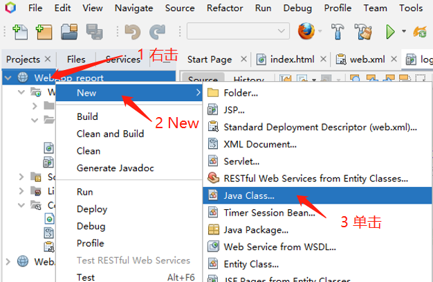
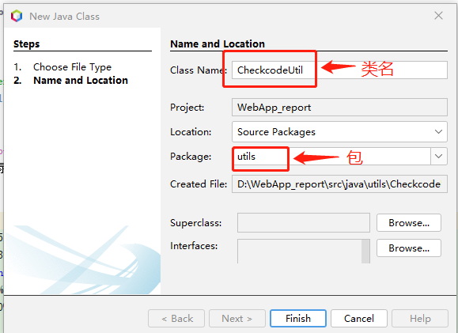
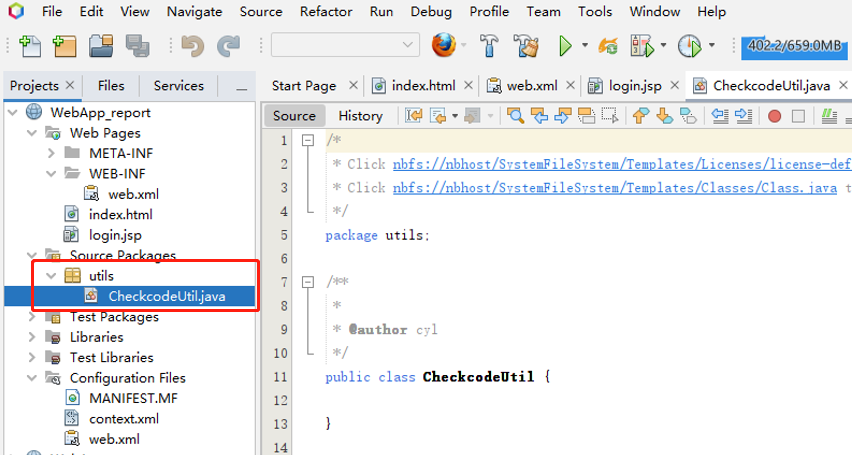
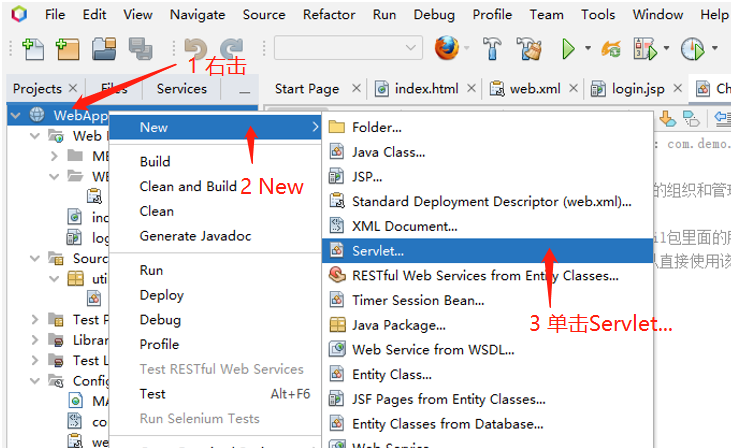
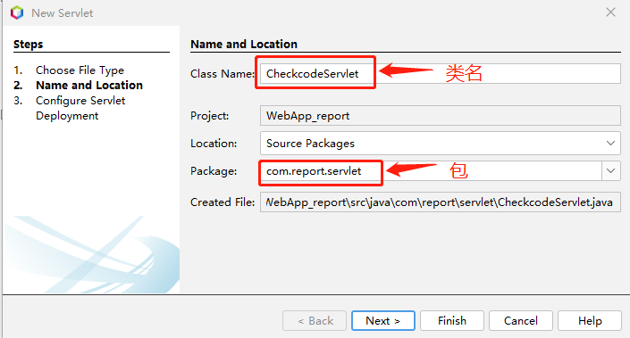
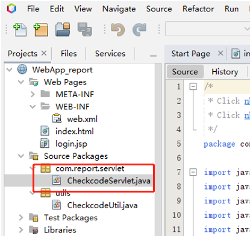
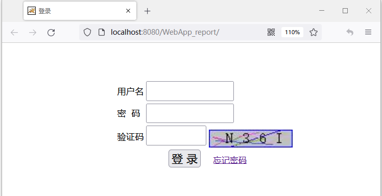

# 一 新建验证码工具类
打开NetBeans IDE，继续项目WebApp_report，右击项目，New->Java Class...,单击新建Java Class。


设置类名和包，


设置完成后点击Finish，



<text color="gray">**Java Map集合的特点**</text><text color="gray">：</text>
<text color="gray">1.Map是一个双列集合，一个元素包含两个值（一个key，一个value）；</text>
<text color="gray">2.Map集合中的元素，key和value的数据类型可以相同，也可以不同；</text>
<text color="gray">3.Map中的元素，key不允许重复，value可以重复；</text>
<text color="gray">4.Map里的key和value是一一对应的。</text>
```java {wrap}
package utils; //包名所有字母一般小写。例如：com.demo.servlet
/*
包（package）是一个为了方便管理组织java文件的组织和管理方式,包内包含有一组类;
可以使用import关键字来导入一个包;
例如使用import java.util.*就可以导入java.util包里面的所有类;
导入这个包里面的所有类，在接下来的程序中可以直接使用该包中的类。
 */
import java.awt.*;
import java.awt.image.BufferedImage;
import java.util.Random;
import java.util.HashMap;
import java.util.Map;

import java.util.logging.Level;
import java.util.logging.Logger;
import javax.imageio.ImageIO;
import java.io.File;
import java.io.IOException;

public class CheckcodeUtil {
//public：访问权;class：定义类的关键字
//JAVA类名必须和文件名一致，类名：首字母大写,每个单词首字母大写

  private static int width = 90;// 定义图片的width，变量名第一个单词首字母小写，从第二个单词开始每个单词首字母大写
  private static int height = 20;// 定义图片的height
  private static int codeCount = 4;// 定义图片上显示验证码的个数
  private static Font font = new Font("宋体", Font.PLAIN, 16);
  private static String chars = "OPASDFGHQWERTYKLZXCVUIJBNM7014368259cvbnmlkjzxhgfrtyuiopdsaqwe";

  //生成验证码和图像
  public static Map<String, Object> getCheckCodeAndImage() {
    //方法名的第一个单词首字母小写，从第二个单词开始每个单词首字母大写
    BufferedImage image = new BufferedImage(width, height, BufferedImage.TYPE_INT_BGR);
    String checkCode;
    Graphics g = image.getGraphics();//画笔对象
    g.setColor(Color.LIGHT_GRAY); //背景色
    g.fillRect(0, 0, width, height);
    g.setColor(Color.BLUE);//边框颜色
    g.drawRect(0, 0, width - 1, height - 1);//画边框
    StringBuilder sb = new StringBuilder();
    Random ran = new Random();
    for (int i = 0; i < 10; i++) {//生成随机坐标点，画线
      int x1 = ran.nextInt(width);
      int x2 = ran.nextInt(width);
      int y1 = ran.nextInt(height);
      int y2 = ran.nextInt(height);
      g.setColor(new Color((int) (Math.random() * 0x1000000)));
      g.drawLine(x1, y1, x2, y2);
    }
    g.setColor(Color.black);
    g.setFont(font);
    for (int i = 1; i <= codeCount; i++) {
      int index = ran.nextInt(chars.length());
      char ch = chars.charAt(index); //取字符
      sb.append(ch);
      g.drawString(ch + "", width / (codeCount + 1) * i, height / 2 + 5);//写验证码
    }
    checkCode = sb.toString();
    Map<String, Object> map = new HashMap<>();
    //存放验证码
    map.put("checkCode", checkCode);
    //存放生成的验证码BufferedImage对象
    map.put("image", image);
    return map;
  }

  /*
     main方法是java程序的入口，把要执行的代码放到main方法里面
     保存图片文件：ImageIO.write(image, "png", new File("D:\\test.png"));
   */
 /*   public static void main(String[] args) {
        Map<String, Object> map = getCheckCodeAndImage();
        System.out.println(map.get("checkCode"));
        try {
            ImageIO.write((BufferedImage) map.get("image"), "png", new File("D:\\test.png"));
        } catch (IOException ex) {
            Logger.getLogger(CheckcodeUtil.class.getName()).log(Level.SEVERE, null, ex);
        }
    }
   */
}
```

验证码工具类checkCodeUtil的静态方法：
public static Map<String, Object> getCheckCodeAndImage()用于生成验证码图像（BufferedImage）和验证码（String）
```java
        Map<String, Object> map = CheckcodeUtil.getCheckCodeAndImage();
        //验证码
        String checkcode_session = (String) map.get("checkCode");
        //验证码图片
        BufferedImage image = (BufferedImage) map.get("image");
```


# 二  生成验证码的Servlet程序
新建生成验证码的Servlet程序“CheckcodeServlet”，右击项目,然后选择New->Servlet,


设置类名和包，


然后Next，完成Servlet的创建。


编辑CheckcodeSerlvert代码，
```html
import javax.imageio.ImageIO;
import javax.servlet.ServletException;
import javax.servlet.annotation.WebServlet;
import javax.servlet.http.HttpServlet;
import javax.servlet.http.HttpServletRequest;
import javax.servlet.http.HttpServletResponse;
import java.awt.image.BufferedImage;
import java.io.IOException;
import java.util.Map;
import utils.CheckcodeUtil;

/**
 *
 * @author 
 */
//简易验证码
@WebServlet(name = "CheckcodeServlet", urlPatterns = {"/CheckcodeServlet"})
public class CheckcodeServlet extends HttpServlet {

  @Override
  protected void doPost(HttpServletRequest request, HttpServletResponse response) throws ServletException, IOException {
    Map<String, Object> map = CheckcodeUtil.getCheckCodeAndImage();
    //验证码
    String checkcode_session = (String) map.get("checkCode");
    //验证码图片
    BufferedImage image = (BufferedImage) map.get("image");
    //验证码存入会话session             
    request.getSession().setAttribute("checkcode_session", checkcode_session);
    //图片输出到页面
    ImageIO.write(image, "jpg", response.getOutputStream());
  }

  @Override
  protected void doGet(HttpServletRequest request, HttpServletResponse response) throws ServletException, IOException {
    this.doPost(request, response);
  }
}
```

运行项目，可以显示验证码图片了。


# 三 验证码更新和表单验证
编辑登录界面“login.jsp”程序，代码如下，
1. 增加点击验证码图片时更新验证码功能，插入JavaScript脚本（25-36行）；
1. 增加表单输入框不能为空验证，插入JavaScript脚本（38-52行）；
1. 第55行，表单form增加属性 name="form1" onSubmit="return Check()"。
```html {wrap}
<%-- 
    Document   : login
    Created on : 
    Author     : 
--%>

<%@page contentType="text/html" pageEncoding="UTF-8"%>
<!DOCTYPE html> 
<html> 
  <head>
    <meta http-equiv="Content-Type" content="text/html; charset=UTF-8">
    <title>登录</title>
  </head>   
  <body>
    <style>
      dfv{
        width: 500px;
        height:300px;
        position: absolute;
        top: 10%;
        left: 30%;
      }
    </style> 
       
    <script type="text/javascript"> //这里是JavaScript
      window.onload = function () {<%-- html加载完毕后，立刻执行--%>
        document.getElementById("img").onclick = function () {
          /*document.getElementById()通过元素的id来获取元素，
           .getElementById("img")先获取"img" 元素；
           然后.onclick()，点击触发一个事件，这个事件发生会执行funciton()函数。               
           目的:点击id为img的页面元素时会触发funciton函数。生成验证码*/
          this.src = "CheckcodeServlet?time" + new Date().getTime();
          //new Date().getTime()增加时间戳来更换验证码图片
        };
      };
    </script>
    
    <script type="text/javascript">
      function Check()
      {
        for (var i = 0; i < document.form1.elements.length - 1; i++)
        {
          if (document.form1.elements[i].value === "")
          {
            alert("不允许空！");
            document.form1.elements[i].focus();
            return false;
          }
        }
        return true;
      }
    </script>
    
  <dfv>
<form action="LoginServlet" method="post" name="form1" onSubmit="return Check()">
      <!-- form属性action="LoginServlet"，用于处理请求--> 
      <table>
        <tr>
          <td>用户名</td>
          <td><input style="width: 150px;height:30px;" type="text" name="username" size="20"></td>
        </tr>
        <tr>
          <td>密&nbsp;&nbsp;码</td>
          <td><input style="width: 150px;height:30px;" type="password" name="password" size="20"></td>
        </tr>
        <tr>
          <td>验证码</td>
          <td><input style="width: 100px;height:30px;" type="text" name="checkcode" size="15">
            
            <!-- id为img的页面元素,显示验证码图像；src="CheckcodeServlet"
            -->                    
          </td>
        </tr>  
        <tr><td></td>                    
          <td><input size-="25" style="margin-left:40px;font-size:20px;" type="submit" value="登&nbsp;录">
            <font style="font-size:15px">&nbsp;&nbsp;&nbsp;&nbsp;<a href="#">忘记密码 </a> </font></td>                                   
        </tr>
      </table>
    </form>
  </dfv>
</body>
</html>
```


