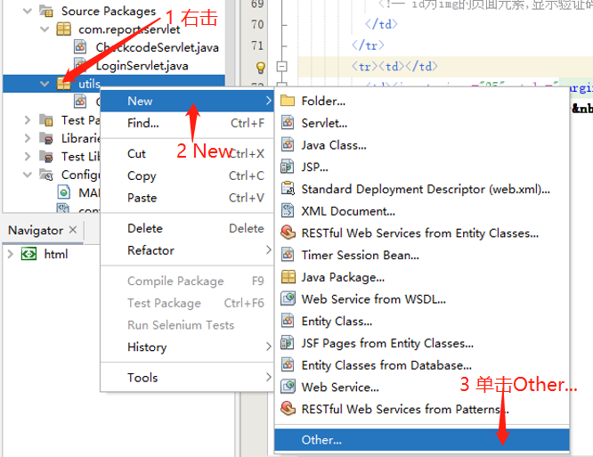
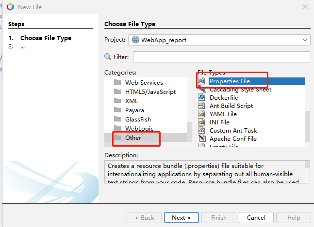
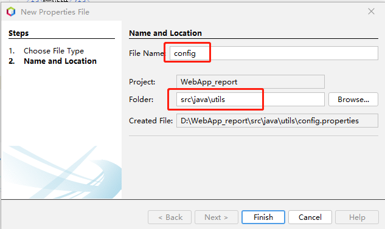
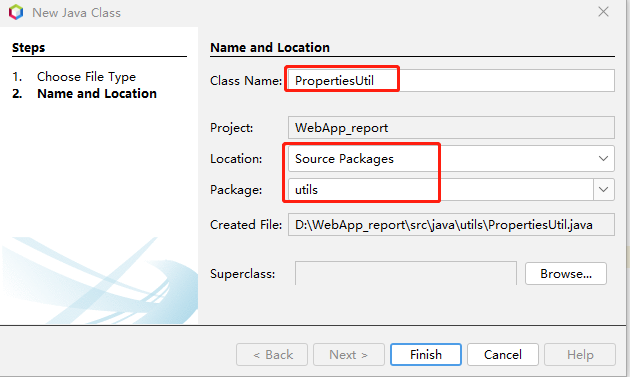

# 一 属性文件
Java属性文件以键值对的形式存放信息。项目使用属性文件"utils/config.property"设置配置信息，比如数据源、文件存储路径、系统邮件账号等。
新建属性文件，右击项目窗口里的包utils，选择New->Other,


选择属性文件


设置文件


Finish完成，编辑属性文件“util/property”。
```java
# fileName: config.properties

#数据源,参数参照数据源配置属性 name="XXX"，数据源在META-INF/contex.xml中配置
#data_source=java:comp/env/jdbc/Win_sqlserver_reportdb

#数据源,参数参照数据源配置属性 name="XXX"，数据源在META-INF/contex.xml中配置
data_source=java:comp/env/jdbc/Win_mysql_reportdb

#数据源,参数参照数据源配置属性 name="XXX"，数据源在META-INF/contex.xml中配置
#data_source=java:comp/env/jdbc/Linux_mysql_reportV1

#windows 系统保存路径
Win_path=D:\\report_system

#Linux系统保存路径
Linux_path=/usr/report_systemV1

#日志文件子目录
logger_file=report_log

 #发件人账号
from=

#发件人邮箱授权码，“开启”（IMAP/SMTP服务），不同邮箱获取方式不同
password=

#发件邮箱服务器
smtpHost =smtp.126.com
```

# <text color="gray">二 属性工具类</text>
新建属性工具类，


1. 创建属性文件对象：Properties props = new Properties();
1. 使用类加载器获得属性文件输入流：InputStream is = 当前类.class.getClassLoader().getResourceAsStream("属性文件的路径");  其中的路径，如“.properties”属性文件在前类的包下，可以直接写文件名。
1. 加载属性文件：props.load(is);
1. 获取属性值 value = props.getProperty("key"); 
```java {wrap}
/*
属性工具类,获取项目配置参数
对应的属性文件：config.properties
 */
package utils;

import java.io.File;
import java.io.FileInputStream;
import java.io.FileNotFoundException;
import java.io.IOException;
import java.io.InputStream;
import java.io.UnsupportedEncodingException;
import java.net.URLDecoder;
import java.util.Properties;
import java.util.logging.Level;
import java.util.logging.Logger;

/**
 *
 * @author cyl
 */
public class PropertiesUtil {

  public static Properties pro = new Properties();

  static {//静态代码块，在虚拟机加载类的时候就会加载执行，而且只执行一次;  
    //File.separator: 是系统分隔符，比如windows下面文件路径的分隔符是"\"; linux下面是"/"
    //Linux没有"D:"这种"盘符"的概念
    //配置文件路径
    String proPath = PropertiesUtil.class.getClassLoader().getResource("utils" + File.separator + "config.properties").getPath();
    try {//对路径进行decode，否则如果文件的路径中有中文或特殊字符，得到的路径就不正确
      proPath = URLDecoder.decode(proPath, "UTF-8");
    } catch (UnsupportedEncodingException ex) {
      ex.printStackTrace();
    }
    //System.out.println(proPath); 
    InputStream is = null;
    try {
      is = new FileInputStream(proPath);
    } catch (FileNotFoundException e2) {
      e2.printStackTrace();
    }
    try {
      pro.load(is);
      //pro.load(new InputStreamReader(is, "utf-8"));      
    } catch (IOException e1) {
      e1.printStackTrace();
    }
  }

  /* 
    //判断是否 windows 系统 
    if(System.getProperties().getProperty("os.name").startsWith("Windows"))
            System.out.println("Windows"); 
   */
 /* 
    public static void main(String[] args) {
        String name = PropertiesUtil.pro.getProperty("data_source");
        System.out.println(name);
    }
   */
}
```

项目中，只需要使用以下代码，即可获取属性data_source的值。
```html
PropertiesUtil.pro.getProperty("data_source");
```


