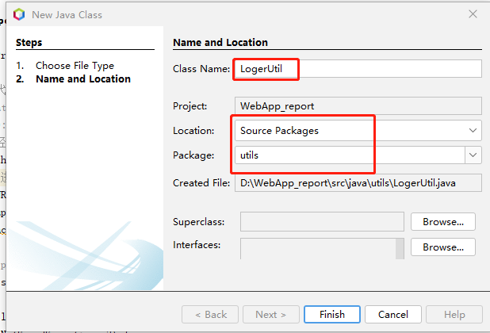

**java.util.logging是****JDK****自带的日志记录包。**
JDK Logging的使用很简单，先使用Logger类的静态方法getLogger就可以获取到一个logger，然后在任何地方都可以通过获取到的logger进行日志输入。
**JDK****的日志包涉及handler,formatter,level**
1. Handler：控制日志输出的，比如JDK自带的ConsoleHanlder把输出流重定向到System.err输出，每次调用Logger的方法进行输出时都会调用Handler的publish方法，每个logger可以有多个handler。可以利用handler来把日志输入到不同的地方(比如文件系统或者是远程Socket连接).
1. Formatter：日志格式化，包括：是否输出时间、时间格式、是否输入线程名、是否使用国际化信息等都依赖于Formatter。 
1. Log Level：logging能帮助我们适应从开发调试到部署上线等不同阶段对日志输出粒度的不同需求。日志记录级别：SEVERE（最高值） 、WARNING 、INFO 、CONFIG 、FINE 、FINER 、FINEST（最低值）；ALL(记录所有信息)  OFF(不记录任何级别信息)
新建类“LogerUtil”，



```java {wrap}
package utils;

import java.io.File;
import java.io.IOException;
import java.io.InputStream;
import java.io.PrintStream;
import java.io.UnsupportedEncodingException;
import java.text.SimpleDateFormat;
import java.util.Date;
import java.util.Enumeration;
import java.util.logging.FileHandler;
import java.util.logging.Level;
import java.util.logging.LogManager;
import java.util.logging.Logger;
import java.util.logging.SimpleFormatter;
import java.nio.charset.Charset;
import java.util.logging.ConsoleHandler;

/**
 * @author cyl
 */
//未包含抽象方法的抽象类，方法都是静态的；不让调用者创建该类对象
public abstract class LoggerUtil {

    /*Find or create a logger for a named subsystem. 
     If a logger has already been created with the given name it is returned. 
     Otherwise a new logger is created.*/
    public static final Logger logger = Logger.getLogger("MyLog");

    //Returns the global LogManager object.
    public static LogManager logManager = LogManager.getLogManager();
    static String file;

    //静态代码块，虚拟机加载类时加载执行，而且只执行一次; 
    static {
        InputStream in = LoggerUtil.class.getResourceAsStream("logger.properties");
        if (in == null) {
            logger.warning("没找到指定的配置文件！loger.properties");
        }
        try {
            logManager.readConfiguration(in);
            System.setOut(new PrintStream(System.out, true, "UTF-8"));
        } catch (IOException | ExceptionInInitializerError ex) {
            ex.printStackTrace();
            System.out.println("读取配置文件失败？");
        }

        if (System.getProperties().getProperty("os.name").startsWith("Windows")) {
            file = PropertiesUtil.pro.getProperty("Win_path");
        } else {
            file = PropertiesUtil.pro.getProperty("Linux_path");
        }
        file = file + File.separator + PropertiesUtil.pro.getProperty("logger_file");

        //如果目录不存在则创建
        File dir = new File(file);
        if (!dir.exists()) {
            dir.mkdirs();
            //System.out.println("build" + savePath);
        }

        Date date = new Date();
        SimpleDateFormat df = new SimpleDateFormat("yyyy-MM-dd-HH-mm-ss");
        file = file + File.separator + String.valueOf(df.format(date)) + ".log";
        // System.out.println(file);
        /* 
        try { // This block configure the logger with handler and formatter 
              //本例中使用配置文件
            
            FileHandler fh= new FileHandler(file);
            SimpleFormatter formatter = new SimpleFormatter();
            fh.setFormatter(formatter);
            logger.addHandler(fh);//自动创建文件，不会创建文件夹,先要把文件夹创建好，文件夹不存在会报错
                      
            ConsoleHandler consoleHandler = new ConsoleHandler();
            consoleHandler.setEncoding("UTF-8");// 设置编码 
            logger.addHandler(consoleHandler);

            // the following statement is used to log any messages  
            logger.info("My New log");

            //*****设置系统日志级别*****
            //logger.setLevel(Level.WARNING);
            //logger.setLevel(Level.SEVERE);
        
        } catch (SecurityException | IOException e) {
            e.printStackTrace();
        }
         */
    }

    public static void main(String[] args) throws SecurityException, UnsupportedEncodingException {//test Logger 

        logger.info("你好info");
        logger.warning("warning");
        Enumeration<String> logNames = logManager.getLoggerNames();
        String logname;
        while (logNames.hasMoreElements()) {
            logname = logNames.nextElement();
            System.out.println(logname);
        }
        //项目中需要写日志的时候，直接用下面的代码写入info级的日志或warning级的日志
        String log_str = "info-1test";
        LoggerUtil.logger.info(log_str);

        log_str = "warning-1test";

        LoggerUtil.logger.warning(log_str);
        LoggerUtil.logger.severe("SEVERE-1test");
        LoggerUtil.logger.log(Level.INFO, "占位符使用：{0}", "例1");
        LoggerUtil.logger.log(Level.WARNING, "占位符使用{0}{1}{2}", new Object[]{"零", "一", 2});
    }
}

```

日志配置文件logger.properties
```java
# https://docs.oracle.com/en/java/javase/22/docs/api/java.logging/java/util/logging/package-summary.html

#Configuration: By default each FileHandler is initialized using the following LogManager configuration properties where <handler-name> refers to the fully-qualified class name of the handler. If properties are not defined (or have invalid values) then the specified default values are used.

#<handler-name>.level specifies the default level for the Handler (defaults to Level.ALL).
#<handler-name>.filter specifies the name of a Filter class to use (defaults to no Filter).
#<handler-name>.formatter specifies the name of a Formatter class to use (defaults to java.util.logging.XMLFormatter)
#<handler-name>.encoding the name of the character set encoding to use (defaults to the default platform encoding).
#<handler-name>.limit specifies an approximate maximum amount to write (in bytes) to any one file. If this is zero, then there is no limit. (Defaults to no limit).
#<handler-name>.count specifies how many output files to cycle through (defaults to 1).
#<handler-name>.pattern specifies a pattern for generating the output file name. See below for details. (Defaults to "%h/java%u.log").
#<handler-name>.append specifies whether the FileHandler should append onto any existing files (defaults to false).
#<handler-name>.maxLocks specifies the maximum number of concurrent locks held by FileHandler (defaults to 100).

#For example, the properties for FileHandler would be
  #java.util.logging.FileHandler.level=INFO
  #java.util.logging.FileHandler.formatter=java.util.logging.SimpleFormatter

#For a custom handler, e.g. com.foo.MyHandler, the properties would be:
  #com.foo.MyHandler.level=INFO
  #com.foo.MyHandler.formatter=java.util.logging.SimpleFormatter

# 输出到文件和控制台
handlers= java.util.logging.FileHandler,java.util.logging.ConsoleHandler

#日志输出级别 level
.level= ALL

# 控制台输出级别和格式
java.util.logging.ConsoleHandler.level = FINER
java.util.logging.ConsoleHandler.formatter = java.util.logging.SimpleFormatter
java.util.logging.ConsoleHandler.encoding=UTF-8

# 文件输出级别
java.util.logging.FileHandler.level=CONFIG

# 文件输出地址，路径中的文件夹必须存在，会自动创建文件但不会自动创建文件夹，文件夹不存在会报错
#java.util.logging.FileHandler.pattern = ../logs/logging.log


#The FileHandler can either write to a specified file, or it can write to a rotating set of files.
#For a rotating set of files, as each file reaches a given size limit, it is closed, rotated out, and a new file opened. Successively older files are named by adding "0", "1", "2", etc. into the base filename.
#限制文件的大小（100000字节）
#java.util.logging.FileHandler.limit = 100000

#过滤，总共保存1个文件,接着猜覆盖
java.util.logging.FileHandler.count = 1

#XMLFormatter是以xml样式输出，SimpleFormatter是以普通样式输出
java.util.logging.FileHandler.formatter = java.util.logging.SimpleFormatter

#指定是否应该将 FileHandler 追加到任何现有文件上（false会覆盖，但默认为false）
java.util.logging.FileHandler.append=true
```

