# 一 数据库设计
初步识别的实体包括：实验课教学班、课程、用户（教师、学生）、实验项目、实验报告。一个学生可以选修多门课程，一门课程被多个学生选；一门课程有一个任课教师，一个教师可以任教多门课程；每门课程有多个实验项目。
1. 每个实验课(Coures)的courseID是不同的（实验课名称可能相同）对应一个“实验课教学班（Class）”。“实验课教学班表”导入实验课的项目和学生信息（项目名称、学生姓姓名和学号），“实验课教学班表”按照“课程名+班级名”命名，如：
数据库原理与应用221
<sheet token="shtcngfXMffFz6OPT0LlO2LPzGg_SFmS7U"/>

1. tb_User，用户（教师、学生）
1. tb_Course,课程
1. tb_SC,选课表
1. tb_Project,实验项目
<diagram type="2"/>

report.sql 脚本（MySQL）
```javascript {wrap}
#set global wait_timeout = 28800000;
#set global interactive_timeout = 28800000;
#show global variables like 'wait_timeout';
#show global variables like 'interactive_timeout';

#创建 Schema report
CREATE SCHEMA `report` DEFAULT CHARACTER SET utf8;

#选择 report
use report;

#创建表
CREATE TABLE  tb_User (
         user_name   nchar(15) NOT NULL,#用户名为学号
         user_password   nchar(50) NULL,#口令默认为学号
         full_name nvarchar(50) NULL,#学生姓名
         email nvarchar (50) NULL,
         role_type nchar(10) default 'student',
         attemps int NULL,
 CONSTRAINT  PK_tb_User  PRIMARY KEY CLUSTERED 
(user_name) 
);
 
 CREATE TABLE  tb_Course(
         course_id nvarchar(50) NOT NULL,#课程+班级 例：数据库原理与应用实验191
         course_name   nvarchar(50) NULL,#课程名 例：数据库原理与应用实验
         num_of_project   int  NULL,#实验项目数量
         table_name   nvarchar(50) NULL,
         teacher_id nvarchar(50) NULL, 
        /*班级实验项目明细表，例：
         infoSec191_DB(SNO,sname,SQL_server实验,数据库定义实验,
         数据库查询实验,...)
         表infoSec191_DB由Excel模板表导入，然后从infoSec191_DB把学生信息
         添加到tb_User表
         */
 CONSTRAINT  PK_tb_Course  PRIMARY KEY CLUSTERED 
(course_id  ASC)
);
 
CREATE TABLE  tb_SC(
         SNO   nchar(15) NOT NULL,#学号    
         course_id   nvarchar(50) NOT NULL,#课程，例：数据库原理与应用实验191
         grade   nvarchar(50) NULL,#成绩
 CONSTRAINT  PK_tb_SC  PRIMARY KEY CLUSTERED 
(SNO , course_id),#主键
# 外键约束，表约束
FOREIGN KEY(SNO) REFERENCES  tb_User (user_name),
# 外键约束，表约束 
FOREIGN KEY(course_id) REFERENCES tb_Course(course_id)
);
 
CREATE TABLE  tb_Project(
         id int PRIMARY KEY AUTO_INCREMENT,
         project_id   nvarchar(50) NOT NULL,#项目名班级，例：191数据库编程实验
         project_name   nvarchar(50) NULL,#项目名称，例：数据库编程实验
         course_id   nvarchar(50) NULL,#课程 例：数据库原理与应用实验191
         project_open   int  NULL,
FOREIGN KEY(course_id) REFERENCES   tb_Course(course_id)
);

#创建存储过程
delimiter @@
create PROCEDURE add_data(IN course_id nvarchar(200),IN table_name nvarchar(200),IN teacher_id nvarchar(10))
begin
declare prj nvarchar(128);
declare  prjnum int;
DECLARE  no_more_record INT DEFAULT 0;
DECLARE i INT DEFAULT 0;
DECLARE prj_Cursor CURSOR for SELECT tb1.COLUMN_NAME from  information_schema.`COLUMNS` as tb1 where tb1.table_name=table_name;
DECLARE  EXIT HANDLER FOR NOT FOUND  SET  no_more_record = 1; /*这个是个条件处理,针对NOT FOUND的条件,当没有记录时赋值为1*/
 
set prjnum=(SELECT (count(mt.COLUMN_NAME)-3) from information_schema.`COLUMNS` as mt where mt.table_name=table_name);
set @str_sql:=CONCAT("insert into tb_Course(course_id,course_name,num_of_project,table_name,teacher_id) values(",
"'",
course_id,
"',",
"'",
left(course_id,(LENGTH(course_id)-11)),
"',",
prjnum,
",'",
table_name,
"','",
teacher_id,
"')"
);
PREPARE stmt from @str_sql;
EXECUTE stmt;#课程信息插入到tb_Course

set @str_sql:=CONCAT("insert into tb_User(user_name,user_password,full_name,role_type) select tb2.SNO,MD5(tb2.SNO),tb2.Sname,",
"'student'",
" from ",
table_name,
" as tb2 ",
" where tb2.SNO not in(select tb3.user_name from tb_User as tb3)"
);

PREPARE stmt from @str_sql;
EXECUTE stmt; #学生账号插入到tb_User

set @str_sql:=CONCAT("insert into tb_SC(SNO,course_id) select tb4.SNO,",
"'",
course_id,
"'",
" from ",
table_name,
" as tb4"
);

PREPARE stmt from @str_sql;
EXECUTE stmt;
#选课信息插入到tb_SC

OPEN prj_Cursor;
set i=1;
WHILE i<=4 DO
FETCH  prj_Cursor into  prj;
set i=i+1;
END WHILE;
set i=1;
WHILE i<=prjnum DO
set @str_sql:=CONCAT("insert into tb_Project(project_id,project_name,course_id,project_open) values(",
"'",
right(course_id,3),
prj,
"',",
"'",
prj,
"',",
"'",
course_id,
"', 0)"
);
#
set @str_s:=CONCAT('UPDATE ',table_name,' set ',prj,'= NULL');
PREPARE stmt from @str_s;
EXECUTE stmt; #把table_name每个项目值设置为NULL

PREPARE stmt from @str_sql;
EXECUTE stmt; #把实验项目加入到tb_Project表

FETCH  prj_Cursor into  prj;
#SELECT prj;
set i=i+1;
END WHILE;
close prj_Cursor;

#先准备好InfoSec201_db表,使用Excel导入
##调用示例
#SET SQL_SAFE_UPDATES = 0;
#call  add_data('数据库原理与应用实验201','InfoSec201_db',101001')
##courseID和表名一致可能更好
#call  add_data('数据库原理与应用实验201','数据库原理与应用实验201',101001')
end@@

#存储过程delete_data，移除某门课的数据，
delimiter @@
CREATE PROCEDURE delete_data(IN course_id nvarchar(200),IN table_name nvarchar(200))
begin
set @str_sql:=CONCAT("delete from tb_SC where course_id=","'",course_id,"'"," and SNO in(select SNO from ", table_name,")");
PREPARE stmt from @str_sql;
EXECUTE stmt;

set @str_sql:=CONCAT("delete from tb_Project where course_id=","'",course_id,"'"); 
PREPARE stmt from @str_sql;
EXECUTE stmt;

set @str_sql:=CONCAT("delete from tb_Course where course_id=","'",course_id,"'");
PREPARE stmt from @str_sql;
EXECUTE stmt;

set @str_sql:=CONCAT("delete from tb_User where user_name in(select SNO from ", table_name,")","and user_name not in(select SNO from tb_SC)");
PREPARE stmt from @str_sql;
EXECUTE stmt;
end@@

#插入一条教师记录示例，用户名和口令都是101001
#INSERT INTO `tb_User` (`user_name`, `user_password`, `full_name`, `email`, `role_type`) VALUES ('101001', md5('101001'), '赵钱孙李', NULL, 'teacher');

#清除课程数据示例
#SET SQL_SAFE_UPDATES = 0; 
#call delete_data('面向对象系统分析与设计实验201','面向对象系统分析与设计实验201');

#创建用户，数据库授权，执行存储过程授权
#CREATE USER '用户名'@'localhost' IDENTIFIED BY '口令';#depending on your needs
#GRANT ALL PRIVILEGES ON report.* TO '用户名'@'localhost'; 
#GRANT EXECUTE ON PROCEDURE report.add_data TO '用户名'@'localhost';
#flush privileges;
```

SQL Server
```sql
create database MS_reportdb
go
use MS_reportdb
go
/*在SQL语句中，可以用方括号：[  ]，包围对象和字段名(Around Object and Field Names);
如果名称不包含任何空格或特殊字符（如标点符号），方括号是可选的；
如果名称中含有空格或特殊字符，必须使用方括号。
注：当设计表格和报告时，包含空格、标点的名称更容易阅读，
但最终可能使SQL语句包括更多的内容，为数据库中的对象命名时，应考虑这点。
*/
CREATE TABLE [dbo].[tb_User](
        [user_name] [nvarchar](12) NOT NULL,--用户名为学号
        [user_password] [nvarchar](50) NULL,--口令默认为学号
        full_name nvarchar(50) NULL,--学生姓名
    email nvarchar (50) NULL,
    role_type nvarchar (10) default 'student',
    attemps int NULL,
 CONSTRAINT [PK_tb_User] PRIMARY KEY CLUSTERED([user_name]) 
)
go
 CREATE TABLE [dbo].[tb_Course](
        [course_id] [nvarchar](50) NOT NULL,--课程+班级 例：数据库原理与应用实验191
        [course_name] [nvarchar](50) NULL,--课程名 例：数据库原理与应用实验
        [num_of_project] [int] NULL,--实验项目数量
        [table_name] [nvarchar](50) NULL,
        teacher_id nvarchar(50) NULL,
        /*班级实验项目明细表，例：
         infoSec191_DB(SNO,sname,SQL_server实验,数据库定义实验,
         数据库查询实验,...)
         表infoSec191_DB由Excel模板表导入，然后从infoSec191_DB把学生信息
         添加到tb_User表
         */
 CONSTRAINT [PK_tb_Course] PRIMARY KEY CLUSTERED([course_id] ASC)
)
go
CREATE TABLE [dbo].[tb_SC](
        [SNO] [nvarchar](12) NOT NULL,--学号    
        [course_id] [nvarchar](50) NOT NULL,--课程，例：数据库原理与应用实验191
        [Grade] [nvarchar](50) NULL,--成绩
 CONSTRAINT [PK_tb_SC] PRIMARY KEY CLUSTERED([SNO],[course_id]),--主键
-- 外键约束，表约束
FOREIGN KEY(SNO) REFERENCES [dbo].[tb_User](user_name),
-- 外键约束，表约束 
FOREIGN KEY(course_id) REFERENCES [dbo].[tb_Course](course_id)
)
go
CREATE TABLE [dbo].[tb_Project](
    id int IDENTITY(1,1),
        [project_id] [nvarchar](50) NOT NULL,--项目名班级，例：191数据库编程实验
        [project_name] [nvarchar](50) NULL,--项目名称，例：数据库编程实验
        [course_id] [nvarchar](50) NULL,--课程 例：数据库原理与应用实验191
        [project_open] [int] NULL,
 CONSTRAINT [PK_tb_Project] PRIMARY KEY CLUSTERED([project_id]),
FOREIGN KEY(course_id) REFERENCES [dbo].[tb_Course](course_id),
)
go
 /*
 --插入一个教师用户
INSERT INTO tb_User(user_name,user_password,full_name,email,role_type) 
VALUES('101001', 
substring(sys.fn_sqlvarbasetostr(HASHBYTES('MD5','101001')),3,32), 
'赵钱孙李', 
NULL, 
'teacher');
*/

/*--示例1： 数据库原理与应用信安191 ，各门课程的表由程序创建

CREATE TABLE [dbo].[数据库原理与应用信安191](
        [ID] [float] NULL,
        [SNO] [float] NOT NULL,
        [Sname] [nvarchar](255) NULL,
        [SQL_server实验] [nvarchar](50) NULL,
        [数据库定义实验] [nchar](10) NULL,
        [数据库查询实验] [nchar](10) NULL,
        [数据库更新实验] [nvarchar](50) NULL,
        [数据控制实验] [varbinary](50) NULL,
        [视图与存储实验] [float] NULL,
        [数据库编程实验] [float] NULL,
        [数据库设计实验] [float] NULL, 
) 
*/
/*--示例2

CREATE TABLE [dbo].[infoSec191_DS](
        [ID] [float] NULL,
        [SNO] [float] NOT NULL,
        [Sname] [nvarchar](255) NULL,
        [二叉树] [float] NULL,
        [队列] [float] NULL
)

*/
 
 
--#建立存储过程，把数据导入到相应的表中
--execute add_data '面向对象系统分析与设计实验信计201','面向对象系统分析与设计实验信计201','101001'
 create proc add_data @course_id nvarchar(200),@table_name nvarchar(200),@teacher_id nvarchar(200)
as 
if exists(select * from syscursors where cursor_name='prj_Cursor')
deallocate  prj_Cursor 
declare @str_sql varchar(1024);
declare @num int;
SELECT @num=count(NAME)-3 FROM SYSCOLUMNS WHERE ID=OBJECT_ID(@table_name);
set @str_sql=CONCAT('insert into tb_Course(course_id,course_name,num_of_project,table_name,teacher_id)values(',
'''',
@course_id,
''',',
'''',
left(@course_id,len(@course_id)-3),
''',',
cast(@num as varchar),
',''',
@table_name,
''',''',
@teacher_id,
''')');

print @str_sql
EXEC(@str_sql)--课程信息插入到tb_Course
DECLARE prj_Cursor SCROLL CURSOR 
for
SELECT NAME FROM SYSCOLUMNS WHERE ID=OBJECT_ID(@table_name);
OPEN prj_Cursor
declare @prj nvarchar(128)
FETCH ABSOLUTE 4 FROM prj_Cursor into @prj 
while (@@fetch_status=0)
begin--把实验项目加入到tb_Project表
print(@prj)
set @str_sql='insert into tb_Project(project_id,project_name,course_id,project_open) 
values('''+ right(@course_id,3)+@prj+''','+ ''''+@prj+''','''+@course_id+''','+'0'+')'
print @str_sql
EXEC(@str_sql)--项目信息插入到tb_Project

FETCH next FROM prj_Cursor into @prj 
end
set @str_sql=CONCAT('insert into tb_User(user_name,user_password,full_name) select ',
'SNO',
',substring(sys.fn_sqlvarbasetostr(HASHBYTES(''MD5'',','SNO)),3,32),Sname',
' from ',
@table_name,
' where SNO not in(select user_name from tb_User)'
);
print @str_sql
EXEC(@str_sql)--学生账号插入到tb_User

set @str_sql='insert into tb_SC(SNO,course_id)
select SNO,''' +@course_id+
''' from '+@table_name
print @str_sql 
EXEC(@str_sql)--项目信息插入到tb_SC
go


--存储过程delete_data，移除某门课的数据
--execute delete_data '面向对象系统分析与设计实验信计201','面向对象系统分析与设计实验信计201'
CREATE PROCEDURE delete_data  @course_id nvarchar(200),@table_name nvarchar(200)
as
declare @str_sql varchar(1024);
set @str_sql=CONCAT('delete from tb_SC where course_id=',
'''',
@course_id,
'''',
' and trim(SNO) in(select SNO from ',
@table_name,
')');
--print @str_sql
EXEC(@str_sql)

set @str_sql=CONCAT('delete from tb_Project where course_id=',
'''',
@course_id,
''''); 
--print @str_sql
EXEC(@str_sql)

set @str_sql=CONCAT('delete from tb_Course where course_id=',
'''',
@course_id,
'''');
--print @str_sql
EXEC(@str_sql)

set @str_sql=CONCAT('delete from tb_User where trim(user_name) in(select SNO from '
,@table_name,
')',
' and user_name not in(select SNO from tb_SC)');
--print @str_sql
EXEC(@str_sql)
go
```

# 二 下载和安装MySQL
 Windows 平台上安装配置 MySQL
下载和安装https://dev.mysql.com/downloads/installer/

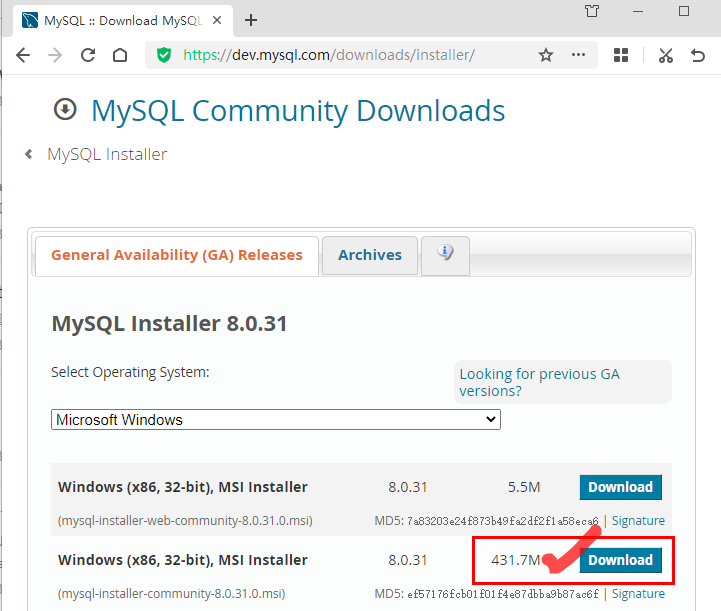

安装时选择 Developer Default：默认安装类型即可，然后一直用默认设置，一直next，MySQL 安装过程中需要对服务器进行配置，其中，Acounts and Roles 设置服务器root的密码，要记住这个密码。
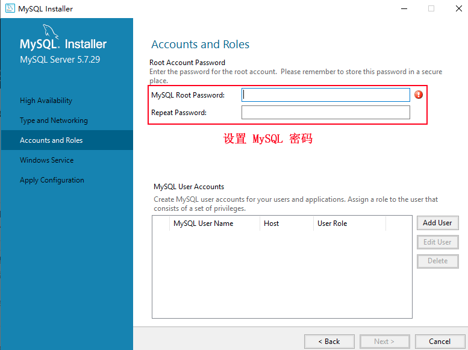

重复输入两次登录密码（最好字母数字加符号），点击 Next 按钮继续。
在Connect to Server步骤，输入用户名root和之前步骤设置的密码,Check通过后继续next，
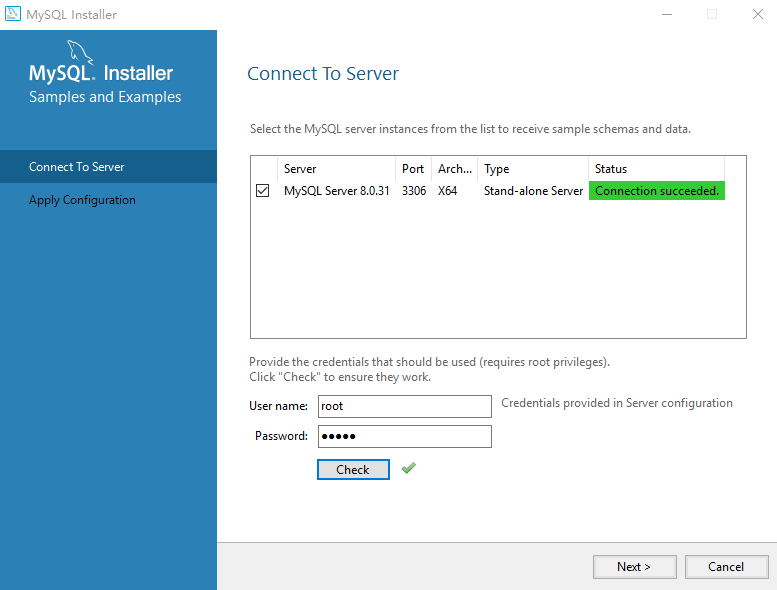

安装完成后运行 MySQL 8.0 Command Line Client-Unicode
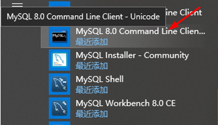

运行界面如下，输入密码，按回车
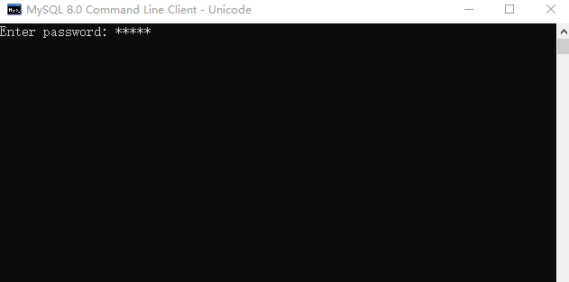

显示结果如下
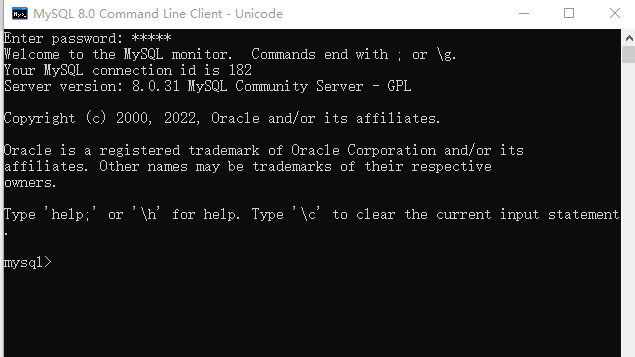

输入命令行
```javascript
 show databases;
```

<text color="gray">命令后面一定要加分号“;”，表示sql语句结束。这个命令用于表示显示默认安装的数据库，如下图显示安装成功。</text>
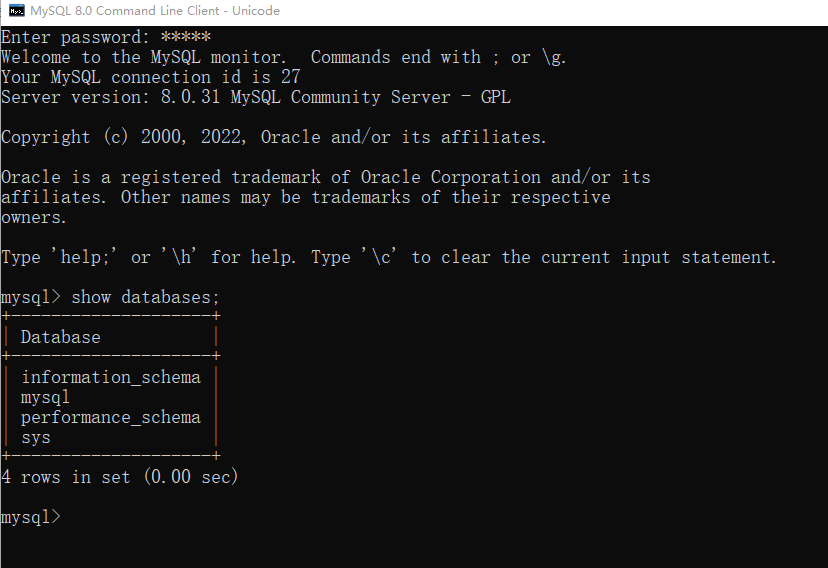

如果项目中想使用root用户连接数据库服务器，把下面命令中的密码换成root用户的实际密码，然后执行。
```java
ALTER USER 'root'@'localhost' IDENTIFIED WITH mysql_native_password BY '密码';
FLUSH PRIVILEGES; 
```

运行 MySQL Workbench,
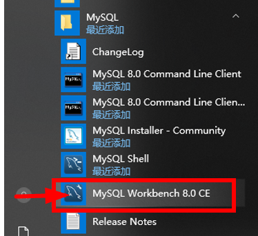

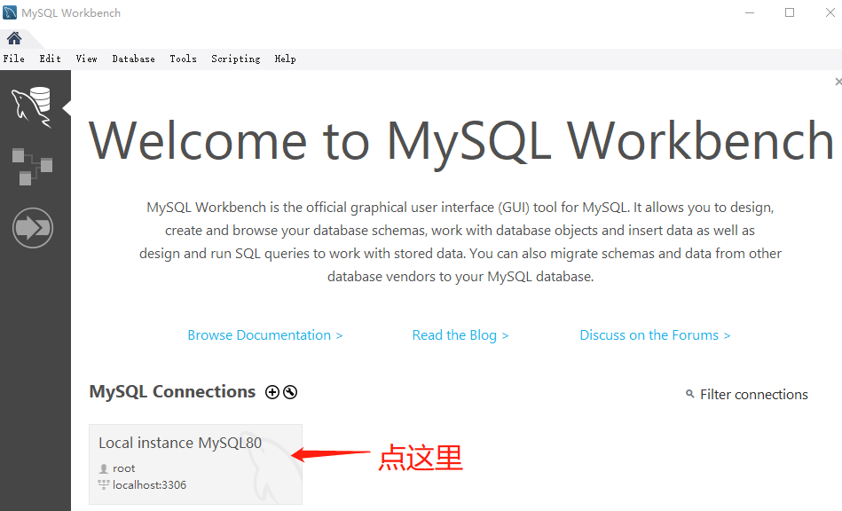

输入密码
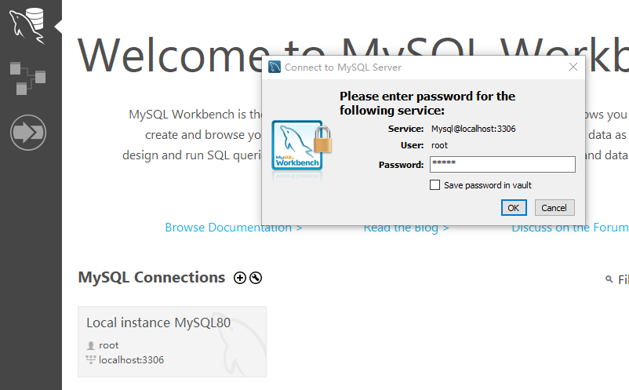

建立数据库
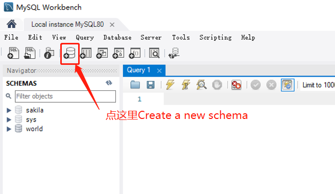

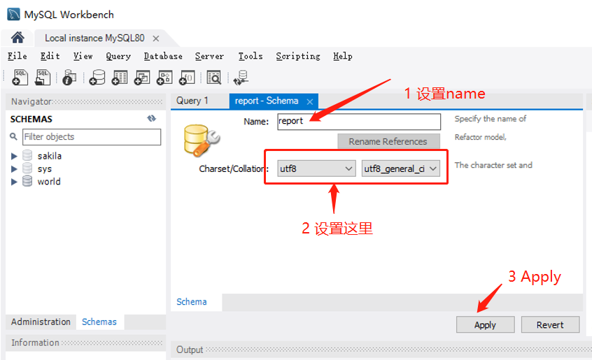

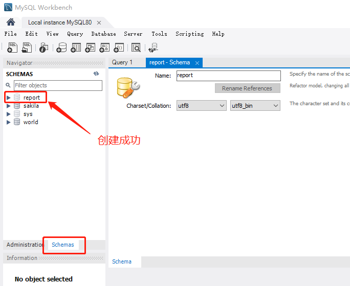


<text color="gray">MySql Workbench 数据库建立连接后需要指定当前的数据库，如数据库名是 </text><text color="gray">report</text><text color="gray">。</text>
<text color="gray">指定数据库有两种方法。</text>
<text color="gray">第一种方法使用命令 use </text><text color="gray">report</text><text color="gray">;</text>
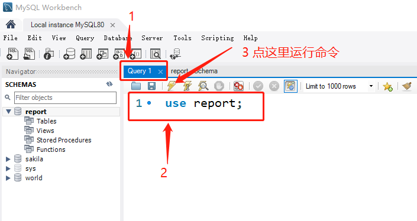

<text color="gray">第二种方法</text>
<text color="gray">在</text><text color="gray">**SCHEMAS**</text><text color="gray">栏双击指定的数据库</text>
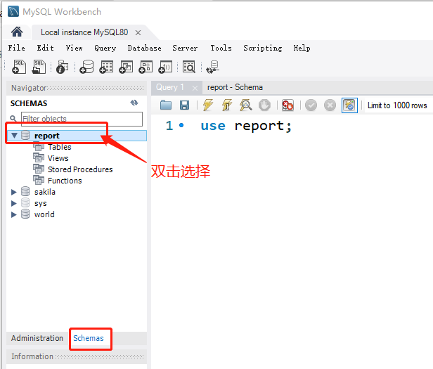

删除<text color="gray">**SCHEMA“**</text><text color="gray">**report**</text><text color="gray">**”，这里真的要删除，后面我们会用脚本重新建。**</text>
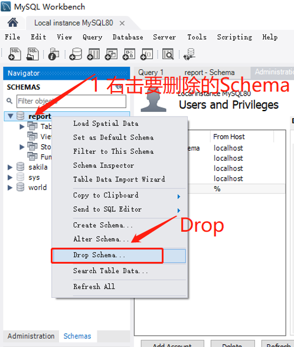

脚本“report.sql "包括“report” Schema的建立，表的的建立，存储过程“add_data”和“delete_data”,在查询窗口中执行脚本“report.sql "
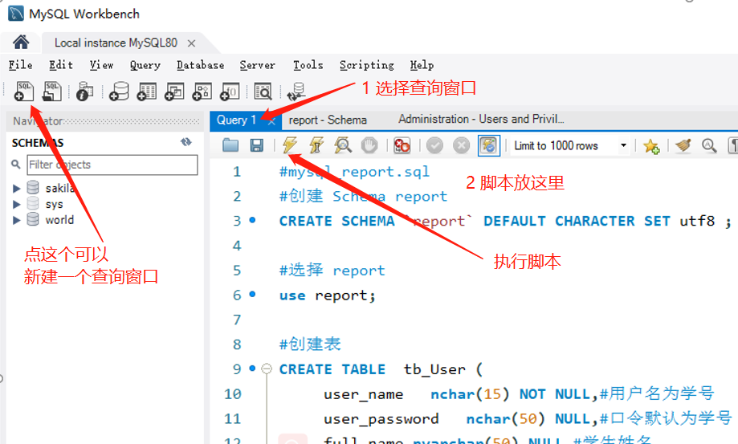

执行完刷新一下
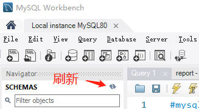

可以看到表和存储过程建好了
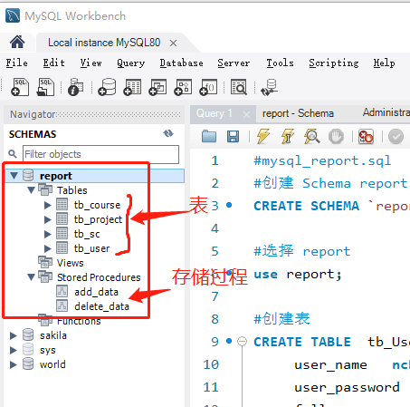

# 三 创建账号
1. 打开MySql Workbench，选择Server->Users and Privilegs
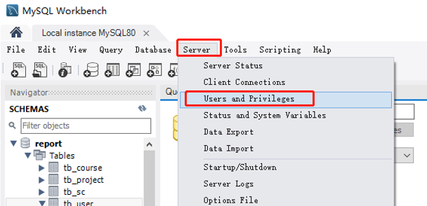

1. <text color="gray">单击“Add Account”，输入登录名和密码，单击“Apply”</text>
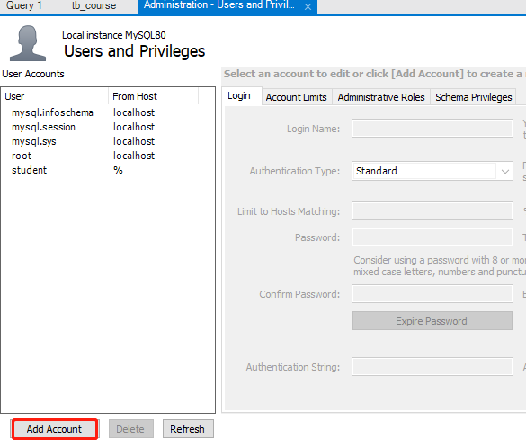

1. 设置登录名和口令
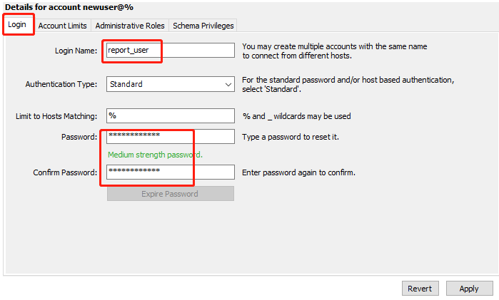

1. 设置权限
选择Schema Privileges，然后单击Add Entry....
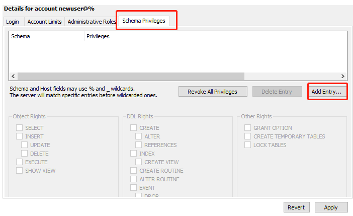

单击Selected schema，选择“report”，然后单击OK
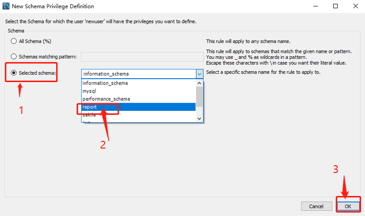

选择权限，然后单击Apply 
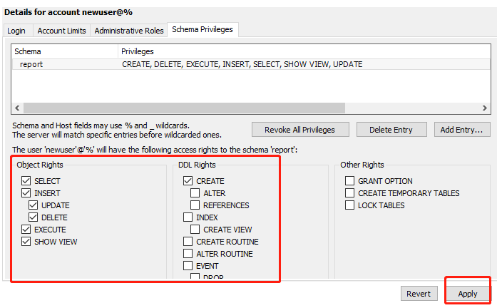

设置完成
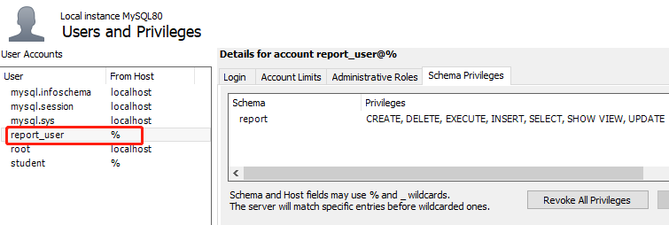

# 四 配置数据源
配置文件：META-INF/contex.xml，
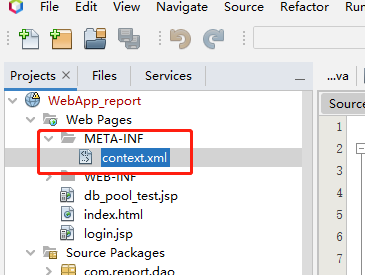

编辑配置文件
```xml {wrap}
<?xml version="1.0" encoding="UTF-8"?>
<Context path="/WebApp_report">
<!--Mysql 数据源 示例--> 
<Resource auth="Container"
          driverClassName="com.mysql.cj.jdbc.Driver" 
              maxIdle="30" 
              maxTotal="30" 
              maxWaitMillis="10000" 
              name="jdbc/Win_mysql_reportdb" 
              password="***" 
              type="javax.sql.DataSource" 
              url="jdbc:mysql://localhost/report?serverTimezone=UTC"
              username="report_user" 
              validationQuery="select 1"/>
</Context>
```

其中， username="report_user" 和 password="***" 分别配置数据库服务器用户名和密码，用实际环境中的用户名和密码替换； name="jdbc/Win_mysql_reportdb" 配置数据源的名称。
# 五  测试数据源
配置开发环境JDBC驱动程序
1. 下载JDBC驱动程序 https://www.mysql.com/products/connector/
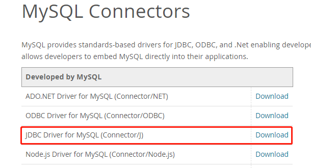

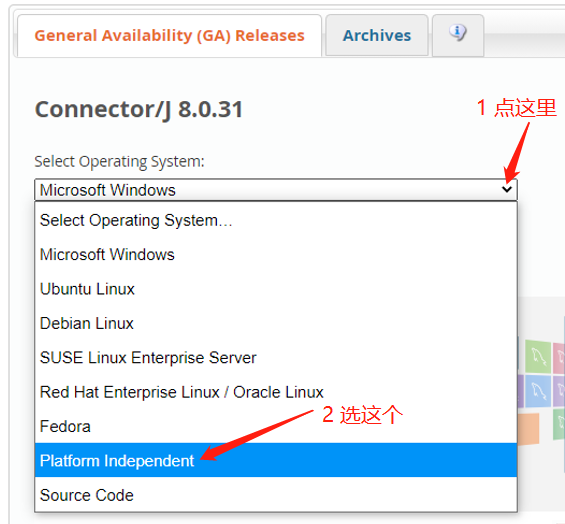

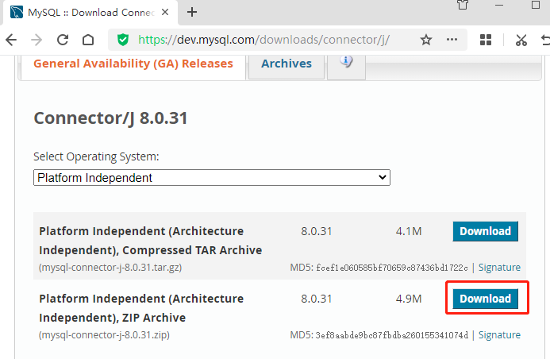

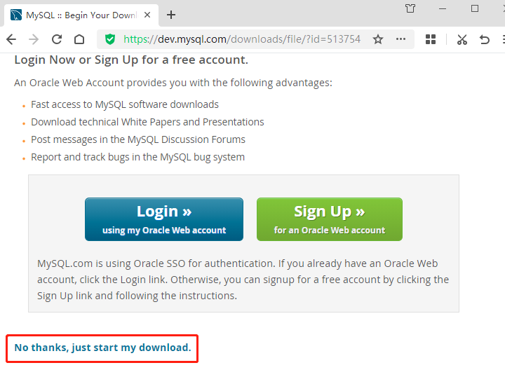

1. 下载后解压（最好解压到项目文件夹中）
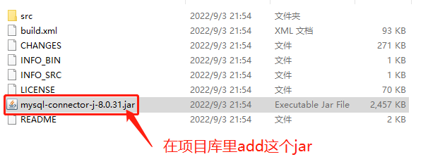

1. 在NetBeans的项目里，右击库
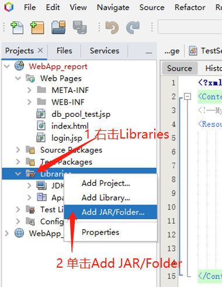

1. 添加驱动程序，选择Jar文件，然后打开。
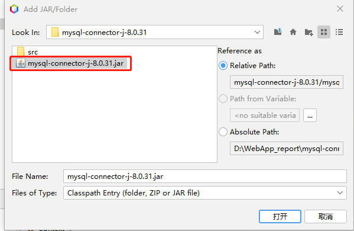

1. 数据源连接测试
新建JSP程序“db_pool_test.jsp”，
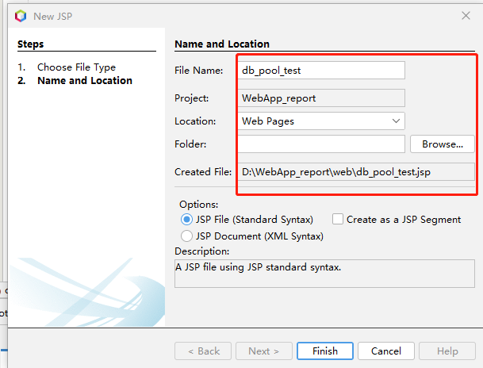


```java {wrap}
<%@ page import="java.lang.*,java.io.*,java.sql.*,java.util.* "%>
<%@page contentType="text/html" pageEncoding="UTF-8"%>
<%@ page import="javax.naming.*"%>
<%@ page import="javax.sql.*"%>

<!DOCTYPE html>
<html>
  <head>
    <meta http-equiv="Content-Type" content="text/html; charset=UTF-8">
    <title>数据源测试</title>
  </head>
  <body>
    <%
      try {
        //查找数据源
        Context ctx = new InitialContext();
        DataSource ds = (DataSource) ctx.lookup("java:comp/env/jdbc/Win_mysql_reportdb");
        //数据库连接
        java.sql.Connection con = ds.getConnection();
        String sql = "select user_name,full_name from tb_User";
        //语句对象
        PreparedStatement stmt = con.prepareStatement(sql);
        ResultSet rs = stmt.executeQuery(sql);
        int i = 0;
        while (rs.next()) {
          i++;
          out.println("记录" + i + "->");
    %>
    用户名：<%=rs.getString(1)%>；
    姓名：<%=rs.getString(2)%><br>
    <% } %>
    <% out.print("数据库操作成功!"); %>
    <% rs.close();
        stmt.close();
        con.close();
      } //捕获错误信息
      catch (Exception e) {
        out.println(e.getMessage());
      }
    %>
  </body>
</html>
```

1. 运行项目，在浏览器地址栏后面输入“db_poll_test.jsp”，然后回车。


1. 查询成功。


