# 一  DAO接口
DAO接口是所有数据访问对象的根接口，定义获取数据库连接的默认方法：
public default Connection getConnection()
新建Java Class，设置如下图，
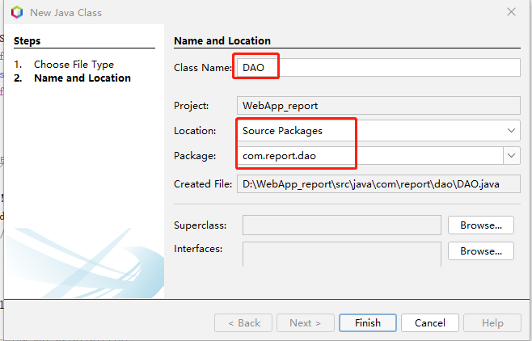

单击Finish，编辑代码“DAO.java”
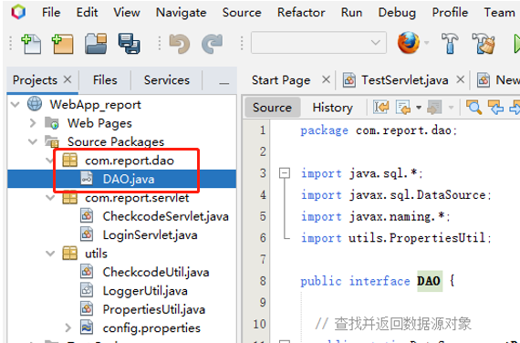


```java {wrap}
package com.report.dao;

import java.sql.*;
import javax.sql.DataSource;
import javax.naming.*;
import utils.PropertiesUtil;

public interface DAO {

  // 查找并返回数据源对象
  public static DataSource getDataSource() {
    DataSource dataSource = null;
    try {
      Context context = new InitialContext();
      //使用属性工具类PropertiesUtil获取数据源配置
      // config.properties 中data_source属性指定了数据源；数据源在META-INF/contex.xml中配置
      dataSource = (DataSource) context.lookup(PropertiesUtil.pro.getProperty("data_source"));
      // System.out.println(PropertiesUtil.pro.getProperty("data_source"));
    } catch (NamingException ne) {
      System.out.println("异常:" + ne);
    }
    return dataSource;
  }

  //返回连接对象方法
  //接口的default方法可以有方法体,default方法方法可以不被实现类重写；而接口中的普通方法必须被实现类重写
  public default Connection getConnection() {
    DataSource dataSource = getDataSource();
    Connection conn = null;
    try {
      conn = dataSource.getConnection();
    } catch (SQLException sqle) {
      System.out.println("异常:" + sqle);
    }
    return conn;
  }
}
```

# 二 实体类
实体类用来存储数据，实体类要可序列化，新建User类。
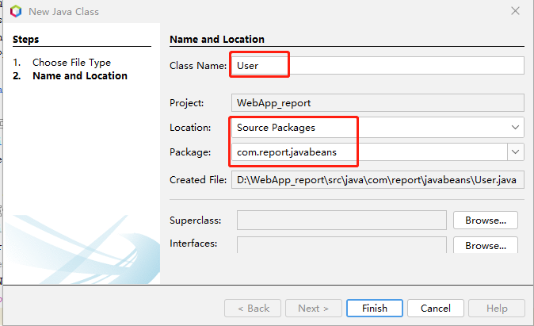

设置好类名和包，Finish完成，
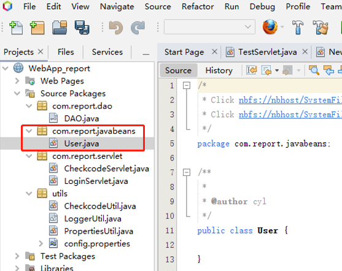

编辑User.java代码，
```java
package com.report.javabeans;

import java.io.Serializable;

/**
 *
 * @author cyl
 */
public class User implements Serializable {

  String username = null;
  String password = null;
  String fullName = null;
  String email = null;
  String role = null; //student or teacher

  public String getEmail() {
    return email;
  }

  public void setEmail(String email) {
    this.email = email;
  }

  public String getUsername() {
    return username;
  }

  public void setUsername(String username) {
    this.username = username;
  }

  public String getPassword() {
    return password;
  }

  public void setPassword(String password) {
    this.password = password;
  }

  public String getRole() {
    return role;
  }

  public void setRole(String role) {
    this.role = role;
  }

  public String getFullName() {
    return fullName;
  }

  public void setFullName(String fullName) {
    this.fullName = fullName;
  }

}
```

# 三 创建UserDAO
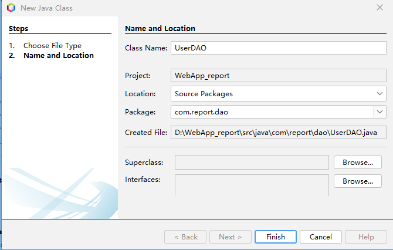

编辑UserDAO.java，UserDAO实现了DAO接口。
```java
package com.report.dao;

import java.sql.*;
import com.report.javabeans.User;
import java.util.logging.Level;
import java.util.logging.Logger;
import utils.LoggerUtil;

/**
 *
 * @author cyl
 */
public class UserDAO implements DAO {
  //更新口令和邮箱
  public boolean updateUser(User user) {
    Connection conn = getConnection();
    String sql = "UPDATE tb_User set user_password=?,email=? where user_name=?";
    try {
      PreparedStatement pstmt = conn.prepareStatement(sql);
      pstmt.setString(3, user.getUsername());
      pstmt.setString(2, user.getEmail());
      pstmt.setString(1, user.getPassword());
      pstmt.executeUpdate();
    } catch (SQLException sqle) {
      System.out.println(sqle);
      return false;
    }
    try {
      conn.close();
    } catch (SQLException ex) {
      Logger.getLogger(UserDAO.class.getName()).log(Level.SEVERE, null, ex);
    }
    String message=this.getClass() + user.getFullName() + ":更新个人信息！";
    LoggerUtil.logger.warning(message);
    return true;
  }

  /* find(User user) 在数据库中查询是否存在user的记录，
    存在返回User对象,否则返回null */
  public User find(User user) {
    String sql = "SELECT * FROM tb_User WHERE user_name =? and user_password=?";
    try {
      Connection conn = getConnection();
      PreparedStatement pstmt = conn.prepareStatement(sql);
      pstmt.setString(1, user.getUsername());
      pstmt.setString(2, user.getPassword());
      try ( ResultSet rst = pstmt.executeQuery()) {
        if (rst.next()) {
          user.setUsername(rst.getString("user_name"));
          user.setPassword(rst.getString("user_password"));
          user.setEmail(rst.getString("email"));
          user.setFullName(rst.getString("full_name"));
          user.setRole(rst.getString("role_type"));
          conn.close();
          return user;
        }
      }
    } catch (SQLException se) {
      System.out.println(se);
      return null;
    }
    return null;
  }
  /* find(String username),忘记密码时调用，在数据库中查询是否存在user的记录，
    存在返回User对象,否则返回null */
    public User find(String username){
        String sql = "SELECT * FROM tb_User WHERE user_name =?";
        User user = new User();
        try (
                Connection conn = getConnection();
                PreparedStatement pstmt = conn.prepareStatement(sql)) {
            pstmt.setString(1, username);

            try (ResultSet rst = pstmt.executeQuery()) {
                if (rst.next()) {
                    user.setUsername(rst.getString("user_name"));
                    user.setEmail(rst.getString("email"));
                    user.setFullName(rst.getString("full_name"));
                    conn.close();
                    return user;
                }
            }
        } catch (SQLException se) {
            System.out.println(se);
            return null;
        }
        return null;
    }  
}
```

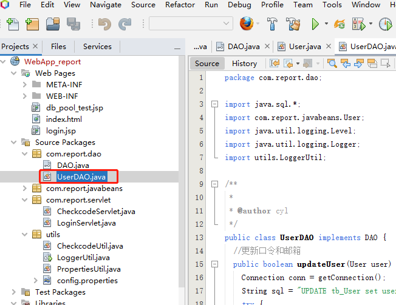

其它数据数据访问***DAO待后续开发。
# 四 登录控制
1. 下载 和添加Apache Commons Codec**：**
Apache Commons Codec下载链接：
https://commons.apache.org/proper/commons-codec/download_codec.cgi
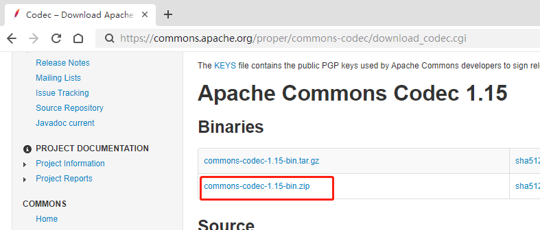

下载后解压，jar文件添加到项目库中，


选择jar文件，然后打开
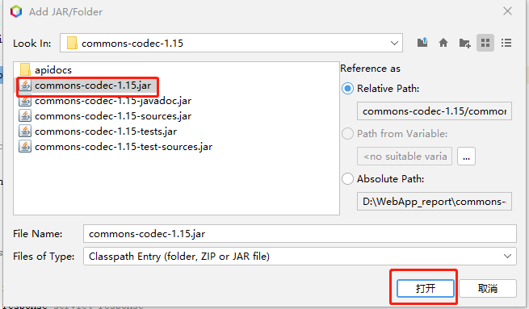

1. 新建Servlet程序“LoginServlet”,
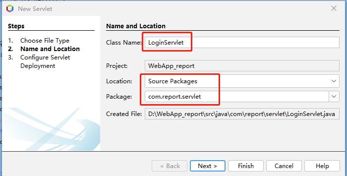

```java {wrap}
package com.report.servlet;

import com.report.dao.UserDAO;
import com.report.javabeans.User;
import javax.servlet.ServletException;
import javax.servlet.annotation.WebServlet;
import javax.servlet.http.HttpServlet;
import javax.servlet.http.HttpServletRequest;
import javax.servlet.http.HttpServletResponse;
import javax.servlet.http.HttpSession;
import java.io.IOException;
import javax.servlet.RequestDispatcher;
import org.apache.commons.codec.digest.DigestUtils;

@WebServlet("/LoginServlet")
public class LoginServlet extends HttpServlet {

  @Override
  protected void doPost(HttpServletRequest request, HttpServletResponse response)
          throws ServletException, IOException {
    response.setContentType("text/html;charset=UTF-8");
    response.setHeader("Pragma", "no-cache");
    response.addHeader("Cache-Control", "must-revalidate");
    response.addHeader("Cache-Control", "no-cache");
    response.addHeader("Cache-Control", "no-store");
    response.setDateHeader("Expires", 0);
    //设置字符编码
    request.setCharacterEncoding("utf-8");
    //读客户端参数
    String username = request.getParameter("username");//读用户名
    String password = request.getParameter("password");//读口令
    String checkcode = request.getParameter("checkcode");//读验证码
    HttpSession session = request.getSession();
    String checkcode_session = (String) session.getAttribute("checkcode_session");
    //删除Session中存储的验证码
    session.removeAttribute("checkcode_session");
    //判断验证码是否正确，equalsIgnoreCase忽略大小写的比较
    if (checkcode_session != null && checkcode_session.equalsIgnoreCase(checkcode)) {
      //验证码正确
      User user = new User();
      user.setUsername(username);
      password = DigestUtils.md5Hex(password);//MD5
      user.setPassword(password);
      UserDAO userdao = new UserDAO();
      user = userdao.find(user);
      if (user != null) { //用户名和口令正确
        //储用户信息到会话：session 
        session.setAttribute("user", user);
        //是否第一次登录（未设置邮箱）
        if (user.getEmail() == null) //转到set_password_email.jsp
        {
          RequestDispatcher rd = request.getRequestDispatcher("/WEB-INF/set_password_email.jsp");
          rd.forward(request, response);
        } else {  //根据用户角色转到相应的页面
          if (user.getRole().trim().equals("student")) {
            response.sendRedirect("list.jsp");//学生界面
          } else if (user.getRole().trim().equals("teacher")) {
            //System.out.println("teacher!");
            //教师界面 /WEB-INF/list_teacher.jsp
            RequestDispatcher rd = request.getRequestDispatcher("/WEB-INF/list_teacher.jsp");
            rd.forward(request, response);
          }
        }
      } else {
        //用户名或口令错误，登录失败
        //提示信息存储到请求对象：request
        request.setAttribute("login_error", "用户名或口令错误");
        //请求转发到登录页面login.jsp
        request.getRequestDispatcher("/login.jsp").forward(request, response);
      }
    } else {
      //验证码错误，提示信息到存储请求对象：request
      request.setAttribute("checkcode_error", "验证码错误");
      //请求转发到登录页面
      request.getRequestDispatcher("/login.jsp").forward(request, response);
    }

  }
  @Override
  protected void doGet(HttpServletRequest request, HttpServletResponse response)
          throws ServletException, IOException{
  }
}
```

1. 新建JSP程序“set_password_email”，
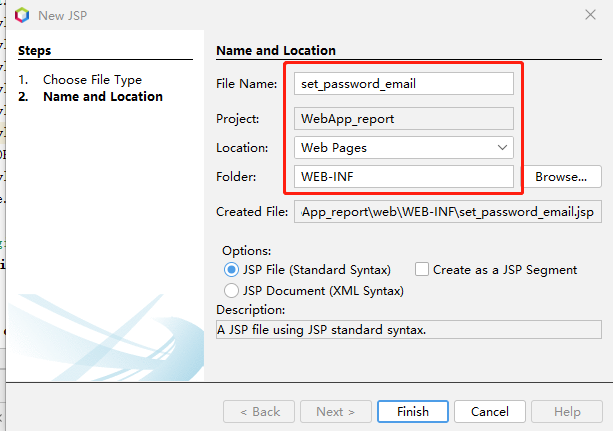

Finish，运行项目，
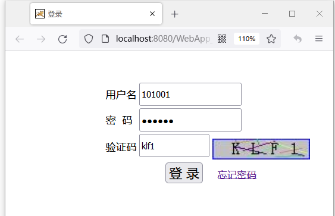

输入数据库中已存储的用户名“101001”，密码也是“101001”，输入验证码，点击登录，验证成功将显示。
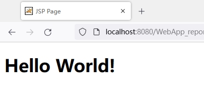


