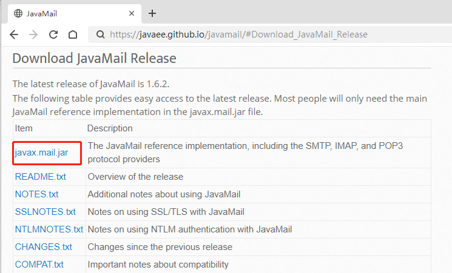
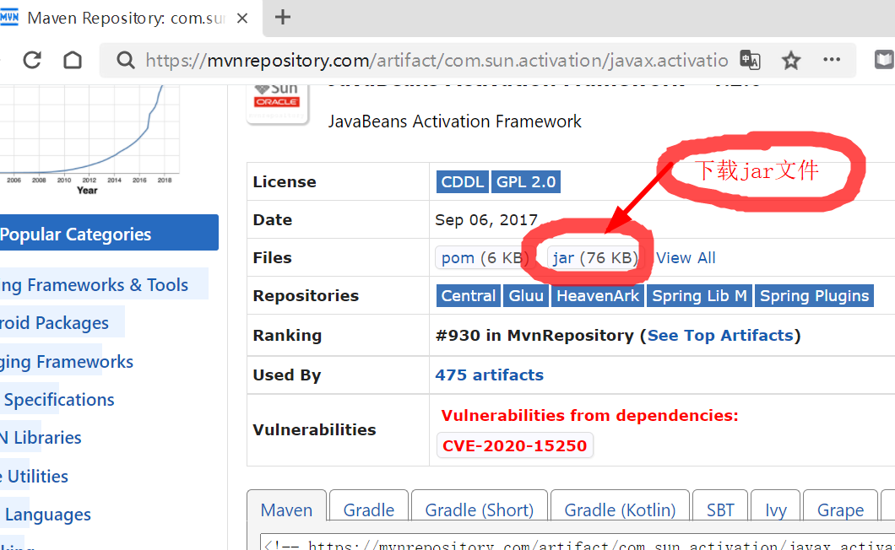
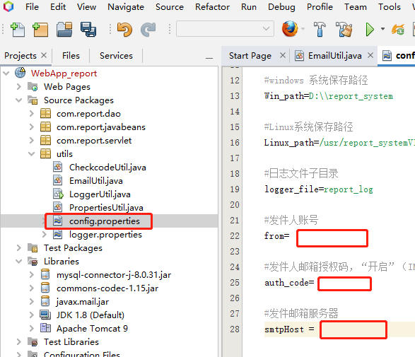
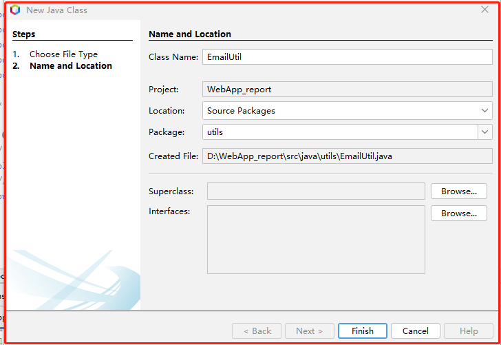

1. 下载 javax.mail.jar，https://javaee.github.io/javamail/


1.  把javax.mail.jar添加到项目库中，


<callout emoji="pushpin" background-color="light-orange" border-color="light-orange">
注：Java发送邮件药用javax.mail-api.jar和activation.jar两个jar包，包含activation.jar的Java的最后一个版本是java1.8。如果使用的java1.9版本需要下载activation.jar，并把activation.jar加到库中。
https://mvnrepository.com/artifact/com.sun.activation/javax.activation/1.2.0
如下图所示：
</callout>




1. 在config.properties文件中设置系统邮箱，用于发送系统验证码


1. 新建类EmailUtil，


```java {wrap}
package utils;

/**
 *
 * @author cyl
 */
import java.util.Date;
import java.util.Properties;
import java.util.Random;
import javax.mail.MessagingException;
import javax.mail.Session;
import javax.mail.Transport;
import javax.mail.internet.InternetAddress;
import javax.mail.internet.MimeMessage;

public class EmailUtil {

  private static final String FROM;  // 发件人账号,reportServer11
  private static final String AUTHCODE;  // 发件人邮箱授权码
  private static final String SMTPHOST;  // 发件邮箱服务器
  private static final Properties PROPS;  // 参数配置
  private static final Session MAILSESSION;  // 会话对象
  private String checkCode; //验证码

  static {//静态代码块，在虚拟机加载类时执行且只执行一次  
    FROM = PropertiesUtil.pro.getProperty("from");
    AUTHCODE = PropertiesUtil.pro.getProperty("auth_code");
    SMTPHOST = PropertiesUtil.pro.getProperty("smtpHost");
    PROPS = new Properties();
    PROPS.setProperty("mail.transport.protocol", "smtp");  // 协议
    PROPS.setProperty("mail.smtp.host", SMTPHOST);  // SMTP 服务器地址
    PROPS.setProperty("mail.smtp.auth", "true");  // 请求认证
    MAILSESSION = Session.getInstance(PROPS);
    // session.setDebug(true);  // 设置为debug模式, 可以查看详细的发送 log 
  }

  /**
   * 构造函数，属性配置
   */
  public EmailUtil() {

  }

  //生成随机的n位验证码
  public String getCheckcode(int codeCount) {
    String chars = "OPASDFGHQWERTYKLZXCVUIJBNM7014368259cvbnmlkjzxhgfrtyuiopdsaqwe";
    StringBuilder code;
    code = new StringBuilder();
    Random ran = new Random();
    for (int i = 1; i <= codeCount; i++) {
      int index = ran.nextInt(chars.length());
      char ch = chars.charAt(index); //取字符
      code.append(ch);
    }
    return code.toString();

  }

  /**
   * 构建邮件内容
   *
   * @param email
   * @return
   * @throws java.lang.Exception
   * @throws javax.mail.MessagingException
   */
  public MimeMessage setEmailContent(String email) throws Exception, MessagingException {
    MimeMessage message = new MimeMessage(MAILSESSION);
    // 发件人
    message.setFrom(new InternetAddress(FROM, "实验报告系统", "UTF-8"));
    // 收件人
    message.setRecipient(MimeMessage.RecipientType.TO, new InternetAddress(email));
    // 邮件主题
    message.setSubject("实验报告系统验证码", "UTF-8");
    // 邮件正文 
    checkCode = getCheckcode(4);
    message.setContent("验证码是：" + checkCode + " 如非本人操作，请检查账号安全。", "text/html;charset=UTF-8");
    // 设置发件时间
    message.setSentDate(new Date());
    // 保存设置
    message.saveChanges();
    return message;
  }

  /**
   * 发送邮件
   *
   * @param email
   * @throws java.lang.Exception
   */
  public void sendEmail(String email) throws Exception {
    try ( Transport transport = MAILSESSION.getTransport()) {
      transport.connect(FROM, AUTHCODE);
      MimeMessage message = setEmailContent(email); // 设置邮件内容
      transport.sendMessage(message, message.getAllRecipients());
      //System.out.println(email+"验证码发送成功！");
      String ms = email + "验证码发送成功！";
      LoggerUtil.logger.warning(ms);
      // 关闭连接
    }
  }

  public String getCheckCode() {
    return checkCode;
  }
  /**
   * main 测试 发送验证码邮件工具类
   *
   * @param args
   */
  /*   
     public static void main(String[] args) {
        EmailUtil emailUtil = new EmailUtil();

        try {
            emailUtil.sendEmail("收验证码邮箱");
            System.out.println(emailUtil.getCheckCode());
        } catch (Exception ex) {
            System.out.println(ex);
        }
     }
   */
}
```

新建Servlet程序“EmailCheckcodeServlet”
```java
package com.report.servlet;

import java.io.IOException;
import java.io.PrintWriter;
import javax.servlet.ServletException;
import javax.servlet.annotation.WebServlet;
import javax.servlet.http.HttpServlet;
import javax.servlet.http.HttpServletRequest;
import javax.servlet.http.HttpServletResponse;
import utils.EmailUtil;
import utils.LoggerUtil;

/**
 * 生成验证码，验证码字符串存到session并发送到用户邮箱,图片发送浏览器
 *
 * @author cyl
 */
@WebServlet(name = "EmailCheckcodeServlet", urlPatterns = {"/EmailCheckcodeServlet"})
public class EmailCheckcodeServlet extends HttpServlet {
  @Override
  protected void service(HttpServletRequest request, HttpServletResponse response)
          throws ServletException, IOException {
    response.setContentType("text/html;charset=UTF-8");
    try ( PrintWriter out = response.getWriter()) {
      EmailUtil emailUtil = new EmailUtil();
      try {
        emailUtil.sendEmail(request.getParameter("email"));
      } catch (Exception ex) {
        LoggerUtil.logger.warning(ex.getMessage());
      }
      request.getSession().setAttribute("emailCheckcode", emailUtil.getCheckCode());
      //System.out.print("send to->");
      //System.out.println(request.getParameter("email"));
      out.flush();
    }
  }
}
```


