# 一 首次登录
用户（教师或学生），第一次登录系统需要更改密码，设置邮箱，邮箱用于接收验证码。
编辑JSP程序“set_password_email.jsp”
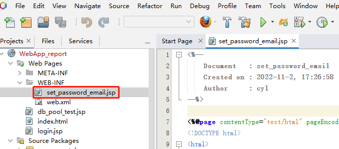

```html {wrap}
<%-- 
    Document   : set_password_email
--%>

<%@page contentType="text/html" pageEncoding="UTF-8"%>
<%response.setContentType("text/html;charset=UTF-8");
  response.setHeader("Pragma", "no-cache");
  response.addHeader("Cache-Control", "must-revalidate");
  response.addHeader("Cache-Control", "no-cache");
  response.addHeader("Cache-Control", "no-store");
  response.setDateHeader("Expires", 0);
%> 
<!DOCTYPE html>
<html>
  <head>
    <meta http-equiv="Content-Type" content="text/html; charset=UTF-8">
    <title>重置口令</title>
  </head>

  <body>
    <div style="width: 500px;height:300px;position: absolute;top: 10%;left: 30%;">
      <form action="SetPasswordEmail.do" method="post" name="form1" onSubmit="return Check()">
        原密码 <div id="old"><input type="password" name="oldpass" >${requestScope.password_error}</div>
        新密码 <div id="new"><input type="password" name="newpass" ><div id="info_newpass" style="color: #ff0000;display:inline;"></div></div>
        确认新密码 <div id="comfirm"><input type="password" name="confirmpass"  ><div id="info_confirm" style="color: #ff0000;display:inline;"></div> </div>
        电子邮箱 <div id="email"><input type="text" name="email" onblur=isEmail(this.value)> <input type="button" id="button" value="获取验证码"></div>
        验证码<div id="emailcode"><input type="text" name="emailCheckcode"  placeholder="输入邮箱中收到的验证码"/>${requestScope.emailCheckcode_error}</div>
        <p>
          <input type="submit" id="submit" value="提交">
      </form>
        <div id="result"></div>
    </div>
    <script>
      const info_newpass = document.getElementById("info_newpass");
      const info_confirm = document.getElementById("info_confirm");
      const newpass = document.getElementsByTagName("input")[1];
      const confirmpass = document.getElementsByTagName("input")[2];
      const email = document.getElementsByTagName("input")[3];
      newpass.onchange = function () {
        info_newpass.innerHTML = "长度6-8位";
        if (confirmpass.value === newpass.value && newpass.value.length >= 4)
          info_confirm.innerHTML = "ok";
        else
        {
          info_confirm.innerHTML = "不匹配";
        }
      };

      confirmpass.onchange = function () {
        if (confirmpass.value === newpass.value && newpass.value.length >= 4)
          info_confirm.innerHTML = "ok";
        else
        {
          info_confirm.innerHTML = "不匹配";
        }
      };

      function isEmail(strEmail) {
        if (strEmail.search(/^\w+((-\w+)|(\.\w+))*\@[A-Za-z0-9]+((\.|-)[A-Za-z0-9]+)*\.[A-Za-z0-9]+$/) !== -1)
          return true;
        else
          alert(email.value + "邮箱格式错误");
      }
      function Check()
      {
        for (var i = 0; i < document.form1.elements.length - 1; i++)
        {
          if (document.form1.elements[i].value === "")
          {
            alert("不允许空！");
            document.form1.elements[i].focus();
            return false;
          }
        }
        if (newpass.value.length < 6)
        {
          alert("密码长度不足！");
          document.getElementsByTagName("input")[1].focus();
          return false;
        }
        if (confirmpass.value !== newpass.value)
        {
          alert("两次输入不匹配！");
          document.getElementsByTagName("input")[2].focus();
          return false;
        }
        return true;

      }
      //获取button
      const btn = document.getElementById("button");
      const result=document.getElementById("result");
      //绑定按钮的 click 事件   
      btn.onclick = function () {
        if (!isEmail(email.value))
          return false;
        btn.disabled = true;//禁用按钮
        setBTN();
        //1.创建请求对象
        const xhr = new XMLHttpRequest();
        //2.设置请求方法和URL
        xhr.open("post", "/WebApp_report/EmailCheckcodeServlet?email=" + email.value, true);
        //3.发送
        xhr.send();
        //4. 绑定事件 处理服务端返回的结果
        //readystate 是xhr的一个属性，状态 0 1 2 3 4
        xhr.onreadystatechange = function () {
          // 如果服务器端返回了所有的结果
          if (xhr.readyState === 4) {
            //判断响应码 2XX 表示成功
            if (xhr.status >= 200 && xhr.status <= 300) {
              //处理结果    
              console.log(xhr.status);//状态码
              console.log(xhr.statusText);//状态字符串
              console.log(xhr.getAllResponseHeaders());//响应头
              console.log(xhr.response);//响应体
              //设置 result 显示的文本内容
              result.innerHTML=xhr.response;
            } else {
            }
          }
        };
      };

      //修改按钮，控制验证码重新获取
      var time0 = 20;
      var time = time0;
      var t;  // 验证按钮的20s计时
      //修改按钮，控制验证码重新获取
      function changeBTN() {
        if (time > 0) {
          btn.value = "(" + time + "s)" + "重新获取";
          time = time - 1;
        } else {

          btn.disabled = false;
          btn.value = "获取验证码";
          clearInterval(t);
          time = time0;
        }
      }
      function setBTN() {
        btn.value = "(" + time + "s)" + "重新获取";
        time = time - 1;
        t = setInterval("changeBTN()", 1000);  // 1s调用一次
      }
    </script>
  </body>
</html>

```

运行项目
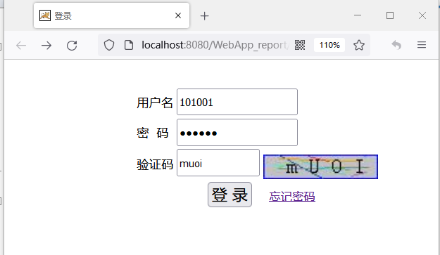

输入用户名和口令（都是101001），输入验证码，然后点击登录
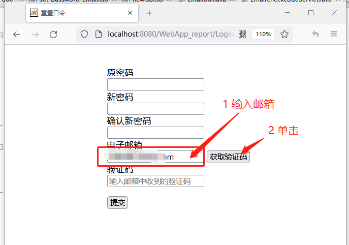

输入用户邮箱，单击获取验证码，验证码将发送到用户邮箱。
新建Servlet程序“SePasswordEmailServlet”
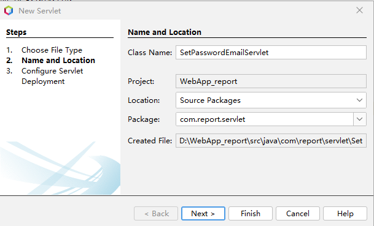

Next
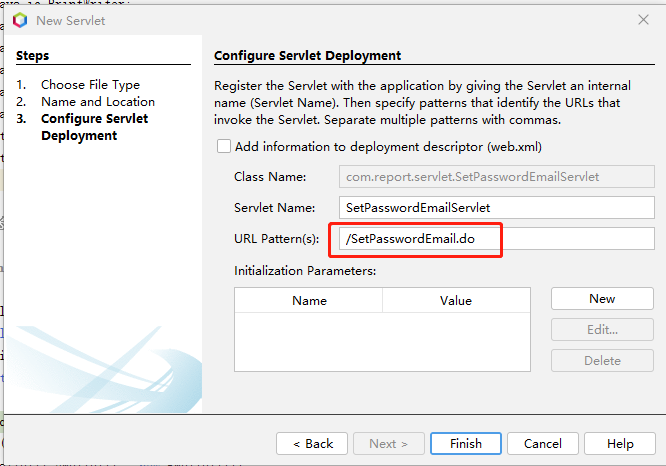

点击Finsh,然后编辑代码
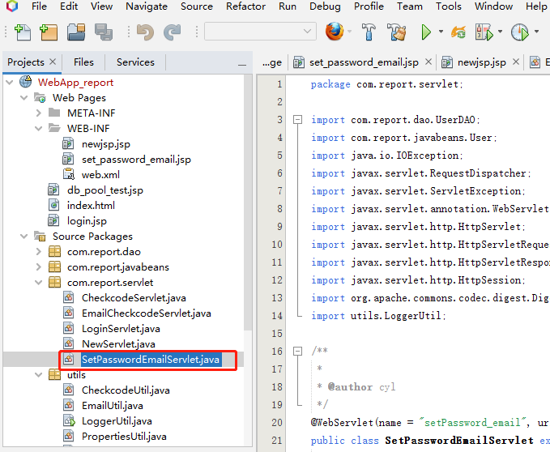

```java {wrap}
package com.report.servlet;

import com.report.dao.UserDAO;
import com.report.javabeans.User;
import java.io.IOException;
import javax.servlet.RequestDispatcher;
import javax.servlet.ServletException;
import javax.servlet.annotation.WebServlet;
import javax.servlet.http.HttpServlet;
import javax.servlet.http.HttpServletRequest;
import javax.servlet.http.HttpServletResponse;
import javax.servlet.http.HttpSession;
import org.apache.commons.codec.digest.DigestUtils;
import utils.LoggerUtil;

/**
 *
 * @author cyl
 */
@WebServlet(name = "SetPasswordEmailServlet", urlPatterns = {"/SetPasswordEmail.do"})
public class SetPasswordEmailServlet extends HttpServlet {

  /**
   * Processes requests for both HTTP <code>GET</code> and <code>POST</code> methods.
   *
   * @param request servlet request
   * @param response servlet response
   * @throws ServletException if a servlet-specific error occurs
   * @throws IOException if an I/O error occurs
   */
  protected void processRequest(HttpServletRequest request, HttpServletResponse response)
          throws ServletException, IOException {
    response.setContentType("text/html;charset=UTF-8");
    response.setHeader("Pragma", "no-cache");
    response.addHeader("Cache-Control", "must-revalidate");
    response.addHeader("Cache-Control", "no-cache");
    response.addHeader("Cache-Control", "no-store");
    response.setDateHeader("Expires", 0);

    HttpSession session = request.getSession();

    String checkcode = (String) request.getSession().getAttribute("emailCheckcode");
    System.out.println("验证码："+checkcode);
    if (!request.getParameter("emailCheckcode").equalsIgnoreCase(checkcode)) {
      request.setAttribute("emailCheckcode_error", "验证码错误！");
      //request.getSession().removeAttribute("emailCheckcode");
      //教师界面 /WEB-INF/list_teacher.jsp
      request.getRequestDispatcher("/WEB-INF/set_password_email.jsp").forward(request, response);
      return;
    }
    //清除验证码
    request.getSession().removeAttribute("emailCheckcode");

    User user = (User) session.getAttribute("user");
    if (user.getEmail() != null) {
      response.sendRedirect("list.jsp");//学生界面
      return;
    }
    String oldPass = request.getParameter("oldpass");
    oldPass = DigestUtils.md5Hex(oldPass);//MD5
    user.setPassword(oldPass);
    UserDAO userdao = new UserDAO();
    try {
      user = userdao.find(user);
    } catch (Exception ex) {
      System.out.println(ex);
    }
    if (user == null) {
      request.setAttribute("password_error", "密码错误！");
      RequestDispatcher rd;
      rd = request.getRequestDispatcher("/WEB-INF/set_password_email.jsp");
      rd.forward(request, response);
      return;
    }
    user.setEmail(request.getParameter("email"));
    String newPass = request.getParameter("newpass");
    newPass = DigestUtils.md5Hex(newPass);//MD5
    user.setPassword(newPass);
    request.getSession().setAttribute("user", user);
    try {
      //out.println(user.getEmail());
      //out.println(user.getPassword());
      if (userdao.updateUser(user)) {
        String log_str = this.getClass() + "->" + user.getFullName() + ":重置密码，设置邮箱！";
        LoggerUtil.logger.warning(log_str);
        if (user.getRole().equals("student")) {
          response.sendRedirect("list.jsp");
        }
        if (user.getRole().equals("teacher")) {
          request.getRequestDispatcher("/WEB-INF/list_teacher.jsp").forward(request, response);
        }
        //request.getRequestDispatcher("list.jsp").forward(request, response);
      }
    } catch (IOException | ServletException ex) {
      System.out.println(ex);
    }

  }

  // <editor-fold defaultstate="collapsed" desc="HttpServlet methods. Click on the + sign on the left to edit the code.">
  /**
   * Handles the HTTP <code>GET</code> method.
   *
   * @param request servlet request
   * @param response servlet response
   * @throws ServletException if a servlet-specific error occurs
   * @throws IOException if an I/O error occurs
   */
  @Override
  protected void doGet(HttpServletRequest request, HttpServletResponse response)
          throws ServletException, IOException {
    processRequest(request, response);
  }

  /**
   * Handles the HTTP <code>POST</code> method.
   *
   * @param request servlet request
   * @param response servlet response
   * @throws ServletException if a servlet-specific error occurs
   * @throws IOException if an I/O error occurs
   */
  @Override
  protected void doPost(HttpServletRequest request, HttpServletResponse response)
          throws ServletException, IOException {
    processRequest(request, response);
  }

  /**
   * Returns a short description of the servlet.
   *
   * @return a String containing servlet description
   */
  @Override
  public String getServletInfo() {
    return "set password email";
  }// </editor-fold>

}
```

新建教师界面JSP程序“list_teacher.jsp”
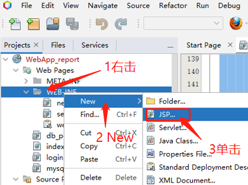


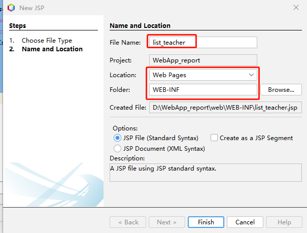


教师界面JSP程序“list_teacher.jsp”待后续完善，运行项目
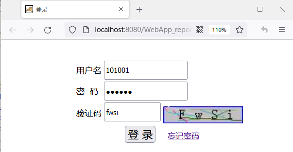

登录
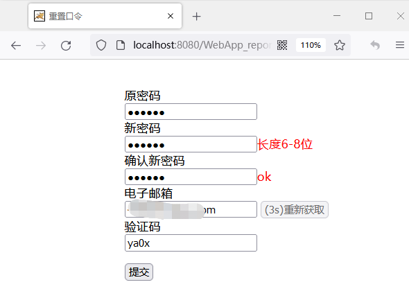

设置完成后提交，
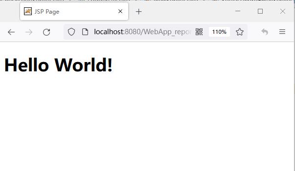

修改成功，重新运行项目，可以用新密码登录。
# 二 忘记密码
用户忘记密码，可以使用预留的邮箱接收验证码，然后重置密码。
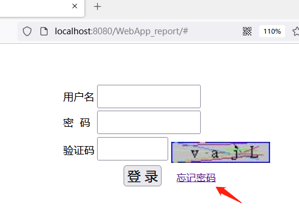

新建忘记密码界面JSP程序，“forgetPassword.jsp”
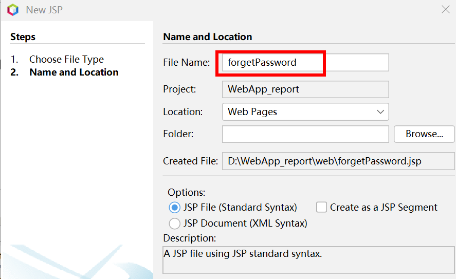


编辑代码，
```java
<%-- 
    Document   : forgetPassword
    Author     : cyl
--%>
<%@page import="java.util.Random"%>
<%@page contentType="text/html" pageEncoding="UTF-8"%>
<%
  response.setHeader("Pragma", "no-cache");
  response.addHeader("Cache-Control", "must-revalidate");
  response.addHeader("Cache-Control", "no-cache");
  response.addHeader("Cache-Control", "no-store");
  response.setDateHeader("Expires", 0);
%>
<!DOCTYPE html>
<html>
  <head>
    <meta http-equiv="Content-Type" content="text/html; charset=UTF-8">
    <title>忘记密码</title>
  </head>
  <body>
    <% Random ran = new Random();
      int index = ran.nextInt(10000);
      request.getSession().setAttribute("index", index);
    %>
    <div style="width: 500px;height:300px;position:absolute;top:10%;left:30%;">
      <form action="forgetPass.do" method="post" name="form1" onSubmit="return Check()">
        用户名 <div id="old"><input type="text" name="username" >${requestScope.username_error}</div>
        预留的邮箱 <div id="email"><input type="text" name="email" onblur=isEmail(this.value)> <input type="button" id="button" value="获取验证码">${requestScope.email_error}</div>
        验证码<div id="emailcode"><input type="text" name="emailCheckcode"  placeholder="输入邮箱中收到的验证码"/>${requestScope.checkcode_error}</div>
        新密码 <div id="new"><input type="password" id="idnewpass" name="newpass" ><div id="info_newpass" style="color: #ff0000;display:inline;"></div></div>
        确认新密码 <div id="comfirm"><input type="password" id="idconfirmpass" name="confirmpass"></div>
        <input type="hidden" name="index" value="${index}"/>
        <p>
          <input type="submit" id="submit" value="提交">
      </form>
    </div>
    <script>
      //const newpass = document.getElementsByTagName("input")[1];
      const email = document.getElementsByTagName("input")[1];
      function isEmail(strEmail) {
        if (strEmail.search(/^\w+((-\w+)|(\.\w+))*\@[A-Za-z0-9]+((\.|-)[A-Za-z0-9]+)*\.[A-Za-z0-9]+$/) != -1)
          return true;
        else
          alert(email.value + "邮箱格式错误");
      }
      function getAppPath() {
        //获取当前URL
        var curURL = window.document.location.href;
        //获取主机地址之后的路径部分（就是文件地址）
        var pathName = window.document.location.pathname;
        var pos = curURL.indexOf(pathName);
        //获取应用地址   
        var host = curURL.substring(0, pos);
        //获取带"/"的应用名，如：/***
        var webAppName = pathName.substring(0, pathName.substr(1).indexOf('/') + 1);
        return host + webAppName;
      }
      //获取button
      const btn = document.getElementById("button");
      //const result=document.getElementById("result");
      //绑定按钮的 click 事件   
      btn.onclick = function () {
        if (!isEmail(email.value))
          return false;
        btn.disabled = true;//禁用按钮
        setBTN();
        //1.创建请求对象
        const xhr = new XMLHttpRequest();
        //2.设置请求方法和URL
        xhr.open("post", getAppPath() + "/EmailCheckcodeServlet?email=" + email.value, true);
        //3.发送
        xhr.send();
        //4. 绑定事件 处理服务端返回的结果
        //readystate 是xhr的一个属性，状态 0 1 2 3 4
        xhr.onreadystatechange = function () {
          // 如果服务器端返回了所有的结果
          if (xhr.readyState === 4) {
            //判断响应码 2XX 表示成功
            if (xhr.status >= 200 && xhr.status <= 300) {
              //处理结果    
              console.log(xhr.status);//状态码
              console.log(xhr.statusText);//状态字符串
              console.log(xhr.getAllResponseHeaders());//响应头
              console.log(xhr.response);//响应体
              //设置 result 显示的文本内容
              //result.innerHTML=xhr.response;
            } else {
            }
          }
        };
      };
      //修改按钮，控制验证码重新获取           
      var time0 = 20;
      var time = time0;
      var t;  // 验证按钮的20s计时
      //修改按钮，控制验证码重新获取
      function changeBTN() {
        if (time > 0) {
          btn.value = "(" + time + "s)" + "重新获取";
          time = time - 1;
        } else {
          btn.disabled = false;
          btn.value = "获取验证码";
          clearInterval(t);
          time = time0;
        }
      }
      function setBTN() {
        btn.value = "(" + time + "s)" + "重新获取";
        time = time - 1;
        t = setInterval("changeBTN()", 1000);  // 1s调用一次
      }

    </script>

    <script>
      const info_newpass = document.getElementById("info_newpass");
      const info_confirm = document.getElementById("info_confirm");
      const newpass = document.getElementById("idnewpass");
      const confirmpass = document.getElementById("idconfirmpass");
      newpass.onfocus = function () {
        info_newpass.innerHTML = "长度6-8位";
      }
      confirmpass.onchange = function () {
        if (confirmpass.value == newpass.value && newpass.value.length >= 4)
          info_confirm.innerHTML = "ok";
        else
        {
          info_confirm.innerHTML = "输入不匹配";
          confirmpass.focus();
        }
      }
      function Check()
      {
        for (var i = 0; i < document.form1.elements.length - 1; i++)
        {
          if (document.form1.elements[i].value == "")
          {
            alert("不允许空！");
            document.form1.elements[i].focus();
            return false;
          }
        }
        if (newpass.value.length < 6)
        {
          alert("密码长度不足！");
          document.getElementsByTagName("input")[1].focus();
          return false;
        }
       // alert(confirmpass.value)
        if (confirmpass.value != newpass.value)
        {
          alert("两次输入不匹配！");
          document.getElementsByTagName("input")[2].focus();
          return false;
        }
        return true;
      }
    </script>
  </body>
</html>
```

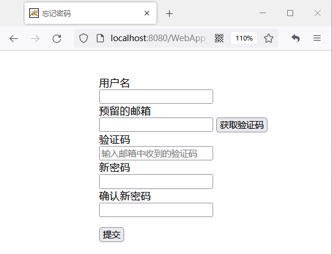

新建Servlet程序“forgetPasswordServlet”
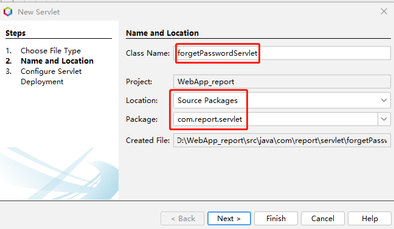

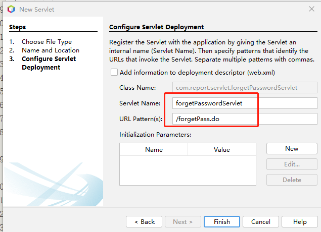


```java
package com.report.servlet;

import com.report.dao.UserDAO;
import com.report.javabeans.User;
import java.io.IOException;
import java.io.PrintWriter;
import javax.servlet.RequestDispatcher;
import javax.servlet.ServletException;
import javax.servlet.annotation.WebServlet;
import javax.servlet.http.HttpServlet;
import javax.servlet.http.HttpServletRequest;
import javax.servlet.http.HttpServletResponse;
import javax.servlet.http.HttpSession;
import org.apache.commons.codec.digest.DigestUtils;
import utils.LoggerUtil;

/**
 *
 * @author cyl
 */
@WebServlet(name = "forgetPasswordServlet", urlPatterns = {"/forgetPass.do"})
public class forgetPasswordServlet extends HttpServlet {

  protected void processRequest(HttpServletRequest request, HttpServletResponse response)
          throws ServletException, IOException {
    response.setContentType("text/html;charset=UTF-8");
    response.setHeader("Pragma", "no-cache");
    response.addHeader("Cache-Control", "must-revalidate");
    response.addHeader("Cache-Control", "no-cache");
    response.addHeader("Cache-Control", "no-store");
    response.setDateHeader("Expires", 0);
    String atrr_index = request.getParameter("index");
    String session_index = String.valueOf(request.getSession().getAttribute("index"));

    //检查是否是从forget.jsp的链接过来的
    if (atrr_index == null || !atrr_index.equals(session_index)) {
      System.out.println(" check index error!");
      String ms = this.getClass() + "check index error!,不是从从forget.jsp的链接过来的";
      LoggerUtil.logger.warning(ms);
      //RequestDispatcher rd;
      //rd = request.getRequestDispatcher("login.jsp");
      //rd.forward(request, response);
      System.out.println("check index eror!");
    }
    HttpSession session = request.getSession();
    try ( PrintWriter out = response.getWriter()) {
      String username = request.getParameter("username");
      //System.out.println(username);
      UserDAO userDAO = new UserDAO();
      User user = null;
      String checkcode = (String) request.getSession().getAttribute("emailCheckcode");
      //检查验证码
      if (!request.getParameter("emailCheckcode").equalsIgnoreCase(checkcode)) {
        //System.out.println(request.getParameter("emailCheckcode"));
        //System.out.println(request.getSession().getAttribute("emailCheckcode"));
        request.setAttribute("checkcode_error", "验证码错误！");
        //request.getSession().removeAttribute("emailCheckcode");
        request.getRequestDispatcher("forgetPassword.jsp").forward(request, response);
        return;
      } else {
        request.getSession().removeAttribute("emailCheckcode");
      }
      user = userDAO.find(username);
      // System.out.println(user.getEmail());
      //检查用户名
      if (user == null) {
        request.setAttribute("username_error", "用户名错误！");
        RequestDispatcher rd;
        rd = request.getRequestDispatcher("forgetPassword.jsp");
        rd.forward(request, response);
        return;
      }
      String email = request.getParameter("email");
      //检查预留邮箱是否一致
      if (!email.equals(user.getEmail())) {
        request.setAttribute("email_error", "邮箱与预留的邮箱不一致！");
        RequestDispatcher rd;
        rd = request.getRequestDispatcher("forgetPassword.jsp");
        rd.forward(request, response);
      }
      String newPass = request.getParameter("newpass");
      String confirmPass = request.getParameter("confirmpass");
      //System.out.println(newPass);
      //System.out.println(confirmPass);
      if (newPass.equals(confirmPass)) {
        newPass = DigestUtils.md5Hex(newPass);//MD5
        user.setPassword(newPass);
        userDAO.updateUser(user);
        String ms = user.getFullName() + ":通过忘记密码修改了密码！";
        LoggerUtil.logger.warning(ms);
      } else {//两次密码匹配检测，浏览器检查通过，服务器检测没通过。

        response.sendRedirect("login.jsp");
      }
      out.println("<!DOCTYPE html>");
      out.println("<html>");
      out.println("<head>");
      out.println("<title>setNewpass</title>");
      out.println("<div style='width: 500px;height:300px;position:absolute;top:10%;left:30%;'>");
      out.println("密码修改成功!");
      out.println("<a href='login.jsp'>登录</a>");
      out.println("</body>");
      out.println("</html>");
    }
  }

  /**
   * Handles the HTTP <code>POST</code> method.
   *
   * @param request servlet request
   * @param response servlet response
   * @throws ServletException if a servlet-specific error occurs
   * @throws IOException if an I/O error occurs
   */
  @Override
  protected void doPost(HttpServletRequest request, HttpServletResponse response)
          throws ServletException, IOException {
    processRequest(request, response);
  }

  /**
   * Returns a short description of the servlet.
   *
   * @return a String containing servlet description
   */
  @Override
  public String getServletInfo() {
    return "忘记密码 forget password";
  }// </editor-fold>

}

```

 
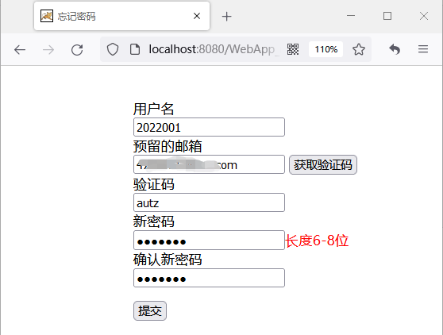

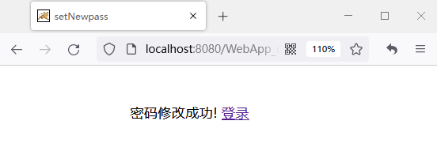


